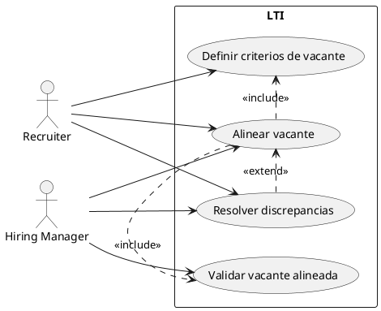
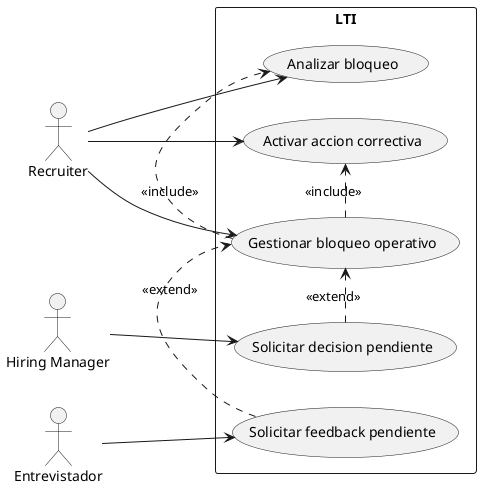
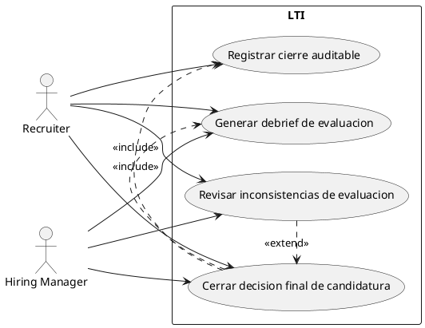
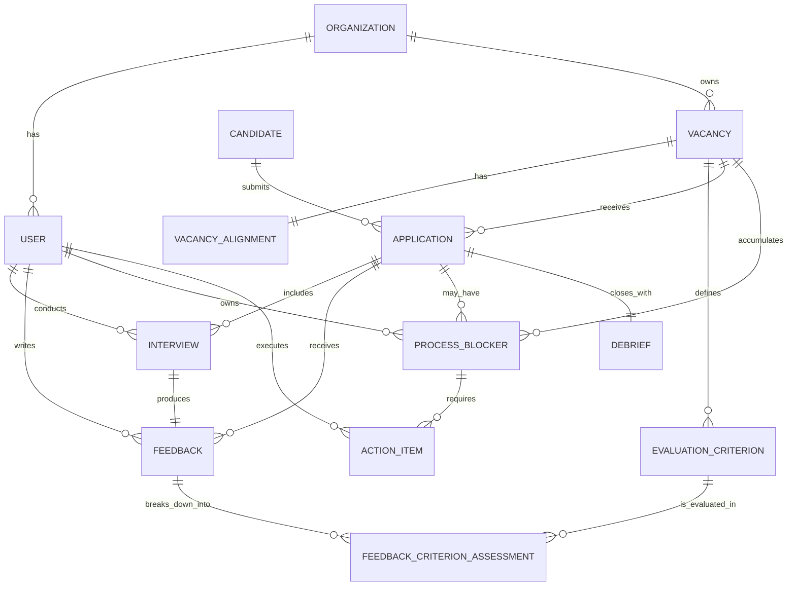
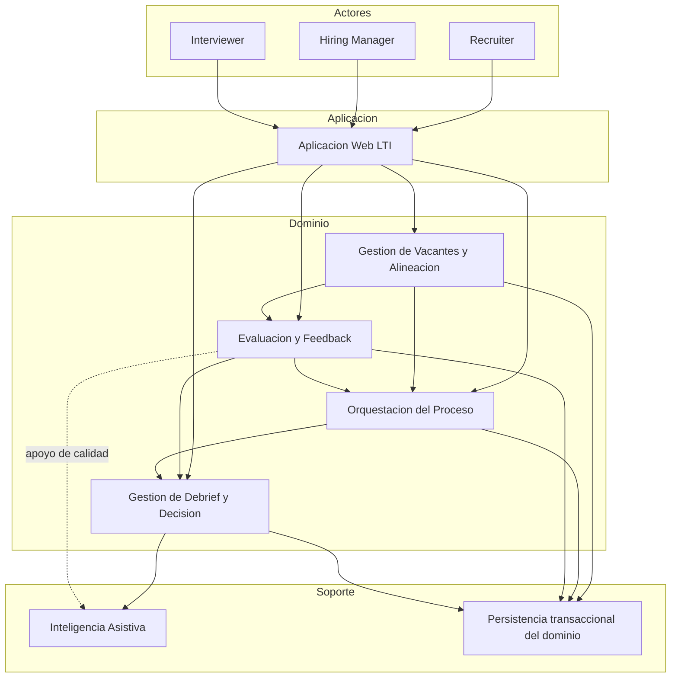
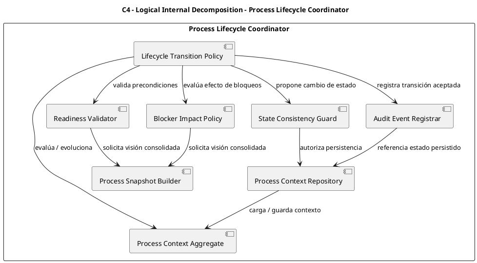

# Prompt 1
`````markdown
Actúa como Product Manager en un entorno SaaS B2B.

A partir del siguiente conjunto de User Stories de LTI (plataforma de recruiting), genera un Product Backlog priorizado.

Para cada User Story incluye:
- Prioridad (Alta / Media / Baja)
- Justificación breve basada en valor de negocio
- Dependencias si existen

Ordena el backlog de mayor a menor prioridad.

User Stories:
````markdown
## US-01

- **Épica:** E1
- **Título:** Crear vacante en estado pendiente de alineación
- **Historia:**  
  "Como recruiter, quiero crear una vacante con información básica para poder iniciar el proceso de alineación con el hiring manager"
- **Descripción:**  
  Permite iniciar el proceso sin necesidad de completar toda la alineación desde el primer momento.
- **Criterios de aceptación (BDD):**
  - **Dado que** soy recruiter  
    **Cuando** creo una vacante con la información mínima obligatoria  
    **Entonces** la vacante queda en estado "pendiente de alineación"
  - **Dado que** la vacante está en estado "pendiente de alineación"  
    **Cuando** accedo al detalle de la vacante  
    **Entonces** veo que la alineación está pendiente de completar
  - **Dado que** faltan campos obligatorios  
    **Cuando** intento crear la vacante  
    **Entonces** el sistema impide su creación y muestra los campos requeridos
- **Estimación:** S
- **Tipo:** Core

### INVEST
- Independent: Sí — No depende de otras historias para aportar valor inicial.
- Negotiable: Sí — Los campos mínimos pueden ajustarse.
- Valuable: Sí — Permite iniciar el flujo.
- Estimable: Sí — Alcance acotado.
- Small: Sí
- Testable: Sí — Estados verificables.

---

## US-02

- **Épica:** E1
- **Título:** Definir criterios de la vacante
- **Historia:**  
  "Como recruiter, quiero definir criterios y requisitos para alinearlos con el hiring manager"
- **Descripción:**  
  Permite estructurar la vacante con una base común antes de su validación.
- **Criterios de aceptación (BDD):**
  - **Dado que** existe una vacante creada  
    **Cuando** edito su información de alineación  
    **Entonces** puedo definir objetivo, requisitos y criterios de evaluación
  - **Dado que** he informado criterios válidos  
    **Cuando** guardo la alineación  
    **Entonces** los criterios quedan asociados a la vacante
  - **Dado que** faltan campos obligatorios de alineación  
    **Cuando** intento guardar  
    **Entonces** el sistema impide continuar y muestra qué información falta
- **Estimación:** M
- **Tipo:** Core

### INVEST (mejorado)
- Independent: Parcial  
  - Justificación: Requiere que exista una vacante previa (US-01).  
  - Mejora: Mantener US-01 como prerequisito explícito del flujo.
- Negotiable: Sí  
  - Justificación: El nivel de detalle de criterios puede variar.
- Valuable: Sí  
  - Justificación: Define la base del proceso de selección.
- Estimable: Sí  
  - Justificación: Funcionalidad clara de edición y persistencia.
- Small: Sí  
  - Justificación: Acotada a definición de criterios.
- Testable: Sí  
  - Justificación: Validaciones y persistencia comprobables.

---

## US-03

- **Épica:** E1
- **Título:** Validar alineación
- **Historia:**  
  "Como hiring manager, quiero validar la vacante para asegurar que cumple mis expectativas"
- **Descripción:**  
  Permite cerrar la alineación y habilitar la ejecución de la vacante.
- **Criterios de aceptación (BDD):**
  - **Dado que** existe una vacante con alineación definida  
    **Cuando** el hiring manager accede a su detalle  
    **Entonces** puede revisar la información antes de validarla
  - **Dado que** el hiring manager considera correcta la alineación  
    **Cuando** la valida  
    **Entonces** la vacante pasa a estado "alineada"
  - **Dado que** una vacante ya alineada sufre cambios en criterios clave  
    **Cuando** esos cambios se guardan  
    **Entonces** la vacante vuelve a estado "pendiente de validación"
- **Estimación:** M
- **Tipo:** Core

### INVEST
- **Independent:** Parcial — Depende de alineación previa.
- **Negotiable:** Sí
- **Valuable:** Sí — Desbloquea ejecución.
- **Estimable:** Sí
- **Small:** Sí
- **Testable:** Sí

---

## US-04

- **Épica:** E2
- **Título:** Crear bloqueo operativo
- **Historia:**  
  "Como recruiter, quiero registrar un bloqueo para poder hacer visible un problema y facilitar que el proceso vuelva a avanzar"
- **Descripción:**  
  Introduce el concepto de bloqueo operativo en el sistema.
- **Criterios de aceptación (BDD):**
  - **Dado que** estoy en una vacante activa  
    **Cuando** registro un bloqueo con descripción y responsable  
    **Entonces** el bloqueo queda creado y asociado a la vacante
  - **Dado que** se ha creado un bloqueo  
    **Cuando** accedo al detalle de la vacante  
    **Entonces** el bloqueo aparece en el listado de bloqueos activos
  - **Dado que** no he informado un responsable  
    **Cuando** intento guardar el bloqueo  
    **Entonces** el sistema impide su creación
- **Estimación:** S
- **Tipo:** Core

### INVEST
- **Independent:** Parcial — Requiere vacante existente.
- **Negotiable:** Sí
- **Valuable:** Sí — Hace visible el problema y permite actuar.
- **Estimable:** Sí
- **Small:** Sí
- **Testable:** Sí

---

## US-05

- **Épica:** E2
- **Título:** Visualizar bloqueos
- **Historia:**  
  "Como recruiter, quiero ver bloqueos para entender por qué el proceso no avanza"
- **Descripción:**  
  Da visibilidad al estado operativo de la vacante.
- **Criterios de aceptación (BDD):**
  - **Dado que** una vacante tiene bloqueos activos  
    **Cuando** accedo a su detalle  
    **Entonces** veo el listado de bloqueos activos
  - **Dado que** existe un bloqueo registrado  
    **Cuando** consulto su información  
    **Entonces** veo su causa y su responsable
  - **Dado que** una vacante no tiene bloqueos activos  
    **Cuando** accedo a su detalle  
    **Entonces** el sistema lo indica claramente
- **Estimación:** M
- **Tipo:** Core

### INVEST
- **Independent:** Parcial — Requiere bloqueos.
- **Negotiable:** Sí
- **Valuable:** Sí — Aporta visibilidad operativa.
- **Estimable:** Sí
- **Small:** Sí
- **Testable:** Sí

---

## US-06

- **Épica:** E2
- **Título:** Crear acción para bloqueo
- **Historia:**  
  "Como recruiter, quiero asignar acciones para resolver bloqueos y hacer avanzar el proceso"
- **Descripción:**  
  Permite asignar responsabilidad concreta para resolver un bloqueo.
- **Criterios de aceptación (BDD):**
  - **Dado que** existe un bloqueo activo  
    **Cuando** creo una acción y asigno un responsable  
    **Entonces** la acción queda asociada al bloqueo
  - **Dado que** he creado una acción válida  
    **Cuando** la guardo  
    **Entonces** la acción queda registrada en el sistema
  - **Dado que** no he asignado responsable  
    **Cuando** intento guardarla  
    **Entonces** el sistema impide su creación
- **Estimación:** S
- **Tipo:** Core

### INVEST
- Independent: Parcial  
  - Justificación: Depende de un bloqueo existente (US-04).  
  - Mejora: En el futuro podría desacoplarse permitiendo acciones no ligadas inicialmente a bloqueos.
- Negotiable: Sí  
  - Justificación: Los atributos de la acción pueden evolucionar.
- Valuable: Sí  
  - Justificación: Introduce ejecución operativa real.
- Estimable: Parcial  
  - Justificación: Puede crecer si se añaden notificaciones o SLA.  
  - Mejora: Limitar alcance en MVP a creación básica.
- Small: Sí  
  - Justificación: Solo creación simple.
- Testable: Sí  
  - Justificación: Asociación y validaciones verificables.

---

## US-07

- **Épica:** E2
- **Título:** Visualizar acciones asignadas
- **Historia:**  
  "Como recruiter, quiero ver mis acciones asignadas para saber qué tareas debo ejecutar"
- **Descripción:**  
  Permite a cada participante del proceso conocer sus responsabilidades pendientes.
- **Criterios de aceptación (BDD):**
  - **Dado que** tengo acciones asignadas  
    **Cuando** accedo a mi vista de acciones  
    **Entonces** veo el listado de acciones pendientes
  - **Dado que** existe una acción asignada  
    **Cuando** la consulto  
    **Entonces** veo su estado actual
  - **Dado que** no tengo acciones asignadas  
    **Cuando** accedo  
    **Entonces** el sistema lo indica claramente
- **Estimación:** S
- **Tipo:** Nice-to-have

### INVEST
- **Independent:** Parcial — Requiere acciones.
- **Negotiable:** Sí
- **Valuable:** Sí — Mejora ejecución individual.
- **Estimable:** Sí
- **Small:** Sí
- **Testable:** Sí

---

## US-08

- **Épica:** E2
- **Título:** Resolver bloqueo
- **Historia:**  
  "Como recruiter, quiero marcar bloqueos como resueltos para reflejar que el proceso puede continuar"
- **Descripción:**  
  Permite cerrar el ciclo operativo del bloqueo.
- **Criterios de aceptación (BDD):**
  - **Dado que** existe un bloqueo activo  
    **Cuando** lo marco como resuelto  
    **Entonces** su estado cambia a "resuelto"
  - **Dado que** un bloqueo está resuelto  
    **Cuando** accedo  
    **Entonces** no aparece como activo
  - **Dado que** un bloqueo se reabre  
    **Cuando** detecto que persiste el problema  
    **Entonces** vuelve a estado activo
- **Estimación:** S
- **Tipo:** Core

### INVEST
- **Independent:** Parcial
- **Negotiable:** Sí
- **Valuable:** Sí
- **Estimable:** Sí
- **Small:** Sí
- **Testable:** Sí

---

## US-09

- **Épica:** E3
- **Título:** Registrar feedback
- **Historia:**  
  "Como entrevistador, quiero registrar feedback para evaluar candidatos y aportar evidencia para la decisión final"
- **Descripción:**  
  Permite capturar información clave de evaluación.
- **Criterios de aceptación (BDD):**
  - **Dado que** tengo una entrevista  
    **Cuando** registro feedback  
    **Entonces** queda asociado
  - **Dado que** el feedback es válido  
    **Cuando** lo guardo  
    **Entonces** se persiste correctamente
  - **Dado que** faltan campos obligatorios  
    **Cuando** intento enviarlo  
    **Entonces** el sistema lo impide
- **Estimación:** M
- **Tipo:** Core

### INVEST
- Independent: Parcial  
  - Justificación: Depende de entrevista o candidatura existente.  
  - Mejora: Permitir feedback manual básico en MVP.
- Negotiable: Sí  
  - Justificación: La estructura puede evolucionar.
- Valuable: Crítica  
  - Justificación: Sin feedback no hay decisión.
- Estimable: Parcial  
  - Justificación: Depende del nivel de detalle requerido.  
  - Mejora: Limitar a campos mínimos en MVP.
- Small: Sí  
- Testable: Sí  

---

## US-10

- **Épica:** E3
- **Título:** Visualizar feedback
- **Historia:**  
  "Como recruiter, quiero ver feedback en una única vista para poder analizar fácilmente a los candidatos"
- **Descripción:**  
  Facilita la revisión del feedback disponible antes de consolidar la decisión.
- **Criterios de aceptación (BDD):**
  - **Dado que** una candidatura tiene feedback registrado  
    **Cuando** accedo a su detalle  
    **Entonces** veo el listado de evaluaciones disponibles
  - **Dado que** existen múltiples evaluaciones de una candidatura  
    **Cuando** reviso la vista agregada  
    **Entonces** puedo compararlas en una única pantalla
  - **Dado que** una candidatura no tiene feedback registrado  
    **Cuando** accedo a su detalle  
    **Entonces** el sistema lo indica claramente
- **Estimación:** S
- **Tipo:** Core

### INVEST
- **Independent:** Parcial — Requiere feedback previo.
- **Negotiable:** Sí
- **Valuable:** Sí — Facilita revisión.
- **Estimable:** Sí
- **Small:** Sí
- **Testable:** Sí

---

## US-11

- **Épica:** E3
- **Título:** Generar debrief
- **Historia:**  
  "Como recruiter, quiero generar un resumen para facilitar decisión"
- **Descripción:**  
  Permite consolidar el feedback en una vista resumida sin lógica avanzada de IA.
- **Criterios de aceptación (BDD):**
  - **Dado que** existe feedback registrado para una candidatura  
    **Cuando** genero el debrief  
    **Entonces** el sistema crea un resumen consolidado
  - **Dado que** el feedback requerido está incompleto  
    **Cuando** intento generar el debrief  
    **Entonces** el sistema lo indica y no lo genera
  - **Dado que** el debrief ya ha sido generado  
    **Cuando** accedo a la candidatura  
    **Entonces** puedo revisarlo antes de la decisión final
- **Estimación:** M
- **Tipo:** Core

### INVEST
- **Independent:** Parcial — Requiere feedback previo.
- **Negotiable:** Sí — La forma de consolidación puede evolucionar.
- **Valuable:** Muy alta — Prepara la decisión.
- **Estimable:** Parcial — Hay que definir bien qué significa “resumen consolidado”.
- **Small:** Sí — Si se limita a agregación básica.
- **Testable:** Sí

---

## US-12

- **Épica:** E3
- **Título:** Registrar decisión
- **Historia:**  
  "Como hiring manager, quiero registrar una decisión para cerrar la candidatura"
- **Descripción:**  
  Permite cerrar el proceso con trazabilidad.
- **Criterios de aceptación (BDD):**
  - **Dado que** existe un debrief disponible  
    **Cuando** el hiring manager registra una decisión final  
    **Entonces** la candidatura queda cerrada con dicha decisión
  - **Dado que** la decisión ha sido registrada  
    **Cuando** accedo al detalle de la candidatura  
    **Entonces** veo la decisión almacenada
  - **Dado que** una candidatura ya ha sido cerrada  
    **Cuando** la consulto  
    **Entonces** veo la trazabilidad de su cierre
- **Estimación:** S
- **Tipo:** Core

### INVEST
- **Independent:** Parcial — Depende del debrief.
- **Negotiable:** Sí
- **Valuable:** Crítica — Cierra el proceso.
- **Estimable:** Sí
- **Small:** Sí
- **Testable:** Sí

---
````
`````

# Prompt 2
`````markdown
Actúa como Product Manager senior en un producto SaaS B2B.

Dadas las siguientes User Stories de LTI, construye un Product Backlog priorizado teniendo en cuenta:

Factores de priorización:
- Valor de negocio (1–10)
- Urgencia (1–10)
- Complejidad técnica (1–10)
- Riesgo (1–10)
- Dependencias

Para cada User Story genera una tabla con:
- ID
- Valor de negocio
- Urgencia
- Complejidad
- Riesgo
- Dependencias
- Prioridad final
- Justificación

Después:
- Ordena el backlog de mayor a menor prioridad
- Identifica qué historias forman el MVP
- Explica brevemente tu decisión

User Stories:
````markdown
## US-01

- **Épica:** E1
- **Título:** Crear vacante en estado pendiente de alineación
- **Historia:**  
  "Como recruiter, quiero crear una vacante con información básica para poder iniciar el proceso de alineación con el hiring manager"
- **Descripción:**  
  Permite iniciar el proceso sin necesidad de completar toda la alineación desde el primer momento.
- **Criterios de aceptación (BDD):**
  - **Dado que** soy recruiter  
    **Cuando** creo una vacante con la información mínima obligatoria  
    **Entonces** la vacante queda en estado "pendiente de alineación"
  - **Dado que** la vacante está en estado "pendiente de alineación"  
    **Cuando** accedo al detalle de la vacante  
    **Entonces** veo que la alineación está pendiente de completar
  - **Dado que** faltan campos obligatorios  
    **Cuando** intento crear la vacante  
    **Entonces** el sistema impide su creación y muestra los campos requeridos
- **Estimación:** S
- **Tipo:** Core

### INVEST
- Independent: Sí — No depende de otras historias para aportar valor inicial.
- Negotiable: Sí — Los campos mínimos pueden ajustarse.
- Valuable: Sí — Permite iniciar el flujo.
- Estimable: Sí — Alcance acotado.
- Small: Sí
- Testable: Sí — Estados verificables.

---

## US-02

- **Épica:** E1
- **Título:** Definir criterios de la vacante
- **Historia:**  
  "Como recruiter, quiero definir criterios y requisitos para alinearlos con el hiring manager"
- **Descripción:**  
  Permite estructurar la vacante con una base común antes de su validación.
- **Criterios de aceptación (BDD):**
  - **Dado que** existe una vacante creada  
    **Cuando** edito su información de alineación  
    **Entonces** puedo definir objetivo, requisitos y criterios de evaluación
  - **Dado que** he informado criterios válidos  
    **Cuando** guardo la alineación  
    **Entonces** los criterios quedan asociados a la vacante
  - **Dado que** faltan campos obligatorios de alineación  
    **Cuando** intento guardar  
    **Entonces** el sistema impide continuar y muestra qué información falta
- **Estimación:** M
- **Tipo:** Core

### INVEST (mejorado)
- Independent: Parcial  
  - Justificación: Requiere que exista una vacante previa (US-01).  
  - Mejora: Mantener US-01 como prerequisito explícito del flujo.
- Negotiable: Sí  
  - Justificación: El nivel de detalle de criterios puede variar.
- Valuable: Sí  
  - Justificación: Define la base del proceso de selección.
- Estimable: Sí  
  - Justificación: Funcionalidad clara de edición y persistencia.
- Small: Sí  
  - Justificación: Acotada a definición de criterios.
- Testable: Sí  
  - Justificación: Validaciones y persistencia comprobables.

---

## US-03

- **Épica:** E1
- **Título:** Validar alineación
- **Historia:**  
  "Como hiring manager, quiero validar la vacante para asegurar que cumple mis expectativas"
- **Descripción:**  
  Permite cerrar la alineación y habilitar la ejecución de la vacante.
- **Criterios de aceptación (BDD):**
  - **Dado que** existe una vacante con alineación definida  
    **Cuando** el hiring manager accede a su detalle  
    **Entonces** puede revisar la información antes de validarla
  - **Dado que** el hiring manager considera correcta la alineación  
    **Cuando** la valida  
    **Entonces** la vacante pasa a estado "alineada"
  - **Dado que** una vacante ya alineada sufre cambios en criterios clave  
    **Cuando** esos cambios se guardan  
    **Entonces** la vacante vuelve a estado "pendiente de validación"
- **Estimación:** M
- **Tipo:** Core

### INVEST
- **Independent:** Parcial — Depende de alineación previa.
- **Negotiable:** Sí
- **Valuable:** Sí — Desbloquea ejecución.
- **Estimable:** Sí
- **Small:** Sí
- **Testable:** Sí

---

## US-04

- **Épica:** E2
- **Título:** Crear bloqueo operativo
- **Historia:**  
  "Como recruiter, quiero registrar un bloqueo para poder hacer visible un problema y facilitar que el proceso vuelva a avanzar"
- **Descripción:**  
  Introduce el concepto de bloqueo operativo en el sistema.
- **Criterios de aceptación (BDD):**
  - **Dado que** estoy en una vacante activa  
    **Cuando** registro un bloqueo con descripción y responsable  
    **Entonces** el bloqueo queda creado y asociado a la vacante
  - **Dado que** se ha creado un bloqueo  
    **Cuando** accedo al detalle de la vacante  
    **Entonces** el bloqueo aparece en el listado de bloqueos activos
  - **Dado que** no he informado un responsable  
    **Cuando** intento guardar el bloqueo  
    **Entonces** el sistema impide su creación
- **Estimación:** S
- **Tipo:** Core

### INVEST
- **Independent:** Parcial — Requiere vacante existente.
- **Negotiable:** Sí
- **Valuable:** Sí — Hace visible el problema y permite actuar.
- **Estimable:** Sí
- **Small:** Sí
- **Testable:** Sí

---

## US-05

- **Épica:** E2
- **Título:** Visualizar bloqueos
- **Historia:**  
  "Como recruiter, quiero ver bloqueos para entender por qué el proceso no avanza"
- **Descripción:**  
  Da visibilidad al estado operativo de la vacante.
- **Criterios de aceptación (BDD):**
  - **Dado que** una vacante tiene bloqueos activos  
    **Cuando** accedo a su detalle  
    **Entonces** veo el listado de bloqueos activos
  - **Dado que** existe un bloqueo registrado  
    **Cuando** consulto su información  
    **Entonces** veo su causa y su responsable
  - **Dado que** una vacante no tiene bloqueos activos  
    **Cuando** accedo a su detalle  
    **Entonces** el sistema lo indica claramente
- **Estimación:** M
- **Tipo:** Core

### INVEST
- **Independent:** Parcial — Requiere bloqueos.
- **Negotiable:** Sí
- **Valuable:** Sí — Aporta visibilidad operativa.
- **Estimable:** Sí
- **Small:** Sí
- **Testable:** Sí

---

## US-06

- **Épica:** E2
- **Título:** Crear acción para bloqueo
- **Historia:**  
  "Como recruiter, quiero asignar acciones para resolver bloqueos y hacer avanzar el proceso"
- **Descripción:**  
  Permite asignar responsabilidad concreta para resolver un bloqueo.
- **Criterios de aceptación (BDD):**
  - **Dado que** existe un bloqueo activo  
    **Cuando** creo una acción y asigno un responsable  
    **Entonces** la acción queda asociada al bloqueo
  - **Dado que** he creado una acción válida  
    **Cuando** la guardo  
    **Entonces** la acción queda registrada en el sistema
  - **Dado que** no he asignado responsable  
    **Cuando** intento guardarla  
    **Entonces** el sistema impide su creación
- **Estimación:** S
- **Tipo:** Core

### INVEST
- Independent: Parcial  
  - Justificación: Depende de un bloqueo existente (US-04).  
  - Mejora: En el futuro podría desacoplarse permitiendo acciones no ligadas inicialmente a bloqueos.
- Negotiable: Sí  
  - Justificación: Los atributos de la acción pueden evolucionar.
- Valuable: Sí  
  - Justificación: Introduce ejecución operativa real.
- Estimable: Parcial  
  - Justificación: Puede crecer si se añaden notificaciones o SLA.  
  - Mejora: Limitar alcance en MVP a creación básica.
- Small: Sí  
  - Justificación: Solo creación simple.
- Testable: Sí  
  - Justificación: Asociación y validaciones verificables.

---

## US-07

- **Épica:** E2
- **Título:** Visualizar acciones asignadas
- **Historia:**  
  "Como recruiter, quiero ver mis acciones asignadas para saber qué tareas debo ejecutar"
- **Descripción:**  
  Permite a cada participante del proceso conocer sus responsabilidades pendientes.
- **Criterios de aceptación (BDD):**
  - **Dado que** tengo acciones asignadas  
    **Cuando** accedo a mi vista de acciones  
    **Entonces** veo el listado de acciones pendientes
  - **Dado que** existe una acción asignada  
    **Cuando** la consulto  
    **Entonces** veo su estado actual
  - **Dado que** no tengo acciones asignadas  
    **Cuando** accedo  
    **Entonces** el sistema lo indica claramente
- **Estimación:** S
- **Tipo:** Nice-to-have

### INVEST
- **Independent:** Parcial — Requiere acciones.
- **Negotiable:** Sí
- **Valuable:** Sí — Mejora ejecución individual.
- **Estimable:** Sí
- **Small:** Sí
- **Testable:** Sí

---

## US-08

- **Épica:** E2
- **Título:** Resolver bloqueo
- **Historia:**  
  "Como recruiter, quiero marcar bloqueos como resueltos para reflejar que el proceso puede continuar"
- **Descripción:**  
  Permite cerrar el ciclo operativo del bloqueo.
- **Criterios de aceptación (BDD):**
  - **Dado que** existe un bloqueo activo  
    **Cuando** lo marco como resuelto  
    **Entonces** su estado cambia a "resuelto"
  - **Dado que** un bloqueo está resuelto  
    **Cuando** accedo  
    **Entonces** no aparece como activo
  - **Dado que** un bloqueo se reabre  
    **Cuando** detecto que persiste el problema  
    **Entonces** vuelve a estado activo
- **Estimación:** S
- **Tipo:** Core

### INVEST
- **Independent:** Parcial
- **Negotiable:** Sí
- **Valuable:** Sí
- **Estimable:** Sí
- **Small:** Sí
- **Testable:** Sí

---

## US-09

- **Épica:** E3
- **Título:** Registrar feedback
- **Historia:**  
  "Como entrevistador, quiero registrar feedback para evaluar candidatos y aportar evidencia para la decisión final"
- **Descripción:**  
  Permite capturar información clave de evaluación.
- **Criterios de aceptación (BDD):**
  - **Dado que** tengo una entrevista  
    **Cuando** registro feedback  
    **Entonces** queda asociado
  - **Dado que** el feedback es válido  
    **Cuando** lo guardo  
    **Entonces** se persiste correctamente
  - **Dado que** faltan campos obligatorios  
    **Cuando** intento enviarlo  
    **Entonces** el sistema lo impide
- **Estimación:** M
- **Tipo:** Core

### INVEST
- Independent: Parcial  
  - Justificación: Depende de entrevista o candidatura existente.  
  - Mejora: Permitir feedback manual básico en MVP.
- Negotiable: Sí  
  - Justificación: La estructura puede evolucionar.
- Valuable: Crítica  
  - Justificación: Sin feedback no hay decisión.
- Estimable: Parcial  
  - Justificación: Depende del nivel de detalle requerido.  
  - Mejora: Limitar a campos mínimos en MVP.
- Small: Sí  
- Testable: Sí  

---

## US-10

- **Épica:** E3
- **Título:** Visualizar feedback
- **Historia:**  
  "Como recruiter, quiero ver feedback en una única vista para poder analizar fácilmente a los candidatos"
- **Descripción:**  
  Facilita la revisión del feedback disponible antes de consolidar la decisión.
- **Criterios de aceptación (BDD):**
  - **Dado que** una candidatura tiene feedback registrado  
    **Cuando** accedo a su detalle  
    **Entonces** veo el listado de evaluaciones disponibles
  - **Dado que** existen múltiples evaluaciones de una candidatura  
    **Cuando** reviso la vista agregada  
    **Entonces** puedo compararlas en una única pantalla
  - **Dado que** una candidatura no tiene feedback registrado  
    **Cuando** accedo a su detalle  
    **Entonces** el sistema lo indica claramente
- **Estimación:** S
- **Tipo:** Core

### INVEST
- **Independent:** Parcial — Requiere feedback previo.
- **Negotiable:** Sí
- **Valuable:** Sí — Facilita revisión.
- **Estimable:** Sí
- **Small:** Sí
- **Testable:** Sí

---

## US-11

- **Épica:** E3
- **Título:** Generar debrief
- **Historia:**  
  "Como recruiter, quiero generar un resumen para facilitar decisión"
- **Descripción:**  
  Permite consolidar el feedback en una vista resumida sin lógica avanzada de IA.
- **Criterios de aceptación (BDD):**
  - **Dado que** existe feedback registrado para una candidatura  
    **Cuando** genero el debrief  
    **Entonces** el sistema crea un resumen consolidado
  - **Dado que** el feedback requerido está incompleto  
    **Cuando** intento generar el debrief  
    **Entonces** el sistema lo indica y no lo genera
  - **Dado que** el debrief ya ha sido generado  
    **Cuando** accedo a la candidatura  
    **Entonces** puedo revisarlo antes de la decisión final
- **Estimación:** M
- **Tipo:** Core

### INVEST
- **Independent:** Parcial — Requiere feedback previo.
- **Negotiable:** Sí — La forma de consolidación puede evolucionar.
- **Valuable:** Muy alta — Prepara la decisión.
- **Estimable:** Parcial — Hay que definir bien qué significa “resumen consolidado”.
- **Small:** Sí — Si se limita a agregación básica.
- **Testable:** Sí

---

## US-12

- **Épica:** E3
- **Título:** Registrar decisión
- **Historia:**  
  "Como hiring manager, quiero registrar una decisión para cerrar la candidatura"
- **Descripción:**  
  Permite cerrar el proceso con trazabilidad.
- **Criterios de aceptación (BDD):**
  - **Dado que** existe un debrief disponible  
    **Cuando** el hiring manager registra una decisión final  
    **Entonces** la candidatura queda cerrada con dicha decisión
  - **Dado que** la decisión ha sido registrada  
    **Cuando** accedo al detalle de la candidatura  
    **Entonces** veo la decisión almacenada
  - **Dado que** una candidatura ya ha sido cerrada  
    **Cuando** la consulto  
    **Entonces** veo la trazabilidad de su cierre
- **Estimación:** S
- **Tipo:** Core

### INVEST
- **Independent:** Parcial — Depende del debrief.
- **Negotiable:** Sí
- **Valuable:** Crítica — Cierra el proceso.
- **Estimable:** Sí
- **Small:** Sí
- **Testable:** Sí

---
````
`````

# Prompt 3
`````markdown
Actúa como Product Manager senior en un producto SaaS B2B.

Contexto:
Te proporciono:
1. PRD de LTI (objetivos de negocio, propuesta de valor y dominio)
2. User Stories del MVP

Objetivo:
Construir un Product Backlog priorizado para un MVP funcional real.

---

## Instrucciones

### 1. Usa el PRD para entender:
- Qué aporta más valor diferencial
- Qué problemas críticos resuelve el producto
- Qué funcionalidades son core vs accesorias

### 2. Para cada User Story calcula:

- Business Value (1–10) → basado en el PRD
- Time Criticality (1–10)
- Risk Reduction (1–10)
- Job Size (1–10)

### 3. Calcula WSJF:
WSJF = (Business Value + Time Criticality + Risk Reduction) / Job Size

---

## Output

Genera una tabla con:

- ID
- WSJF Score
- Business Value (justificado con el PRD)
- Time Criticality
- Risk Reduction
- Job Size
- Dependencias
- Tipo (Core / Nice-to-have)

---

## Análisis adicional

- Identifica el MVP mínimo funcional (vertical slice completo)
- Explica qué historias reflejan el valor diferencial del producto
- Detecta inconsistencias entre User Stories y PRD
- Sugiere mejoras si alguna historia no está alineada con el dominio

---

## Input

PRD:
````markdown
# LTI — Definición de producto, casos de uso, modelo de datos y arquitectura

## 1. Descripción breve del software

LTI es una plataforma SaaS de recruiting diseñada para optimizar la ejecución real de los procesos de selección en empresas medianas y grandes.
Se centra en eliminar bloqueos operativos, alinear a recruiters y hiring managers desde el inicio y mejorar la calidad de decisión mediante feedback estructurado e inteligencia asistida.
A diferencia de un ATS tradicional, LTI actúa como un sistema operativo del proceso de contratación, no solo como un sistema de registro.

---

## 2. Propuesta de valor

### Qué problema resuelve

Los procesos de selección fallan principalmente por:

* Desalineación inicial entre HR y hiring managers
* Bloqueos operativos como feedback tardío, decisiones pendientes o falta de coordinación
* Evaluaciones inconsistentes y poco estructuradas
* Decisiones finales lentas y con baja trazabilidad

### Para quién

* Equipos de HR y Recruiting en empresas medianas y grandes
* Hiring managers con responsabilidad directa en decisiones de contratación
* Equipos de recruiting operations que necesitan visibilidad y control del proceso

### Por qué es mejor que alternativas

* No se limita a gestionar candidatos: **gestiona la ejecución del proceso**
* Introduce **accountability explícito** en cada fase del flujo
* Mejora la calidad de decisión sin depender de modelos avanzados basados en grandes volúmenes históricos
* Incorpora IA en puntos de alto impacto, con trazabilidad y control humano

---

## 3. Ventajas competitivas

* Visibilidad operativa en tiempo real de bloqueos y responsabilidades por vacante
* Alineación estructurada HR–manager antes de iniciar el proceso
* Feedback comparativo basado en evidencia, no solo en percepción individual
* Coordinación integrada en el flujo de trabajo, reduciendo dependencia de herramientas externas
* Debrief asistido por IA con trazabilidad completa y validación humana
* Enfoque en ejecución y decisión, no solo en gestión de candidatos

---

## 4. Funciones principales

### 4.1 Centro de decisiones y bloqueos del proceso

**Descripción**
Vista centralizada que identifica en tiempo real el estado de cada vacante, los puntos de bloqueo y las responsabilidades asociadas.

**Problema que resuelve**
Falta de visibilidad sobre por qué los procesos no avanzan.

**Cómo aporta valor diferencial**

* Expone explícitamente qué impide avanzar cada proceso
* Prioriza acciones en lugar de mostrar solo estados
* Introduce accountability operativa en recruiters y managers

**Uso de IA**

* Clasificación automática de bloqueos según criticidad
* Sugerencias de acción basadas en señales operativas del proceso

---

### 4.2 Orquestador de alineación de vacante

**Descripción**
Flujo estructurado que define y valida los criterios clave de una vacante antes de iniciar el proceso.

**Problema que resuelve**
Desalineación entre HR y hiring manager en perfil, criterios de evaluación y expectativas.

**Cómo aporta valor diferencial**

* Establece una única fuente de verdad para el inicio del proceso
* Reduce cambios de criterio durante la selección
* Mejora la calidad del filtrado desde el inicio

**Uso de IA**

* Sugerencias de estructuración de perfil basadas en roles similares
* Detección de inconsistencias en criterios definidos

---

### 4.3 Feedback guiado y comparativo en tiempo real

**Descripción**
Sistema de evaluación estructurada que exige evidencias y permite comparar evaluaciones entre entrevistadores.

**Problema que resuelve**
Feedback inconsistente, subjetivo o difícil de comparar.

**Cómo aporta valor diferencial**

* Estandariza la evaluación en base a competencias definidas
* Permite identificar discrepancias entre evaluadores
* Reduce la necesidad de interpretación manual por parte de HR

**Uso de IA**

* Detección de feedback incompleto o poco específico
* Identificación de inconsistencias entre evaluaciones
* Sugerencias para mejorar la calidad del feedback

---

### 4.4 Agenda colaborativa de contratación

**Descripción**
Sistema de coordinación de tareas, responsables y tiempos dentro del proceso de selección.

**Problema que resuelve**
Falta de seguimiento y compromiso por parte de los participantes del proceso.

**Cómo aporta valor diferencial**

* Define ownership explícito de cada tarea
* Permite seguimiento de compromisos en tiempo real
* Reduce dependencia de correos y herramientas externas

**Uso de IA**

* Priorización de tareas según impacto operativo
* Recordatorios inteligentes basados en criticidad y retraso

---

### 4.5 Debrief inteligente y auditable

**Descripción**
Síntesis estructurada del proceso de evaluación de una candidatura, integrando el feedback disponible para facilitar la decisión final.

**Problema que resuelve**
Debriefs manuales lentos, redundantes y con baja consistencia.

**Cómo aporta valor diferencial**

* Consolida la información en una única vista accionable
* Identifica conflictos entre evaluadores
* Facilita decisiones más rápidas y fundamentadas

**Uso de IA**

* Síntesis automática del feedback por competencias
* Identificación de contradicciones y falta de evidencia
* Generación de recomendación de decisión con explicación trazable
* Salida editable y validable por humanos

**Nota de gobernanza**
La decisión final nunca es automática: la IA solo asiste, mientras que la validación y el cierre permanecen bajo control humano.

---

## 5. Lean Canvas


---

# 6. Casos de uso principales

## Caso de uso 1: Alinear una vacante antes de iniciar el proceso

### Nombre

**Alinear vacante entre Recruiter y Hiring Manager**

### Descripción breve

Permite definir y validar de forma estructurada los criterios de una vacante antes de iniciar el proceso de selección, asegurando que recruiter y hiring manager comparten prioridades, requisitos, criterios de evaluación y responsabilidades operativas.

### Actores

* Recruiter
* Hiring Manager

### Disparador

El recruiter necesita abrir una nueva vacante y solicita la validación inicial del hiring manager.

### Precondiciones

* Existe una necesidad de contratación aprobada
* El recruiter tiene permisos para crear la vacante
* El hiring manager responsable está identificado
* La vacante aún no ha comenzado su ejecución operativa

### Flujo principal

1. El recruiter crea una nueva vacante en LTI.
2. El sistema inicia el flujo de alineación.
3. El recruiter define objetivo del rol, requisitos clave y criterios iniciales de evaluación.
4. El sistema envía la propuesta al hiring manager para revisión.
5. El hiring manager revisa y ajusta prioridades, requisitos o expectativas del proceso.
6. El sistema compara ambas definiciones y detecta discrepancias.
7. Recruiter y hiring manager resuelven las discrepancias.
8. El sistema consolida la definición final de la vacante.
9. El hiring manager valida la versión final.
10. El sistema marca la vacante como alineada y lista para ejecución.

### Flujos alternativos

* Si el hiring manager no responde, la vacante permanece pendiente de alineación.
* Si existen discrepancias no resueltas, el sistema no permite cerrar la alineación.
* Si el recruiter modifica criterios críticos después de la validación, el sistema reabre la alineación.

### Resultado final

La vacante queda definida con criterios compartidos, responsables claros y una base operativa común para el resto del proceso.

### Funcionalidades implicadas

* Orquestador de alineación de vacante
* Agenda colaborativa de contratación
* Centro de decisiones y bloqueos del proceso

### Justificación

Es un caso de uso principal porque elimina la desalineación inicial entre HR y negocio, origen frecuente de retrabajo y decisiones inconsistentes.

### Diagrama UML de casos de uso




---

## Caso de uso 2: Gestionar bloqueos operativos de una vacante activa

### Nombre

**Gestionar bloqueos operativos de una vacante en ejecución**

### Descripción breve

Permite identificar, analizar y resolver cuellos de botella que ralentizan una vacante activa, asignando responsabilidad explícita y facilitando la acción necesaria para reanudar el avance del proceso.

### Actores

* Recruiter
* Hiring Manager
* Entrevistador

### Disparador

Una vacante activa presenta retrasos, tareas pendientes o falta de respuesta de alguno de los participantes del proceso.

### Precondiciones

* La vacante está alineada y en ejecución
* Existen etapas activas con tareas asignadas
* El sistema dispone del estado actualizado del proceso y de sus responsables

### Flujo principal

1. El sistema detecta un bloqueo operativo.
2. El recruiter accede al centro de decisiones y revisa los bloqueos abiertos.
3. El sistema muestra la causa del bloqueo y el responsable actual.
4. El recruiter selecciona el bloqueo prioritario.
5. El sistema presenta el contexto necesario para actuar.
6. El recruiter asigna o activa una acción correctiva.
7. El sistema notifica al responsable correspondiente.
8. El responsable ejecuta la acción pendiente.
9. El sistema valida si el bloqueo ha sido resuelto.
10. El recruiter confirma la recuperación del flujo o mantiene el seguimiento.

### Flujos alternativos

* Si el responsable no actúa, el bloqueo permanece abierto y visible.
* Si el bloqueo afecta a varias personas, el sistema lo descompone en tareas separadas.
* Si la acción ejecutada no resuelve el problema, el bloqueo se reabre.

### Resultado final

La vacante recupera capacidad de avance o queda marcada como bloqueo persistente con responsabilidad visible.

### Funcionalidades implicadas

* Centro de decisiones y bloqueos del proceso
* Agenda colaborativa de contratación
* Feedback guiado y comparativo en tiempo real

### Justificación

Es un caso de uso principal porque representa el núcleo operativo del producto: LTI no solo registra el estado del proceso, sino que ayuda a desbloquearlo activamente.

### Diagrama UML de casos de uso




---

## Caso de uso 3: Consolidar evaluación y cerrar decisión de candidatura

### Nombre

**Consolidar evaluación y cerrar decisión final de candidatura**

### Descripción breve

Permite consolidar el feedback de entrevistas, generar un debrief estructurado y facilitar una decisión final trazable entre recruiter y hiring manager.

### Actores

* Recruiter
* Hiring Manager

### Disparador

El candidato ha completado las etapas de evaluación y existe feedback suficiente para preparar la decisión final.

### Precondiciones

* El candidato ha finalizado las entrevistas definidas
* Existe feedback registrado por los evaluadores
* La vacante sigue activa y permite avanzar a decisión final

### Flujo principal

1. El recruiter accede a la candidatura lista para decisión.
2. El sistema valida la completitud del feedback.
3. El sistema genera un debrief estructurado de la candidatura.
4. El sistema identifica inconsistencias o falta de evidencia.
5. El recruiter revisa la síntesis generada.
6. El hiring manager accede al debrief consolidado.
7. Recruiter y hiring manager revisan evidencia y recomendación.
8. El hiring manager toma una decisión final.
9. El recruiter registra la decisión en el sistema.
10. El sistema guarda el cierre con trazabilidad completa.

### Flujos alternativos

* Si falta feedback obligatorio, el sistema no permite cerrar la decisión.
* Si existen contradicciones importantes entre evaluaciones, recruiter y manager revisan manualmente la evidencia antes de decidir.
* Si el hiring manager no valida la decisión, la candidatura permanece en estado pendiente.

### Resultado final

La candidatura queda cerrada con una decisión explícita, fundamentada y auditable.

### Funcionalidades implicadas

* Feedback guiado y comparativo en tiempo real
* Debrief inteligente y auditable
* Centro de decisiones y bloqueos del proceso

### Justificación

Es un caso de uso principal porque conecta evaluación y decisión, el punto donde más valor aporta la combinación de estructura, comparabilidad e inteligencia auditable.

### Diagrama UML de casos de uso




---

# 7. Modelo de datos lógico del MVP de LTI

## 7.1 Entidades principales

### Organization

Representa a la empresa cliente que utiliza LTI para gestionar sus procesos de selección.

**Atributos**

* `id` — UUID — sí — Identificador único de la organización
* `name` — string — sí — Nombre de la organización
* `status` — enum — sí — Estado de la organización dentro del sistema
* `created_at` — datetime — sí — Fecha y hora de alta

---

### User

Representa a un usuario interno de la organización que participa en el proceso de selección.

**Atributos**

* `id` — UUID — sí — Identificador único del usuario
* `organization_id` — UUID — sí — Organización a la que pertenece
* `full_name` — string — sí — Nombre completo
* `email` — string — sí — Correo corporativo
* `role` — enum — sí — Rol principal del usuario en la plataforma
* `status` — enum — sí — Estado del usuario
* `created_at` — datetime — sí — Fecha y hora de creación

**Nota**
`role` representa el rol principal del usuario en la plataforma. La participación efectiva en cada proceso se determina por las relaciones de dominio.

---

### Vacancy

Representa una vacante abierta por la organización y gestionada en LTI.

**Atributos**

* `id` — UUID — sí — Identificador único de la vacante
* `organization_id` — UUID — sí — Organización propietaria
* `title` — string — sí — Nombre del puesto
* `department` — string — sí — Área solicitante
* `location` — string — no — Ubicación asociada
* `employment_type` — enum — sí — Tipo de contratación
* `status` — enum — sí — Estado de la vacante
* `priority` — enum — sí — Prioridad de cobertura
* `created_by_user_id` — UUID — sí — Usuario que crea la vacante
* `created_at` — datetime — sí — Fecha y hora de creación

---

### VacancyAlignment

Representa el acuerdo formal entre recruiter y hiring manager sobre una vacante antes de iniciar su ejecución.

**Atributos**

* `id` — UUID — sí — Identificador único de la alineación
* `vacancy_id` — UUID — sí — Vacante asociada
* `recruiter_user_id` — UUID — sí — Recruiter responsable
* `hiring_manager_user_id` — UUID — sí — Hiring manager responsable
* `role_objective` — text — sí — Objetivo del rol
* `must_have_requirements` — text — sí — Requisitos imprescindibles
* `nice_to_have_requirements` — text — no — Requisitos deseables
* `process_expectations` — text — no — Expectativas del proceso
* `status` — enum — sí — Estado de la alineación
* `validated_at` — datetime — no — Fecha de validación final

**Nota**
En el MVP no se mantiene histórico de alineaciones. Cada vacante tiene una única entidad `VacancyAlignment`, que puede reabrirse y actualizarse.

---

### EvaluationCriterion

Define un criterio de evaluación aplicable a una vacante y utilizado en entrevistas y feedback.

**Atributos**

* `id` — UUID — sí — Identificador único del criterio
* `vacancy_id` — UUID — sí — Vacante a la que pertenece
* `name` — string — sí — Nombre del criterio
* `description` — text — no — Descripción
* `weight` — integer — sí — Peso relativo
* `is_mandatory` — boolean — sí — Indica si es obligatorio
* `created_at` — datetime — sí — Fecha de alta

---

### Candidate

Representa a una persona candidata evaluada en procesos de selección.

**Atributos**

* `id` — UUID — sí — Identificador único
* `full_name` — string — sí — Nombre completo
* `email` — string — sí — Correo principal
* `phone` — string — no — Teléfono
* `current_location` — string — no — Ubicación actual
* `resume_url` — string — no — Referencia al CV
* `created_at` — datetime — sí — Fecha de alta

---

### Application

Representa la candidatura de un candidato a una vacante concreta.

**Atributos**

* `id` — UUID — sí — Identificador único
* `vacancy_id` — UUID — sí — Vacante asociada
* `candidate_id` — UUID — sí — Candidato asociado
* `current_stage` — enum — sí — Etapa actual
* `status` — enum — sí — Estado de la candidatura
* `applied_at` — datetime — sí — Fecha de entrada
* `closed_at` — datetime — no — Fecha de cierre

---

### Interview

Representa una entrevista planificada o ejecutada dentro de una candidatura.

**Atributos**

* `id` — UUID — sí — Identificador único
* `application_id` — UUID — sí — Candidatura asociada
* `interviewer_user_id` — UUID — sí — Entrevistador asignado
* `interview_type` — enum — sí — Tipo de entrevista
* `scheduled_at` — datetime — no — Fecha y hora planificadas
* `completed_at` — datetime — no — Fecha y hora de finalización
* `status` — enum — sí — Estado de la entrevista

---

### Feedback

Representa la evaluación emitida por un entrevistador sobre una entrevista de una candidatura.

**Atributos**

* `id` — UUID — sí — Identificador único
* `application_id` — UUID — sí — Candidatura evaluada
* `interview_id` — UUID — sí — Entrevista asociada
* `author_user_id` — UUID — sí — Usuario que emite el feedback
* `summary` — text — no — Resumen general
* `recommendation` — enum — sí — Recomendación final del evaluador
* `status` — enum — sí — Estado del feedback
* `submitted_at` — datetime — no — Fecha de envío definitivo

---

### FeedbackCriterionAssessment

Descompone un feedback en evaluaciones concretas por criterio.

**Atributos**

* `id` — UUID — sí — Identificador único
* `feedback_id` — UUID — sí — Feedback al que pertenece
* `evaluation_criterion_id` — UUID — sí — Criterio evaluado
* `rating` — integer — sí — Puntuación asignada
* `evidence` — text — no — Evidencia observada

---

### ProcessBlocker

Representa un bloqueo operativo que impide el avance normal de una vacante o candidatura.

**Atributos**

* `id` — UUID — sí — Identificador único
* `vacancy_id` — UUID — sí — Vacante afectada
* `application_id` — UUID — no — Candidatura afectada, si aplica
* `blocker_type` — enum — sí — Tipo de bloqueo
* `description` — text — sí — Descripción del bloqueo
* `status` — enum — sí — Estado del bloqueo
* `responsible_user_id` — UUID — sí — Usuario responsable
* `detected_at` — datetime — sí — Fecha de detección
* `resolved_at` — datetime — no — Fecha de resolución

---

### ActionItem

Representa una acción asignada para resolver un bloqueo o avanzar una tarea del proceso.

**Atributos**

* `id` — UUID — sí — Identificador único
* `process_blocker_id` — UUID — sí — Bloqueo asociado
* `assigned_user_id` — UUID — sí — Usuario responsable
* `title` — string — sí — Título corto
* `description` — text — no — Detalle de la acción
* `due_at` — datetime — no — Fecha objetivo
* `status` — enum — sí — Estado de la acción
* `created_at` — datetime — sí — Fecha de creación
* `completed_at` — datetime — no — Fecha de finalización

**Nota**
La agenda colaborativa del MVP se materializa mediante `ActionItem`, `ProcessBlocker` y responsables asignados; no se modela como entidad independiente.

---

### Debrief

Representa la consolidación final de evaluación de una candidatura, incluyendo síntesis y decisión auditable.

**Atributos**

* `id` — UUID — sí — Identificador único
* `application_id` — UUID — sí — Candidatura evaluada
* `generated_by` — enum — sí — Origen del debrief
* `summary` — text — sí — Síntesis consolidada
* `decision_recommendation` — enum — no — Recomendación propuesta
* `final_decision` — enum — no — Decisión final registrada
* `decision_rationale` — text — no — Justificación de la decisión
* `status` — enum — sí — Estado del debrief
* `generated_at` — datetime — sí — Fecha de generación
* `finalized_at` — datetime — no — Fecha de cierre

---

## 7.2. Relaciones entre entidades

* `Organization` → `User` — **1:N** — Una organización tiene múltiples usuarios internos que participan en sus procesos de selección.
* `Organization` → `Vacancy` — **1:N** — Una organización puede gestionar múltiples vacantes.
* `Vacancy` → `VacancyAlignment` — **1:1** — Cada vacante del MVP tiene una única definición de alineación operativa.
* `Vacancy` → `EvaluationCriterion` — **1:N** — Cada vacante define los criterios con los que se evaluará a sus candidaturas.
* `Vacancy` → `Application` — **1:N** — Una vacante puede recibir múltiples candidaturas.
* `Candidate` → `Application` — **1:N** — Un candidato puede postularse a distintas vacantes.
* `Application` → `Interview` — **1:N** — Una candidatura puede recorrer varias entrevistas dentro del proceso.
* `Application` → `Feedback` — **1:N** — Una candidatura puede acumular múltiples evaluaciones individuales.
* `Interview` → `Feedback` — **1:1** — Cada entrevista genera un único feedback principal en el MVP.
* `Feedback` → `FeedbackCriterionAssessment` — **1:N** — Cada feedback se descompone en valoraciones concretas por criterio.
* `EvaluationCriterion` → `FeedbackCriterionAssessment` — **1:N** — Un mismo criterio puede ser evaluado en muchos feedbacks.
* `Vacancy` → `ProcessBlocker` — **1:N** — Una vacante puede presentar múltiples bloqueos operativos a lo largo del proceso.
* `Application` → `ProcessBlocker` — **1:N** — Una candidatura concreta puede originar bloqueos específicos.
* `ProcessBlocker` → `ActionItem` — **1:N** — Un bloqueo puede requerir varias acciones para su resolución.
* `Application` → `Debrief` — **1:1** — Cada candidatura cerrada genera un único debrief final en el MVP.
* `User` → `Interview` — **1:N** — Un usuario puede conducir múltiples entrevistas.
* `User` → `Feedback` — **1:N** — Un usuario puede emitir múltiples feedbacks.
* `User` → `ProcessBlocker` — **1:N** — Un usuario puede ser responsable de distintos bloqueos.
* `User` → `ActionItem` — **1:N** — Un usuario puede tener múltiples acciones asignadas.

---

## 7.3 Decisiones de modelado

### Entidades clave

* **`VacancyAlignment`** existe separada de `Vacancy` porque la alineación inicial no es solo un conjunto de campos descriptivos, sino un acuerdo operativo entre recruiter y hiring manager con estado propio.
* **`EvaluationCriterion`** existe separada de `Feedback` porque los criterios pertenecen a la vacante y deben reutilizarse de forma consistente en todas las entrevistas y evaluaciones de esa vacante.
* **`FeedbackCriterionAssessment`** se modela como entidad independiente porque añade información propia a la relación entre feedback y criterio: puntuación y evidencia.
* **`ProcessBlocker`** existe como entidad de dominio porque el MVP pone el foco en identificar y gestionar explícitamente los bloqueos operativos del proceso.
* **`ActionItem`** existe separada de `ProcessBlocker` porque un mismo bloqueo puede requerir varias acciones con responsables y vencimientos distintos.
* **`Debrief`** existe separada de `Feedback` porque representa una consolidación final auditable de toda la candidatura, no una evaluación individual.
* **`Feedback`** conserva referencia directa a `Application` además de `Interview` para facilitar trazabilidad y consultas de negocio sobre la candidatura, manteniendo consistencia con la entrevista asociada.

### Cómo el modelo soporta los casos de uso

* **Alineación de vacante**: `Vacancy`, `VacancyAlignment` y `EvaluationCriterion` permiten definir el rol, consensuar criterios y dejar una base común antes de iniciar la ejecución.
* **Gestión de bloqueos**: `ProcessBlocker` y `ActionItem` permiten representar cuellos de botella, asignar responsabilidad y hacer seguimiento operativo sobre vacantes y candidaturas.
* **Feedback estructurado**: `Interview`, `Feedback`, `EvaluationCriterion` y `FeedbackCriterionAssessment` permiten evaluar con estructura, comparabilidad y evidencia.
* **Debrief auditable**: `Debrief`, apoyado por `Application` y `Feedback`, permite consolidar la evaluación y registrar una decisión final trazable.

---

## 7.4 Reglas de integridad del dominio

* La relación **`Vacancy -> VacancyAlignment`** se materializa lógicamente como una única alineación por vacante. En el MVP, `VacancyAlignment` es una entidad única y mutable por vacante, sin histórico.
* La relación **`Interview -> Feedback`** se materializa lógicamente como una única evaluación principal por entrevista. No pueden existir varios feedbacks principales para la misma entrevista.
* La relación **`Application -> Debrief`** se materializa lógicamente como un único debrief final por candidatura. No pueden coexistir varios debriefs finales para la misma candidatura.
* En **`Feedback`**, la referencia a `application_id` debe ser consistente con la candidatura de la `Interview` referenciada por `interview_id`. Un feedback no puede pertenecer a una candidatura distinta de la entrevista que evalúa.
* En **`ProcessBlocker`**, `application_id` es opcional porque un bloqueo puede afectar a toda la vacante o solo a una candidatura concreta, pero siempre debe pertenecer a la misma vacante referenciada por `vacancy_id`.
* Los **`EvaluationCriterion`** de un `FeedbackCriterionAssessment` deben corresponder a la misma vacante asociada a la candidatura evaluada; no tiene sentido evaluar una candidatura con criterios de otra vacante.

---

## 7.5 Diagrama ER del modelo




---

# 8. Diseño del sistema a alto nivel

## 8.1 Visión general

LTI se plantea como un **modular monolith orientado a dominio**, con módulos internos separados por responsabilidad funcional y una única fuente de verdad transaccional para el proceso de selección. Este enfoque permite evolucionar rápidamente en la fase MVP, mantener consistencia fuerte sobre el estado de vacantes y candidaturas, y evitar la complejidad operativa de una arquitectura distribuida prematura.

La arquitectura se organiza en cuatro niveles:

* Actores del sistema
* Aplicación Web LTI
* Módulos de dominio
* Servicios de apoyo

**Nota de alcance**
La autenticación y autorización se consideran capacidades transversales de plataforma y quedan fuera del alcance funcional detallado de este documento.

---

## 8.2 Componentes principales del sistema

### Aplicación Web LTI

**Responsabilidad**
Canaliza la interacción de recruiters, hiring managers e entrevistadores con el sistema.

**Casos de uso que soporta**

* Alineación de vacante
* Gestión de bloqueos
* Debrief y decisión final

**Entidades que utiliza**

* `Vacancy`
* `Application`
* `ProcessBlocker`
* `ActionItem`
* `Debrief`

**Interacciones**

* Consume Gestión de Vacantes y Alineación
* Consume Orquestación del Proceso
* Consume Evaluación y Feedback
* Consume Gestión de Debrief y Decisión

---

### Gestión de Vacantes y Alineación

**Responsabilidad**
Gestiona la definición de vacantes, el acuerdo inicial recruiter–manager y los criterios de evaluación.

**Casos de uso que soporta**

* Alineación de vacante

**Entidades que gestiona**

* `Vacancy`
* `VacancyAlignment`
* `EvaluationCriterion`
* `User`

**Interacciones**

* Expone vacantes alineadas a Orquestación del Proceso
* Proporciona criterios a Evaluación y Feedback

---

### Orquestación del Proceso

**Responsabilidad**
Gobierna el estado operativo de vacantes y candidaturas, detecta bloqueos, asigna responsabilidad y coordina acciones correctivas.

**Casos de uso que soporta**

* Gestión de bloqueos
* Soporte operativo al cierre de decisión final

**Entidades que gestiona**

* `Application`
* `ProcessBlocker`
* `ActionItem`
* `Vacancy`

**Interacciones**

* Consume Gestión de Vacantes y Alineación
* Consume Evaluación y Feedback
* Se coordina con Gestión de Debrief y Decisión
* Expone estado y bloqueos a Aplicación Web LTI

**Aclaración**
El **Centro de decisiones y bloqueos** es una capacidad funcional visible para el usuario.
**Orquestación del Proceso** es el componente interno que la soporta.

---

### Evaluación y Feedback

**Responsabilidad**
Gestiona entrevistas, feedback estructurado y valoraciones por criterio.

**Casos de uso que soporta**

* Gestión de bloqueos
* Debrief y decisión final

**Entidades que gestiona**

* `Interview`
* `Feedback`
* `FeedbackCriterionAssessment`
* `EvaluationCriterion`
* `Application`

**Interacciones**

* Recibe criterios desde Gestión de Vacantes y Alineación
* Informa a Orquestación del Proceso
* Proporciona insumos a Gestión de Debrief y Decisión
* Puede invocar Inteligencia Asistiva para revisión de calidad

---

### Gestión de Debrief y Decisión

**Responsabilidad**
Consolida la evaluación de una candidatura, genera el debrief final, registra la decisión y garantiza su trazabilidad.

**Casos de uso que soporta**

* Debrief y decisión final

**Entidades que gestiona**

* `Debrief`
* `Application`
* `Feedback`

**Interacciones**

* Consume insumos desde Evaluación y Feedback
* Consulta a Orquestación del Proceso si la candidatura está lista para cierre
* Consume Inteligencia Asistiva
* Expone el debrief final a Aplicación Web LTI

---

### Inteligencia Asistiva

**Responsabilidad**
Aporta capacidades de apoyo no determinista para síntesis, detección de inconsistencias y soporte al debrief.

**Casos de uso que soporta**

* Debrief y decisión final
* Revisión de calidad del feedback

**Entidades que utiliza**

* `Feedback`
* `FeedbackCriterionAssessment`
* `Debrief`

**Interacciones**

* Es consumida por Gestión de Debrief y Decisión
* Puede ser invocada por Evaluación y Feedback
* No persiste decisiones finales
* No modifica el estado operativo del proceso

---

### Persistencia transaccional del dominio

**Responsabilidad**
Proporciona almacenamiento consistente al modelo del dominio del MVP.

**Casos de uso que soporta**

* Soporte transversal a todo el sistema

**Entidades que almacena**

* `Organization`
* `User`
* `Vacancy`
* `VacancyAlignment`
* `EvaluationCriterion`
* `Candidate`
* `Application`
* `Interview`
* `Feedback`
* `FeedbackCriterionAssessment`
* `ProcessBlocker`
* `ActionItem`
* `Debrief`

**Interacciones**

* Es utilizada por todos los módulos de dominio
* No contiene lógica de negocio

---

## 8.3 Flujos de interacción de alto nivel

### Alineación de vacante

1. Aplicación Web LTI canaliza la creación de la vacante.
2. Gestión de Vacantes y Alineación registra la vacante y coordina la definición inicial.
3. El mismo módulo consolida el acuerdo recruiter–manager y define los criterios de evaluación.
4. Aplicación Web LTI presenta pendientes y validaciones a cada actor.
5. Cuando la alineación queda validada, la vacante se expone a Orquestación del Proceso.

### Gestión de bloqueos

1. Orquestación del Proceso monitoriza el estado operativo de vacantes y candidaturas.
2. Cuando detecta una condición que impide avanzar, registra un bloqueo y las acciones asociadas.
3. Aplicación Web LTI muestra el bloqueo, su responsable y las acciones pendientes.
4. Si el bloqueo depende de entrevistas o feedback, Orquestación del Proceso consulta a Evaluación y Feedback.
5. Los actores ejecutan las acciones correctivas a través de Aplicación Web LTI.
6. Orquestación del Proceso reevalúa el estado y decide si el proceso puede continuar.

### Debrief y decisión final

1. Evaluación y Feedback consolida las evaluaciones individuales de la candidatura.
2. Orquestación del Proceso verifica que no existen bloqueos que impidan el cierre.
3. Gestión de Debrief y Decisión solicita a Inteligencia Asistiva una síntesis del feedback.
4. Inteligencia Asistiva devuelve una propuesta de síntesis y señales de inconsistencia.
5. Gestión de Debrief y Decisión construye el debrief final y lo expone a Aplicación Web LTI.
6. Recruiter y hiring manager revisan el debrief y registran la decisión final.
7. Gestión de Debrief y Decisión persiste el cierre auditable y Orquestación del Proceso actualiza el estado global.

---

## 8.4 Decisiones de diseño

### Por qué se han separado los componentes

La separación sigue cambios reales de responsabilidad en el dominio:

* definir una vacante y alinearla
* gobernar la ejecución del proceso
* evaluar candidatos de forma estructurada
* consolidar la decisión final
* asistir con IA sin invadir la lógica transaccional

### Dónde reside la lógica de negocio principal

La lógica principal reside en:

* Gestión de Vacantes y Alineación
* Orquestación del Proceso
* Gestión de Debrief y Decisión

### Cómo se gestiona la consistencia del proceso

La fuente de verdad del sistema reside en el dominio persistido:

* inicio con `Vacancy` y `VacancyAlignment`
* ejecución con `Application`, `ProcessBlocker` y `ActionItem`
* cierre con `Debrief`

La IA nunca actúa como fuente de verdad ni altera por sí misma el estado del proceso.

### Cómo se integra la lógica de IA

La IA se encapsula en **Inteligencia Asistiva**:

* recibe contexto ya estructurado
* devuelve síntesis o señales
* no decide
* no persiste cierres
* no controla el flujo del proceso

### Trade-offs asumidos

* Se prioriza simplicidad evolutiva frente a escalabilidad distribuida
* Se acepta una única unidad de despliegue en el MVP
* Se separa lógicamente la IA para evitar acoplarla al núcleo del negocio
* Se favorece claridad funcional frente a optimización prematura

---

## 8.5 Diagrama de arquitectura de alto nivel




---

# 9. Vista C4 del sistema LTI (MVP)

## 9.1 Justificación breve de la elección del componente

Se profundiza en **Orquestación del Proceso** porque concentra el control operativo del MVP: coordina el estado de una vacante en ejecución, detecta y gestiona bloqueos, y activa la información necesaria para que HR y hiring managers lleguen a una decisión final con trazabilidad. Es el punto donde más claramente se materializa la tesis de producto de **reducir fricción operativa** y **acelerar decisiones con inteligencia auditable**.

## 9.2. Nivel C1 — Contexto del sistema

### Actores principales

* **HR / Recruiter**

  * Define y acompaña el proceso.
  * Usa LTI para alinear la vacante, gestionar bloqueos y consolidar decisiones.

* **Hiring Manager**

  * Participa en la definición del perfil, seguimiento del proceso y decisión final.
  * Usa LTI para revisar bloqueos, aportar feedback y cerrar contratación.

* **Interviewer**

  * Conduce entrevistas dentro del proceso de selección.
  * Usa LTI para emitir feedback guiado y comparativo.

### Relación con LTI

LTI actúa como plataforma central de recruiting/ATS para:

* alinear una vacante antes de iniciar el proceso,
* coordinar la ejecución operativa del proceso,
* consolidar evaluación y decisión final de forma auditable.

```plantuml
@startuml C1_LTI_Context
!include https://raw.githubusercontent.com/plantuml-stdlib/C4-PlantUML/master/C4_Context.puml

title C1 - System Context Diagram - LTI

Person(hr, "HR / Recruiter", "Configura y opera procesos de contratación")
Person(hm, "Hiring Manager", "Alinea la vacante, sigue el proceso y decide")
Person(interviewer, "Interviewer", "Conduce entrevistas y emite feedback estructurado")

System(lti, "LTI", "Plataforma SaaS de recruiting / ATS para alineación, orquestación, evaluación y decisión auditable")

Rel(hr, lti, "Gestiona vacantes, bloqueos y decisiones")
Rel(hm, lti, "Participa en alineación, seguimiento y cierre")
Rel(interviewer, lti, "Registra feedback guiado")

@enduml
```

## 9.3. Nivel C2 — Contenedores

### Aplicación Web LTI

* **Responsabilidad**

  * Punto de acceso de usuarios internos.
  * Presenta flujos de alineación, seguimiento operativo, feedback y debrief.
* **Interacción principal**

  * Consume los módulos de negocio del sistema.
  * Permite a HR, hiring managers e interviewers operar sobre vacantes, candidatos y decisiones.

### Gestión de Vacantes y Alineación

* **Responsabilidad**

  * Mantener vacantes y su alineación inicial.
  * Centralizar criterios de evaluación y acuerdos previos al inicio del proceso.
* **Interacción principal**

  * Recibe solicitudes desde la aplicación web.
  * Proporciona contexto estructurado a Orquestación del Proceso y Evaluación y Feedback.

### Orquestación del Proceso

* **Responsabilidad**

  * Coordinar el ciclo operativo de una vacante en ejecución.
  * Gestionar bloqueos, acciones, hitos y estado del proceso.
* **Interacción principal**

  * Consume datos de vacante y aplicaciones.
  * Colabora con Evaluación y Feedback y con Gestión de Debrief y Decisión para asegurar continuidad y cierre.

### Evaluación y Feedback

* **Responsabilidad**

  * Recoger feedback guiado, evaluaciones comparables y valoraciones por criterio.
* **Interacción principal**

  * Recibe información de entrevistas y aplicaciones.
  * Entrega evidencia evaluativa a Debrief y Decisión y señales operativas a Orquestación.

### Gestión de Debrief y Decisión

* **Responsabilidad**

  * Consolidar evidencia evaluativa.
  * Formalizar debrief y decisión final auditable.
* **Interacción principal**

  * Recibe inputs desde Evaluación y Feedback y estado operativo desde Orquestación del Proceso.

### Inteligencia Asistiva

* **Responsabilidad**

  * Generar apoyo analítico y síntesis auditable para alineación, feedback y debrief.
* **Interacción principal**

  * Consume información de dominio.
  * Devuelve recomendaciones o resúmenes explicables a los módulos funcionales.

### Almacenamiento del Dominio

* **Responsabilidad**

  * Persistir entidades y estado del sistema.
* **Interacción principal**

  * Es utilizado por todos los módulos de negocio para lectura y escritura consistente del dominio.

```plantuml
@startuml C2_LTI_Containers
!include https://raw.githubusercontent.com/plantuml-stdlib/C4-PlantUML/master/C4_Container.puml

title C2 - Container Diagram - LTI

Person(hr, "HR / Recruiter")
Person(hm, "Hiring Manager")
Person(interviewer, "Interviewer")

System_Boundary(lti, "LTI") {
    Container(web, "Aplicación Web LTI", "Web Application", "Interfaz de operación para HR, hiring managers e interviewers")
    Container(vacancy, "Gestión de Vacantes y Alineación", "Application Module", "Gestiona Vacancy, VacancyAlignment y EvaluationCriterion")
    Container(orchestration, "Orquestación del Proceso", "Application Module", "Coordina estado operativo, bloqueos y acciones del proceso")
    Container(feedback, "Evaluación y Feedback", "Application Module", "Gestiona Interview, Feedback y FeedbackCriterionAssessment")
    Container(debrief, "Gestión de Debrief y Decisión", "Application Module", "Consolida Debrief y decisión final")
    Container(ai, "Inteligencia Asistiva", "Application Module", "Apoyo analítico y síntesis auditable")
    ContainerDb(storage, "Almacenamiento del Dominio", "Logical Data Store", "Persistencia de entidades de dominio")
}

Rel(hr, web, "Usa")
Rel(hm, web, "Usa")
Rel(interviewer, web, "Usa")

Rel(web, vacancy, "Consulta y actualiza")
Rel(web, orchestration, "Consulta y actualiza")
Rel(web, feedback, "Consulta y actualiza")
Rel(web, debrief, "Consulta y actualiza")

Rel(vacancy, storage, "Lee / escribe")
Rel(orchestration, storage, "Lee / escribe")
Rel(feedback, storage, "Lee / escribe")
Rel(debrief, storage, "Lee / escribe")
Rel(ai, storage, "Lee contexto auditable")

Rel(vacancy, orchestration, "Entrega contexto de vacante y alineación")
Rel(vacancy, feedback, "Entrega criterios y contexto evaluativo")
Rel(orchestration, feedback, "Coordina hitos operativos y seguimiento")
Rel(feedback, debrief, "Entrega evidencia evaluativa")
Rel(orchestration, debrief, "Entrega estado operativo y bloqueos")
Rel(orchestration, ai, "Solicita apoyo analítico")
Rel(feedback, ai, "Solicita síntesis comparativa")
Rel(debrief, ai, "Solicita síntesis auditable")

@enduml
```

## 9.4. Nivel C3 — Componentes del contenedor/módulo “Orquestación del Proceso”

### 9.4.1. Process Lifecycle Coordinator

* **Responsabilidad**

  * Coordinar el estado operativo global de cada vacante en ejecución.
  * Determinar transiciones válidas del proceso y sus hitos.
* **Entidades principales**

  * `Vacancy`
  * `Application`
  * `Interview`
  * `ProcessBlocker`
  * `ActionItem`
* **Colaboración**

  * Consume contexto desde Gestión de Vacantes y Alineación.
  * Recibe señales de Evaluación y Feedback.
  * Entrega estado consolidado a Gestión de Debrief y Decisión.

### 9.4.2. Blocker Management

* **Responsabilidad**

  * Registrar, clasificar, priorizar y resolver bloqueos operativos del proceso.
  * Mantener trazabilidad de causa, impacto y estado del bloqueo.
* **Entidades principales**

  * `ProcessBlocker`
  * `Vacancy`
  * `Application`
  * `ActionItem`
* **Colaboración**

  * Trabaja con Process Lifecycle Coordinator para impactar el estado del proceso.
  * Expone bloqueos y su resolución a la Aplicación Web.
  * Proporciona evidencia operativa al Debrief.

### 9.4.3. Action Tracking

* **Responsabilidad**

  * Gestionar acciones derivadas de bloqueos o decisiones operativas.
  * Asignar responsables y controlar seguimiento.
* **Entidades principales**

  * `ActionItem`
  * `ProcessBlocker`
  * `Vacancy`
  * `User`
* **Colaboración**

  * Es activado por Blocker Management.
  * Retroalimenta a Process Lifecycle Coordinator con el avance operativo.

### 9.4.4. Process Timeline Assembler

* **Responsabilidad**

  * Construir una visión cronológica del proceso y sus eventos relevantes.
  * Unificar hitos, bloqueos, acciones y señales de evaluación.
* **Entidades principales**

  * `Vacancy`
  * `Application`
  * `Interview`
  * `Feedback`
  * `ProcessBlocker`
  * `ActionItem`
* **Colaboración**

  * Lee datos del almacenamiento del dominio.
  * Entrega una vista de seguimiento a la Aplicación Web y contexto a Debrief.

### 9.4.5. Operational Readiness Policy

* **Responsabilidad**

  * Evaluar si el proceso puede avanzar según condiciones mínimas del dominio.
  * Evitar transiciones inconsistentes o prematuras.
* **Entidades principales**

  * `Vacancy`
  * `VacancyAlignment`
  * `Application`
  * `Interview`
  * `Feedback`
  * `ProcessBlocker`
* **Colaboración**

  * Es invocada por Process Lifecycle Coordinator.
  * Utiliza señales de Vacantes y Alineación y de Evaluación y Feedback.

### 9.4.6. Orchestration Audit Trail

* **Responsabilidad**

  * Registrar decisiones operativas y cambios relevantes para trazabilidad.
  * Asegurar reconstrucción lógica de lo ocurrido en el proceso.
* **Entidades principales**

  * `Vacancy`
  * `Application`
  * `ProcessBlocker`
  * `ActionItem`
  * `Debrief`
* **Colaboración**

  * Recibe eventos desde Lifecycle, Blocker Management y Action Tracking.
  * Entrega evidencia auditable a Gestión de Debrief y Decisión.

```plantuml
@startuml C3_Orquestacion_Componentes
!include https://raw.githubusercontent.com/plantuml-stdlib/C4-PlantUML/master/C4_Component.puml

title C3 - Component Diagram - Orquestación del Proceso

Container(web, "Aplicación Web LTI", "Web Application")
Container(vacancy, "Gestión de Vacantes y Alineación", "Application Module")
Container(feedback, "Evaluación y Feedback", "Application Module")
Container(debrief, "Gestión de Debrief y Decisión", "Application Module")
ContainerDb(storage, "Almacenamiento del Dominio", "Logical Data Store")

Container_Boundary(orchestration, "Orquestación del Proceso") {
    Component(lifecycle, "Process Lifecycle Coordinator", "Orchestration Component", "Coordina estado y transiciones del proceso")
    Component(blockers, "Blocker Management", "Domain/Application Component", "Gestiona bloqueos operativos")
    Component(actions, "Action Tracking", "Domain/Application Component", "Gestiona acciones derivadas")
    Component(timeline, "Process Timeline Assembler", "Read Model Component", "Construye cronología operativa")
    Component(readiness, "Operational Readiness Policy", "Policy Component", "Evalúa condiciones para avanzar")
    Component(audit, "Orchestration Audit Trail", "Audit Component", "Mantiene trazabilidad operativa")
}

Rel(web, lifecycle, "Opera proceso")
Rel(web, blockers, "Gestiona bloqueos")
Rel(web, actions, "Gestiona acciones")
Rel(web, timeline, "Consulta timeline")

Rel(vacancy, lifecycle, "Entrega contexto de vacante y alineación")
Rel(vacancy, readiness, "Entrega condiciones de alineación")
Rel(feedback, lifecycle, "Entrega señales de evaluación")
Rel(feedback, readiness, "Entrega estado de entrevistas/feedback")
Rel(lifecycle, blockers, "Crea o actualiza bloqueos")
Rel(blockers, actions, "Genera acciones")
Rel(actions, lifecycle, "Retroalimenta avance")
Rel(lifecycle, readiness, "Valida avance")
Rel(lifecycle, audit, "Registra cambios")
Rel(blockers, audit, "Registra cambios")
Rel(actions, audit, "Registra cambios")
Rel(timeline, storage, "Lee")
Rel(lifecycle, storage, "Lee / escribe")
Rel(blockers, storage, "Lee / escribe")
Rel(actions, storage, "Lee / escribe")
Rel(audit, storage, "Escribe")
Rel(lifecycle, debrief, "Entrega estado operativo")
Rel(blockers, debrief, "Entrega evidencia de bloqueos")
Rel(timeline, debrief, "Entrega secuencia del proceso")

@enduml
```

## 9.5. Nivel C4 — Descomposición interna lógica del componente más relevante dentro de “Orquestación del Proceso”

### Subcomponente elegido: Process Lifecycle Coordinator

Se elige porque es el núcleo de coordinación del módulo. Es el responsable de mantener el estado operativo consistente de la vacante y de decidir cuándo el proceso puede avanzar, detenerse o escalar bloqueos.

### Elementos internos de diseño lógico

#### 9.5.1. Process Context Aggregate

* **Responsabilidad**

  * Representar el estado operativo agregado de una vacante en ejecución.
  * Unificar progreso, hitos activos, bloqueos abiertos y señales pendientes.
* **Relación con otros elementos**

  * Es consultado y evolucionado por Lifecycle Transition Policy.
  * Se persiste a través de Process Context Repository.
  * Emite cambios relevantes al Audit Event Registrar.

#### 9.5.2. Lifecycle Transition Policy

* **Responsabilidad**

  * Determinar las transiciones válidas del estado operativo.
  * Aplicar reglas para iniciar, pausar, reanudar o habilitar cierre del proceso.
* **Relación con otros elementos**

  * Evalúa el Process Context Aggregate.
  * Usa Readiness Validator y Blocker Impact Policy.
  * Ordena cambios al State Consistency Guard antes de persistir.

#### 9.5.3. Readiness Validator

* **Responsabilidad**

  * Validar precondiciones de negocio para avanzar en el proceso.
  * Verificar disponibilidad mínima de alineación, entrevistas, feedback o ausencia de bloqueos críticos.
* **Relación con otros elementos**

  * Es invocado por Lifecycle Transition Policy.
  * Consulta Process Snapshot Builder.
  * Puede provocar rechazo de transición.

#### 9.5.4. Blocker Impact Policy

* **Responsabilidad**

  * Traducir el efecto de los bloqueos sobre el estado del proceso.
  * Determinar si un bloqueo es informativo, restrictivo o paralizante.
* **Relación con otros elementos**

  * Es usada por Lifecycle Transition Policy.
  * Consume información consolidada desde Process Snapshot Builder.

#### 9.5.5. Process Snapshot Builder

* **Responsabilidad**

  * Construir una visión consistente del proceso a partir de entidades relacionadas.
  * Reunir vacante, aplicaciones, entrevistas, feedback y bloqueos para evaluación.
* **Relación con otros elementos**

  * Alimenta a Readiness Validator y Blocker Impact Policy.
  * Obtiene datos a través de repositorios lógicos del dominio.

#### 9.5.6. State Consistency Guard

* **Responsabilidad**

  * Garantizar que el cambio de estado preserve invariantes del dominio.
  * Evitar conflictos entre estado del proceso, bloqueos abiertos y acciones pendientes.
* **Relación con otros elementos**

  * Se ejecuta antes de confirmar cambios decididos por Lifecycle Transition Policy.
  * Autoriza o rechaza la persistencia en Process Context Repository.

#### 9.5.7. Process Context Repository

* **Responsabilidad**

  * Persistir y recuperar el estado operativo agregado del proceso.
* **Relación con otros elementos**

  * Es usado por Process Lifecycle Coordinator a través del aggregate.
  * Colabora con State Consistency Guard para confirmar escritura consistente.

#### 9.5.8. Audit Event Registrar

* **Responsabilidad**

  * Registrar evidencias de transición y decisiones operativas relevantes.
* **Relación con otros elementos**

  * Recibe cambios aceptados desde Lifecycle Transition Policy.
  * Envía trazabilidad a Orchestration Audit Trail.



## 9.6. Decisiones de diseño

### Por qué esta descomposición tiene sentido

* Se separa la **coordinación del estado** de la **evaluación de reglas** y de la **persistencia**, lo que evita un componente monolítico.
* El núcleo lógico gira alrededor de un **contexto de proceso agregado**, adecuado para un dominio donde varias entidades influyen sobre una única capacidad: avanzar o bloquear el proceso.
* Las políticas y validadores permiten modelar reglas del negocio sin mezclar responsabilidades de lectura, decisión y auditoría.

### Qué responsabilidades se mantienen dentro de Orquestación del Proceso

Dentro de este módulo quedan:

* control del estado operativo de la vacante en ejecución,
* gestión de bloqueos y acciones derivadas,
* validación de condiciones para avanzar,
* consolidación de la trazabilidad operativa.

Fuera de este módulo permanecen:

* definición de vacante y criterios de alineación,
* captura detallada de feedback y evaluación,
* consolidación final del debrief y decisión.

### Cómo se preserva consistencia del estado

* El avance del proceso no depende de una sola entidad aislada, sino de un **contexto agregado**.
* Toda transición pasa por:

  * validación de readiness,
  * evaluación de impacto de bloqueos,
  * guardas de consistencia antes de persistir.
* La auditoría se registra como consecuencia de una transición aceptada, evitando discrepancias entre estado actual y evidencia histórica.

## 9.7. Diagramas en PlantUML

### C1 Context Diagram

```plantuml
@startuml C1_LTI_Context
!include https://raw.githubusercontent.com/plantuml-stdlib/C4-PlantUML/master/C4_Context.puml

title C1 - System Context Diagram - LTI

Person(hr, "HR / Recruiter", "Configura y opera procesos de contratación")
Person(hm, "Hiring Manager", "Alinea la vacante, sigue el proceso y decide")
Person(interviewer, "Interviewer", "Conduce entrevistas y emite feedback estructurado")

System(lti, "LTI", "Plataforma SaaS de recruiting / ATS para alineación, orquestación, evaluación y decisión auditable")

Rel(hr, lti, "Gestiona vacantes, bloqueos y decisiones")
Rel(hm, lti, "Participa en alineación, seguimiento y cierre")
Rel(interviewer, lti, "Registra feedback guiado")

@enduml
```

### C2 Container Diagram

```plantuml
@startuml C2_LTI_Containers
!include https://raw.githubusercontent.com/plantuml-stdlib/C4-PlantUML/master/C4_Container.puml

title C2 - Container Diagram - LTI

Person(hr, "HR / Recruiter")
Person(hm, "Hiring Manager")
Person(interviewer, "Interviewer")

System_Boundary(lti, "LTI") {
    Container(web, "Aplicación Web LTI", "Web Application", "Interfaz de operación para HR, hiring managers e interviewers")
    Container(vacancy, "Gestión de Vacantes y Alineación", "Application Module", "Gestiona Vacancy, VacancyAlignment y EvaluationCriterion")
    Container(orchestration, "Orquestación del Proceso", "Application Module", "Coordina estado operativo, bloqueos y acciones del proceso")
    Container(feedback, "Evaluación y Feedback", "Application Module", "Gestiona Interview, Feedback y FeedbackCriterionAssessment")
    Container(debrief, "Gestión de Debrief y Decisión", "Application Module", "Consolida Debrief y decisión final")
    Container(ai, "Inteligencia Asistiva", "Application Module", "Apoyo analítico y síntesis auditable")
    ContainerDb(storage, "Almacenamiento del Dominio", "Logical Data Store", "Persistencia de entidades de dominio")
}

Rel(hr, web, "Usa")
Rel(hm, web, "Usa")
Rel(interviewer, web, "Usa")

Rel(web, vacancy, "Consulta y actualiza")
Rel(web, orchestration, "Consulta y actualiza")
Rel(web, feedback, "Consulta y actualiza")
Rel(web, debrief, "Consulta y actualiza")

Rel(vacancy, storage, "Lee / escribe")
Rel(orchestration, storage, "Lee / escribe")
Rel(feedback, storage, "Lee / escribe")
Rel(debrief, storage, "Lee / escribe")
Rel(ai, storage, "Lee contexto auditable")

Rel(vacancy, orchestration, "Entrega contexto de vacante y alineación")
Rel(vacancy, feedback, "Entrega criterios y contexto evaluativo")
Rel(orchestration, feedback, "Coordina hitos operativos y seguimiento")
Rel(feedback, debrief, "Entrega evidencia evaluativa")
Rel(orchestration, debrief, "Entrega estado operativo y bloqueos")
Rel(orchestration, ai, "Solicita apoyo analítico")
Rel(feedback, ai, "Solicita síntesis comparativa")
Rel(debrief, ai, "Solicita síntesis auditable")

@enduml
```

### C3 Component Diagram de Orquestación del Proceso

```plantuml
@startuml C3_Orquestacion_Componentes
!include https://raw.githubusercontent.com/plantuml-stdlib/C4-PlantUML/master/C4_Component.puml

title C3 - Component Diagram - Orquestación del Proceso

Container(web, "Aplicación Web LTI", "Web Application")
Container(vacancy, "Gestión de Vacantes y Alineación", "Application Module")
Container(feedback, "Evaluación y Feedback", "Application Module")
Container(debrief, "Gestión de Debrief y Decisión", "Application Module")
ContainerDb(storage, "Almacenamiento del Dominio", "Logical Data Store")

Container_Boundary(orchestration, "Orquestación del Proceso") {
    Component(lifecycle, "Process Lifecycle Coordinator", "Orchestration Component", "Coordina estado y transiciones del proceso")
    Component(blockers, "Blocker Management", "Domain/Application Component", "Gestiona bloqueos operativos")
    Component(actions, "Action Tracking", "Domain/Application Component", "Gestiona acciones derivadas")
    Component(timeline, "Process Timeline Assembler", "Read Model Component", "Construye cronología operativa")
    Component(readiness, "Operational Readiness Policy", "Policy Component", "Evalúa condiciones para avanzar")
    Component(audit, "Orchestration Audit Trail", "Audit Component", "Mantiene trazabilidad operativa")
}

Rel(web, lifecycle, "Opera proceso")
Rel(web, blockers, "Gestiona bloqueos")
Rel(web, actions, "Gestiona acciones")
Rel(web, timeline, "Consulta timeline")

Rel(vacancy, lifecycle, "Entrega contexto de vacante y alineación")
Rel(vacancy, readiness, "Entrega condiciones de alineación")
Rel(feedback, lifecycle, "Entrega señales de evaluación")
Rel(feedback, readiness, "Entrega estado de entrevistas/feedback")
Rel(lifecycle, blockers, "Crea o actualiza bloqueos")
Rel(blockers, actions, "Genera acciones")
Rel(actions, lifecycle, "Retroalimenta avance")
Rel(lifecycle, readiness, "Valida avance")
Rel(lifecycle, audit, "Registra cambios")
Rel(blockers, audit, "Registra cambios")
Rel(actions, audit, "Registra cambios")
Rel(timeline, storage, "Lee")
Rel(lifecycle, storage, "Lee / escribe")
Rel(blockers, storage, "Lee / escribe")
Rel(actions, storage, "Lee / escribe")
Rel(audit, storage, "Escribe")
Rel(lifecycle, debrief, "Entrega estado operativo")
Rel(blockers, debrief, "Entrega evidencia de bloqueos")
Rel(timeline, debrief, "Entrega secuencia del proceso")

@enduml
```

### C4 Diagram del subcomponente interno elegido


````

User Stories:
````markdown
## US-01

- **Épica:** E1
- **Título:** Crear vacante en estado pendiente de alineación
- **Historia:**  
  "Como recruiter, quiero crear una vacante con información básica para poder iniciar el proceso de alineación con el hiring manager"
- **Descripción:**  
  Permite iniciar el proceso sin necesidad de completar toda la alineación desde el primer momento.
- **Criterios de aceptación (BDD):**
  - **Dado que** soy recruiter  
    **Cuando** creo una vacante con la información mínima obligatoria  
    **Entonces** la vacante queda en estado "pendiente de alineación"
  - **Dado que** la vacante está en estado "pendiente de alineación"  
    **Cuando** accedo al detalle de la vacante  
    **Entonces** veo que la alineación está pendiente de completar
  - **Dado que** faltan campos obligatorios  
    **Cuando** intento crear la vacante  
    **Entonces** el sistema impide su creación y muestra los campos requeridos
- **Estimación:** S
- **Tipo:** Core

### INVEST
- Independent: Sí — No depende de otras historias para aportar valor inicial.
- Negotiable: Sí — Los campos mínimos pueden ajustarse.
- Valuable: Sí — Permite iniciar el flujo.
- Estimable: Sí — Alcance acotado.
- Small: Sí
- Testable: Sí — Estados verificables.

---

## US-02

- **Épica:** E1
- **Título:** Definir criterios de la vacante
- **Historia:**  
  "Como recruiter, quiero definir criterios y requisitos para alinearlos con el hiring manager"
- **Descripción:**  
  Permite estructurar la vacante con una base común antes de su validación.
- **Criterios de aceptación (BDD):**
  - **Dado que** existe una vacante creada  
    **Cuando** edito su información de alineación  
    **Entonces** puedo definir objetivo, requisitos y criterios de evaluación
  - **Dado que** he informado criterios válidos  
    **Cuando** guardo la alineación  
    **Entonces** los criterios quedan asociados a la vacante
  - **Dado que** faltan campos obligatorios de alineación  
    **Cuando** intento guardar  
    **Entonces** el sistema impide continuar y muestra qué información falta
- **Estimación:** M
- **Tipo:** Core

### INVEST (mejorado)
- Independent: Parcial  
  - Justificación: Requiere que exista una vacante previa (US-01).  
  - Mejora: Mantener US-01 como prerequisito explícito del flujo.
- Negotiable: Sí  
  - Justificación: El nivel de detalle de criterios puede variar.
- Valuable: Sí  
  - Justificación: Define la base del proceso de selección.
- Estimable: Sí  
  - Justificación: Funcionalidad clara de edición y persistencia.
- Small: Sí  
  - Justificación: Acotada a definición de criterios.
- Testable: Sí  
  - Justificación: Validaciones y persistencia comprobables.

---

## US-03

- **Épica:** E1
- **Título:** Validar alineación
- **Historia:**  
  "Como hiring manager, quiero validar la vacante para asegurar que cumple mis expectativas"
- **Descripción:**  
  Permite cerrar la alineación y habilitar la ejecución de la vacante.
- **Criterios de aceptación (BDD):**
  - **Dado que** existe una vacante con alineación definida  
    **Cuando** el hiring manager accede a su detalle  
    **Entonces** puede revisar la información antes de validarla
  - **Dado que** el hiring manager considera correcta la alineación  
    **Cuando** la valida  
    **Entonces** la vacante pasa a estado "alineada"
  - **Dado que** una vacante ya alineada sufre cambios en criterios clave  
    **Cuando** esos cambios se guardan  
    **Entonces** la vacante vuelve a estado "pendiente de validación"
- **Estimación:** M
- **Tipo:** Core

### INVEST
- **Independent:** Parcial — Depende de alineación previa.
- **Negotiable:** Sí
- **Valuable:** Sí — Desbloquea ejecución.
- **Estimable:** Sí
- **Small:** Sí
- **Testable:** Sí

---

## US-04

- **Épica:** E2
- **Título:** Crear bloqueo operativo
- **Historia:**  
  "Como recruiter, quiero registrar un bloqueo para poder hacer visible un problema y facilitar que el proceso vuelva a avanzar"
- **Descripción:**  
  Introduce el concepto de bloqueo operativo en el sistema.
- **Criterios de aceptación (BDD):**
  - **Dado que** estoy en una vacante activa  
    **Cuando** registro un bloqueo con descripción y responsable  
    **Entonces** el bloqueo queda creado y asociado a la vacante
  - **Dado que** se ha creado un bloqueo  
    **Cuando** accedo al detalle de la vacante  
    **Entonces** el bloqueo aparece en el listado de bloqueos activos
  - **Dado que** no he informado un responsable  
    **Cuando** intento guardar el bloqueo  
    **Entonces** el sistema impide su creación
- **Estimación:** S
- **Tipo:** Core

### INVEST
- **Independent:** Parcial — Requiere vacante existente.
- **Negotiable:** Sí
- **Valuable:** Sí — Hace visible el problema y permite actuar.
- **Estimable:** Sí
- **Small:** Sí
- **Testable:** Sí

---

## US-05

- **Épica:** E2
- **Título:** Visualizar bloqueos
- **Historia:**  
  "Como recruiter, quiero ver bloqueos para entender por qué el proceso no avanza"
- **Descripción:**  
  Da visibilidad al estado operativo de la vacante.
- **Criterios de aceptación (BDD):**
  - **Dado que** una vacante tiene bloqueos activos  
    **Cuando** accedo a su detalle  
    **Entonces** veo el listado de bloqueos activos
  - **Dado que** existe un bloqueo registrado  
    **Cuando** consulto su información  
    **Entonces** veo su causa y su responsable
  - **Dado que** una vacante no tiene bloqueos activos  
    **Cuando** accedo a su detalle  
    **Entonces** el sistema lo indica claramente
- **Estimación:** M
- **Tipo:** Core

### INVEST
- **Independent:** Parcial — Requiere bloqueos.
- **Negotiable:** Sí
- **Valuable:** Sí — Aporta visibilidad operativa.
- **Estimable:** Sí
- **Small:** Sí
- **Testable:** Sí

---

## US-06

- **Épica:** E2
- **Título:** Crear acción para bloqueo
- **Historia:**  
  "Como recruiter, quiero asignar acciones para resolver bloqueos y hacer avanzar el proceso"
- **Descripción:**  
  Permite asignar responsabilidad concreta para resolver un bloqueo.
- **Criterios de aceptación (BDD):**
  - **Dado que** existe un bloqueo activo  
    **Cuando** creo una acción y asigno un responsable  
    **Entonces** la acción queda asociada al bloqueo
  - **Dado que** he creado una acción válida  
    **Cuando** la guardo  
    **Entonces** la acción queda registrada en el sistema
  - **Dado que** no he asignado responsable  
    **Cuando** intento guardarla  
    **Entonces** el sistema impide su creación
- **Estimación:** S
- **Tipo:** Core

### INVEST
- Independent: Parcial  
  - Justificación: Depende de un bloqueo existente (US-04).  
  - Mejora: En el futuro podría desacoplarse permitiendo acciones no ligadas inicialmente a bloqueos.
- Negotiable: Sí  
  - Justificación: Los atributos de la acción pueden evolucionar.
- Valuable: Sí  
  - Justificación: Introduce ejecución operativa real.
- Estimable: Parcial  
  - Justificación: Puede crecer si se añaden notificaciones o SLA.  
  - Mejora: Limitar alcance en MVP a creación básica.
- Small: Sí  
  - Justificación: Solo creación simple.
- Testable: Sí  
  - Justificación: Asociación y validaciones verificables.

---

## US-07

- **Épica:** E2
- **Título:** Visualizar acciones asignadas
- **Historia:**  
  "Como recruiter, quiero ver mis acciones asignadas para saber qué tareas debo ejecutar"
- **Descripción:**  
  Permite a cada participante del proceso conocer sus responsabilidades pendientes.
- **Criterios de aceptación (BDD):**
  - **Dado que** tengo acciones asignadas  
    **Cuando** accedo a mi vista de acciones  
    **Entonces** veo el listado de acciones pendientes
  - **Dado que** existe una acción asignada  
    **Cuando** la consulto  
    **Entonces** veo su estado actual
  - **Dado que** no tengo acciones asignadas  
    **Cuando** accedo  
    **Entonces** el sistema lo indica claramente
- **Estimación:** S
- **Tipo:** Nice-to-have

### INVEST
- **Independent:** Parcial — Requiere acciones.
- **Negotiable:** Sí
- **Valuable:** Sí — Mejora ejecución individual.
- **Estimable:** Sí
- **Small:** Sí
- **Testable:** Sí

---

## US-08

- **Épica:** E2
- **Título:** Resolver bloqueo
- **Historia:**  
  "Como recruiter, quiero marcar bloqueos como resueltos para reflejar que el proceso puede continuar"
- **Descripción:**  
  Permite cerrar el ciclo operativo del bloqueo.
- **Criterios de aceptación (BDD):**
  - **Dado que** existe un bloqueo activo  
    **Cuando** lo marco como resuelto  
    **Entonces** su estado cambia a "resuelto"
  - **Dado que** un bloqueo está resuelto  
    **Cuando** accedo  
    **Entonces** no aparece como activo
  - **Dado que** un bloqueo se reabre  
    **Cuando** detecto que persiste el problema  
    **Entonces** vuelve a estado activo
- **Estimación:** S
- **Tipo:** Core

### INVEST
- **Independent:** Parcial
- **Negotiable:** Sí
- **Valuable:** Sí
- **Estimable:** Sí
- **Small:** Sí
- **Testable:** Sí

---

## US-09

- **Épica:** E3
- **Título:** Registrar feedback
- **Historia:**  
  "Como entrevistador, quiero registrar feedback para evaluar candidatos y aportar evidencia para la decisión final"
- **Descripción:**  
  Permite capturar información clave de evaluación.
- **Criterios de aceptación (BDD):**
  - **Dado que** tengo una entrevista  
    **Cuando** registro feedback  
    **Entonces** queda asociado
  - **Dado que** el feedback es válido  
    **Cuando** lo guardo  
    **Entonces** se persiste correctamente
  - **Dado que** faltan campos obligatorios  
    **Cuando** intento enviarlo  
    **Entonces** el sistema lo impide
- **Estimación:** M
- **Tipo:** Core

### INVEST
- Independent: Parcial  
  - Justificación: Depende de entrevista o candidatura existente.  
  - Mejora: Permitir feedback manual básico en MVP.
- Negotiable: Sí  
  - Justificación: La estructura puede evolucionar.
- Valuable: Crítica  
  - Justificación: Sin feedback no hay decisión.
- Estimable: Parcial  
  - Justificación: Depende del nivel de detalle requerido.  
  - Mejora: Limitar a campos mínimos en MVP.
- Small: Sí  
- Testable: Sí  

---

## US-10

- **Épica:** E3
- **Título:** Visualizar feedback
- **Historia:**  
  "Como recruiter, quiero ver feedback en una única vista para poder analizar fácilmente a los candidatos"
- **Descripción:**  
  Facilita la revisión del feedback disponible antes de consolidar la decisión.
- **Criterios de aceptación (BDD):**
  - **Dado que** una candidatura tiene feedback registrado  
    **Cuando** accedo a su detalle  
    **Entonces** veo el listado de evaluaciones disponibles
  - **Dado que** existen múltiples evaluaciones de una candidatura  
    **Cuando** reviso la vista agregada  
    **Entonces** puedo compararlas en una única pantalla
  - **Dado que** una candidatura no tiene feedback registrado  
    **Cuando** accedo a su detalle  
    **Entonces** el sistema lo indica claramente
- **Estimación:** S
- **Tipo:** Core

### INVEST
- **Independent:** Parcial — Requiere feedback previo.
- **Negotiable:** Sí
- **Valuable:** Sí — Facilita revisión.
- **Estimable:** Sí
- **Small:** Sí
- **Testable:** Sí

---

## US-11

- **Épica:** E3
- **Título:** Generar debrief
- **Historia:**  
  "Como recruiter, quiero generar un resumen para facilitar decisión"
- **Descripción:**  
  Permite consolidar el feedback en una vista resumida sin lógica avanzada de IA.
- **Criterios de aceptación (BDD):**
  - **Dado que** existe feedback registrado para una candidatura  
    **Cuando** genero el debrief  
    **Entonces** el sistema crea un resumen consolidado
  - **Dado que** el feedback requerido está incompleto  
    **Cuando** intento generar el debrief  
    **Entonces** el sistema lo indica y no lo genera
  - **Dado que** el debrief ya ha sido generado  
    **Cuando** accedo a la candidatura  
    **Entonces** puedo revisarlo antes de la decisión final
- **Estimación:** M
- **Tipo:** Core

### INVEST
- **Independent:** Parcial — Requiere feedback previo.
- **Negotiable:** Sí — La forma de consolidación puede evolucionar.
- **Valuable:** Muy alta — Prepara la decisión.
- **Estimable:** Parcial — Hay que definir bien qué significa “resumen consolidado”.
- **Small:** Sí — Si se limita a agregación básica.
- **Testable:** Sí

---

## US-12

- **Épica:** E3
- **Título:** Registrar decisión
- **Historia:**  
  "Como hiring manager, quiero registrar una decisión para cerrar la candidatura"
- **Descripción:**  
  Permite cerrar el proceso con trazabilidad.
- **Criterios de aceptación (BDD):**
  - **Dado que** existe un debrief disponible  
    **Cuando** el hiring manager registra una decisión final  
    **Entonces** la candidatura queda cerrada con dicha decisión
  - **Dado que** la decisión ha sido registrada  
    **Cuando** accedo al detalle de la candidatura  
    **Entonces** veo la decisión almacenada
  - **Dado que** una candidatura ya ha sido cerrada  
    **Cuando** la consulto  
    **Entonces** veo la trazabilidad de su cierre
- **Estimación:** S
- **Tipo:** Core

### INVEST
- **Independent:** Parcial — Depende del debrief.
- **Negotiable:** Sí
- **Valuable:** Crítica — Cierra el proceso.
- **Estimable:** Sí
- **Small:** Sí
- **Testable:** Sí

---
````
`````

# Prompt 4
`````markdown
Actúa como Product Manager experto en User Story Mapping.

A partir de:
- PRD de LTI
- User Stories del MVP

Construye un User Story Map:

1. Define el backbone de actividades del usuario (flujo end-to-end)
2. Agrupa las User Stories bajo cada actividad

Después:
- Identifica qué historias forman el MVP (release 1)
- Qué historias quedarían para V2
- Explica el criterio de corte

Requisitos:
- El backbone debe reflejar los casos de uso del PRD
- El MVP debe cubrir un flujo completo (inicio → ejecución → decisión)

## Input

PRD:
````markdown
# LTI — Definición de producto, casos de uso, modelo de datos y arquitectura

## 1. Descripción breve del software

LTI es una plataforma SaaS de recruiting diseñada para optimizar la ejecución real de los procesos de selección en empresas medianas y grandes.
Se centra en eliminar bloqueos operativos, alinear a recruiters y hiring managers desde el inicio y mejorar la calidad de decisión mediante feedback estructurado e inteligencia asistida.
A diferencia de un ATS tradicional, LTI actúa como un sistema operativo del proceso de contratación, no solo como un sistema de registro.

---

## 2. Propuesta de valor

### Qué problema resuelve

Los procesos de selección fallan principalmente por:

* Desalineación inicial entre HR y hiring managers
* Bloqueos operativos como feedback tardío, decisiones pendientes o falta de coordinación
* Evaluaciones inconsistentes y poco estructuradas
* Decisiones finales lentas y con baja trazabilidad

### Para quién

* Equipos de HR y Recruiting en empresas medianas y grandes
* Hiring managers con responsabilidad directa en decisiones de contratación
* Equipos de recruiting operations que necesitan visibilidad y control del proceso

### Por qué es mejor que alternativas

* No se limita a gestionar candidatos: **gestiona la ejecución del proceso**
* Introduce **accountability explícito** en cada fase del flujo
* Mejora la calidad de decisión sin depender de modelos avanzados basados en grandes volúmenes históricos
* Incorpora IA en puntos de alto impacto, con trazabilidad y control humano

---

## 3. Ventajas competitivas

* Visibilidad operativa en tiempo real de bloqueos y responsabilidades por vacante
* Alineación estructurada HR–manager antes de iniciar el proceso
* Feedback comparativo basado en evidencia, no solo en percepción individual
* Coordinación integrada en el flujo de trabajo, reduciendo dependencia de herramientas externas
* Debrief asistido por IA con trazabilidad completa y validación humana
* Enfoque en ejecución y decisión, no solo en gestión de candidatos

---

## 4. Funciones principales

### 4.1 Centro de decisiones y bloqueos del proceso

**Descripción**
Vista centralizada que identifica en tiempo real el estado de cada vacante, los puntos de bloqueo y las responsabilidades asociadas.

**Problema que resuelve**
Falta de visibilidad sobre por qué los procesos no avanzan.

**Cómo aporta valor diferencial**

* Expone explícitamente qué impide avanzar cada proceso
* Prioriza acciones en lugar de mostrar solo estados
* Introduce accountability operativa en recruiters y managers

**Uso de IA**

* Clasificación automática de bloqueos según criticidad
* Sugerencias de acción basadas en señales operativas del proceso

---

### 4.2 Orquestador de alineación de vacante

**Descripción**
Flujo estructurado que define y valida los criterios clave de una vacante antes de iniciar el proceso.

**Problema que resuelve**
Desalineación entre HR y hiring manager en perfil, criterios de evaluación y expectativas.

**Cómo aporta valor diferencial**

* Establece una única fuente de verdad para el inicio del proceso
* Reduce cambios de criterio durante la selección
* Mejora la calidad del filtrado desde el inicio

**Uso de IA**

* Sugerencias de estructuración de perfil basadas en roles similares
* Detección de inconsistencias en criterios definidos

---

### 4.3 Feedback guiado y comparativo en tiempo real

**Descripción**
Sistema de evaluación estructurada que exige evidencias y permite comparar evaluaciones entre entrevistadores.

**Problema que resuelve**
Feedback inconsistente, subjetivo o difícil de comparar.

**Cómo aporta valor diferencial**

* Estandariza la evaluación en base a competencias definidas
* Permite identificar discrepancias entre evaluadores
* Reduce la necesidad de interpretación manual por parte de HR

**Uso de IA**

* Detección de feedback incompleto o poco específico
* Identificación de inconsistencias entre evaluaciones
* Sugerencias para mejorar la calidad del feedback

---

### 4.4 Agenda colaborativa de contratación

**Descripción**
Sistema de coordinación de tareas, responsables y tiempos dentro del proceso de selección.

**Problema que resuelve**
Falta de seguimiento y compromiso por parte de los participantes del proceso.

**Cómo aporta valor diferencial**

* Define ownership explícito de cada tarea
* Permite seguimiento de compromisos en tiempo real
* Reduce dependencia de correos y herramientas externas

**Uso de IA**

* Priorización de tareas según impacto operativo
* Recordatorios inteligentes basados en criticidad y retraso

---

### 4.5 Debrief inteligente y auditable

**Descripción**
Síntesis estructurada del proceso de evaluación de una candidatura, integrando el feedback disponible para facilitar la decisión final.

**Problema que resuelve**
Debriefs manuales lentos, redundantes y con baja consistencia.

**Cómo aporta valor diferencial**

* Consolida la información en una única vista accionable
* Identifica conflictos entre evaluadores
* Facilita decisiones más rápidas y fundamentadas

**Uso de IA**

* Síntesis automática del feedback por competencias
* Identificación de contradicciones y falta de evidencia
* Generación de recomendación de decisión con explicación trazable
* Salida editable y validable por humanos

**Nota de gobernanza**
La decisión final nunca es automática: la IA solo asiste, mientras que la validación y el cierre permanecen bajo control humano.

---

## 5. Lean Canvas


---

# 6. Casos de uso principales

## Caso de uso 1: Alinear una vacante antes de iniciar el proceso

### Nombre

**Alinear vacante entre Recruiter y Hiring Manager**

### Descripción breve

Permite definir y validar de forma estructurada los criterios de una vacante antes de iniciar el proceso de selección, asegurando que recruiter y hiring manager comparten prioridades, requisitos, criterios de evaluación y responsabilidades operativas.

### Actores

* Recruiter
* Hiring Manager

### Disparador

El recruiter necesita abrir una nueva vacante y solicita la validación inicial del hiring manager.

### Precondiciones

* Existe una necesidad de contratación aprobada
* El recruiter tiene permisos para crear la vacante
* El hiring manager responsable está identificado
* La vacante aún no ha comenzado su ejecución operativa

### Flujo principal

1. El recruiter crea una nueva vacante en LTI.
2. El sistema inicia el flujo de alineación.
3. El recruiter define objetivo del rol, requisitos clave y criterios iniciales de evaluación.
4. El sistema envía la propuesta al hiring manager para revisión.
5. El hiring manager revisa y ajusta prioridades, requisitos o expectativas del proceso.
6. El sistema compara ambas definiciones y detecta discrepancias.
7. Recruiter y hiring manager resuelven las discrepancias.
8. El sistema consolida la definición final de la vacante.
9. El hiring manager valida la versión final.
10. El sistema marca la vacante como alineada y lista para ejecución.

### Flujos alternativos

* Si el hiring manager no responde, la vacante permanece pendiente de alineación.
* Si existen discrepancias no resueltas, el sistema no permite cerrar la alineación.
* Si el recruiter modifica criterios críticos después de la validación, el sistema reabre la alineación.

### Resultado final

La vacante queda definida con criterios compartidos, responsables claros y una base operativa común para el resto del proceso.

### Funcionalidades implicadas

* Orquestador de alineación de vacante
* Agenda colaborativa de contratación
* Centro de decisiones y bloqueos del proceso

### Justificación

Es un caso de uso principal porque elimina la desalineación inicial entre HR y negocio, origen frecuente de retrabajo y decisiones inconsistentes.

### Diagrama UML de casos de uso


---

## Caso de uso 2: Gestionar bloqueos operativos de una vacante activa

### Nombre

**Gestionar bloqueos operativos de una vacante en ejecución**

### Descripción breve

Permite identificar, analizar y resolver cuellos de botella que ralentizan una vacante activa, asignando responsabilidad explícita y facilitando la acción necesaria para reanudar el avance del proceso.

### Actores

* Recruiter
* Hiring Manager
* Entrevistador

### Disparador

Una vacante activa presenta retrasos, tareas pendientes o falta de respuesta de alguno de los participantes del proceso.

### Precondiciones

* La vacante está alineada y en ejecución
* Existen etapas activas con tareas asignadas
* El sistema dispone del estado actualizado del proceso y de sus responsables

### Flujo principal

1. El sistema detecta un bloqueo operativo.
2. El recruiter accede al centro de decisiones y revisa los bloqueos abiertos.
3. El sistema muestra la causa del bloqueo y el responsable actual.
4. El recruiter selecciona el bloqueo prioritario.
5. El sistema presenta el contexto necesario para actuar.
6. El recruiter asigna o activa una acción correctiva.
7. El sistema notifica al responsable correspondiente.
8. El responsable ejecuta la acción pendiente.
9. El sistema valida si el bloqueo ha sido resuelto.
10. El recruiter confirma la recuperación del flujo o mantiene el seguimiento.

### Flujos alternativos

* Si el responsable no actúa, el bloqueo permanece abierto y visible.
* Si el bloqueo afecta a varias personas, el sistema lo descompone en tareas separadas.
* Si la acción ejecutada no resuelve el problema, el bloqueo se reabre.

### Resultado final

La vacante recupera capacidad de avance o queda marcada como bloqueo persistente con responsabilidad visible.

### Funcionalidades implicadas

* Centro de decisiones y bloqueos del proceso
* Agenda colaborativa de contratación
* Feedback guiado y comparativo en tiempo real

### Justificación

Es un caso de uso principal porque representa el núcleo operativo del producto: LTI no solo registra el estado del proceso, sino que ayuda a desbloquearlo activamente.

### Diagrama UML de casos de uso


---

## Caso de uso 3: Consolidar evaluación y cerrar decisión de candidatura

### Nombre

**Consolidar evaluación y cerrar decisión final de candidatura**

### Descripción breve

Permite consolidar el feedback de entrevistas, generar un debrief estructurado y facilitar una decisión final trazable entre recruiter y hiring manager.

### Actores

* Recruiter
* Hiring Manager

### Disparador

El candidato ha completado las etapas de evaluación y existe feedback suficiente para preparar la decisión final.

### Precondiciones

* El candidato ha finalizado las entrevistas definidas
* Existe feedback registrado por los evaluadores
* La vacante sigue activa y permite avanzar a decisión final

### Flujo principal

1. El recruiter accede a la candidatura lista para decisión.
2. El sistema valida la completitud del feedback.
3. El sistema genera un debrief estructurado de la candidatura.
4. El sistema identifica inconsistencias o falta de evidencia.
5. El recruiter revisa la síntesis generada.
6. El hiring manager accede al debrief consolidado.
7. Recruiter y hiring manager revisan evidencia y recomendación.
8. El hiring manager toma una decisión final.
9. El recruiter registra la decisión en el sistema.
10. El sistema guarda el cierre con trazabilidad completa.

### Flujos alternativos

* Si falta feedback obligatorio, el sistema no permite cerrar la decisión.
* Si existen contradicciones importantes entre evaluaciones, recruiter y manager revisan manualmente la evidencia antes de decidir.
* Si el hiring manager no valida la decisión, la candidatura permanece en estado pendiente.

### Resultado final

La candidatura queda cerrada con una decisión explícita, fundamentada y auditable.

### Funcionalidades implicadas

* Feedback guiado y comparativo en tiempo real
* Debrief inteligente y auditable
* Centro de decisiones y bloqueos del proceso

### Justificación

Es un caso de uso principal porque conecta evaluación y decisión, el punto donde más valor aporta la combinación de estructura, comparabilidad e inteligencia auditable.

### Diagrama UML de casos de uso


---

# 7. Modelo de datos lógico del MVP de LTI

## 7.1 Entidades principales

### Organization

Representa a la empresa cliente que utiliza LTI para gestionar sus procesos de selección.

**Atributos**

* `id` — UUID — sí — Identificador único de la organización
* `name` — string — sí — Nombre de la organización
* `status` — enum — sí — Estado de la organización dentro del sistema
* `created_at` — datetime — sí — Fecha y hora de alta

---

### User

Representa a un usuario interno de la organización que participa en el proceso de selección.

**Atributos**

* `id` — UUID — sí — Identificador único del usuario
* `organization_id` — UUID — sí — Organización a la que pertenece
* `full_name` — string — sí — Nombre completo
* `email` — string — sí — Correo corporativo
* `role` — enum — sí — Rol principal del usuario en la plataforma
* `status` — enum — sí — Estado del usuario
* `created_at` — datetime — sí — Fecha y hora de creación

**Nota**
`role` representa el rol principal del usuario en la plataforma. La participación efectiva en cada proceso se determina por las relaciones de dominio.

---

### Vacancy

Representa una vacante abierta por la organización y gestionada en LTI.

**Atributos**

* `id` — UUID — sí — Identificador único de la vacante
* `organization_id` — UUID — sí — Organización propietaria
* `title` — string — sí — Nombre del puesto
* `department` — string — sí — Área solicitante
* `location` — string — no — Ubicación asociada
* `employment_type` — enum — sí — Tipo de contratación
* `status` — enum — sí — Estado de la vacante
* `priority` — enum — sí — Prioridad de cobertura
* `created_by_user_id` — UUID — sí — Usuario que crea la vacante
* `created_at` — datetime — sí — Fecha y hora de creación

---

### VacancyAlignment

Representa el acuerdo formal entre recruiter y hiring manager sobre una vacante antes de iniciar su ejecución.

**Atributos**

* `id` — UUID — sí — Identificador único de la alineación
* `vacancy_id` — UUID — sí — Vacante asociada
* `recruiter_user_id` — UUID — sí — Recruiter responsable
* `hiring_manager_user_id` — UUID — sí — Hiring manager responsable
* `role_objective` — text — sí — Objetivo del rol
* `must_have_requirements` — text — sí — Requisitos imprescindibles
* `nice_to_have_requirements` — text — no — Requisitos deseables
* `process_expectations` — text — no — Expectativas del proceso
* `status` — enum — sí — Estado de la alineación
* `validated_at` — datetime — no — Fecha de validación final

**Nota**
En el MVP no se mantiene histórico de alineaciones. Cada vacante tiene una única entidad `VacancyAlignment`, que puede reabrirse y actualizarse.

---

### EvaluationCriterion

Define un criterio de evaluación aplicable a una vacante y utilizado en entrevistas y feedback.

**Atributos**

* `id` — UUID — sí — Identificador único del criterio
* `vacancy_id` — UUID — sí — Vacante a la que pertenece
* `name` — string — sí — Nombre del criterio
* `description` — text — no — Descripción
* `weight` — integer — sí — Peso relativo
* `is_mandatory` — boolean — sí — Indica si es obligatorio
* `created_at` — datetime — sí — Fecha de alta

---

### Candidate

Representa a una persona candidata evaluada en procesos de selección.

**Atributos**

* `id` — UUID — sí — Identificador único
* `full_name` — string — sí — Nombre completo
* `email` — string — sí — Correo principal
* `phone` — string — no — Teléfono
* `current_location` — string — no — Ubicación actual
* `resume_url` — string — no — Referencia al CV
* `created_at` — datetime — sí — Fecha de alta

---

### Application

Representa la candidatura de un candidato a una vacante concreta.

**Atributos**

* `id` — UUID — sí — Identificador único
* `vacancy_id` — UUID — sí — Vacante asociada
* `candidate_id` — UUID — sí — Candidato asociado
* `current_stage` — enum — sí — Etapa actual
* `status` — enum — sí — Estado de la candidatura
* `applied_at` — datetime — sí — Fecha de entrada
* `closed_at` — datetime — no — Fecha de cierre

---

### Interview

Representa una entrevista planificada o ejecutada dentro de una candidatura.

**Atributos**

* `id` — UUID — sí — Identificador único
* `application_id` — UUID — sí — Candidatura asociada
* `interviewer_user_id` — UUID — sí — Entrevistador asignado
* `interview_type` — enum — sí — Tipo de entrevista
* `scheduled_at` — datetime — no — Fecha y hora planificadas
* `completed_at` — datetime — no — Fecha y hora de finalización
* `status` — enum — sí — Estado de la entrevista

---

### Feedback

Representa la evaluación emitida por un entrevistador sobre una entrevista de una candidatura.

**Atributos**

* `id` — UUID — sí — Identificador único
* `application_id` — UUID — sí — Candidatura evaluada
* `interview_id` — UUID — sí — Entrevista asociada
* `author_user_id` — UUID — sí — Usuario que emite el feedback
* `summary` — text — no — Resumen general
* `recommendation` — enum — sí — Recomendación final del evaluador
* `status` — enum — sí — Estado del feedback
* `submitted_at` — datetime — no — Fecha de envío definitivo

---

### FeedbackCriterionAssessment

Descompone un feedback en evaluaciones concretas por criterio.

**Atributos**

* `id` — UUID — sí — Identificador único
* `feedback_id` — UUID — sí — Feedback al que pertenece
* `evaluation_criterion_id` — UUID — sí — Criterio evaluado
* `rating` — integer — sí — Puntuación asignada
* `evidence` — text — no — Evidencia observada

---

### ProcessBlocker

Representa un bloqueo operativo que impide el avance normal de una vacante o candidatura.

**Atributos**

* `id` — UUID — sí — Identificador único
* `vacancy_id` — UUID — sí — Vacante afectada
* `application_id` — UUID — no — Candidatura afectada, si aplica
* `blocker_type` — enum — sí — Tipo de bloqueo
* `description` — text — sí — Descripción del bloqueo
* `status` — enum — sí — Estado del bloqueo
* `responsible_user_id` — UUID — sí — Usuario responsable
* `detected_at` — datetime — sí — Fecha de detección
* `resolved_at` — datetime — no — Fecha de resolución

---

### ActionItem

Representa una acción asignada para resolver un bloqueo o avanzar una tarea del proceso.

**Atributos**

* `id` — UUID — sí — Identificador único
* `process_blocker_id` — UUID — sí — Bloqueo asociado
* `assigned_user_id` — UUID — sí — Usuario responsable
* `title` — string — sí — Título corto
* `description` — text — no — Detalle de la acción
* `due_at` — datetime — no — Fecha objetivo
* `status` — enum — sí — Estado de la acción
* `created_at` — datetime — sí — Fecha de creación
* `completed_at` — datetime — no — Fecha de finalización

**Nota**
La agenda colaborativa del MVP se materializa mediante `ActionItem`, `ProcessBlocker` y responsables asignados; no se modela como entidad independiente.

---

### Debrief

Representa la consolidación final de evaluación de una candidatura, incluyendo síntesis y decisión auditable.

**Atributos**

* `id` — UUID — sí — Identificador único
* `application_id` — UUID — sí — Candidatura evaluada
* `generated_by` — enum — sí — Origen del debrief
* `summary` — text — sí — Síntesis consolidada
* `decision_recommendation` — enum — no — Recomendación propuesta
* `final_decision` — enum — no — Decisión final registrada
* `decision_rationale` — text — no — Justificación de la decisión
* `status` — enum — sí — Estado del debrief
* `generated_at` — datetime — sí — Fecha de generación
* `finalized_at` — datetime — no — Fecha de cierre

---

## 7.2. Relaciones entre entidades

* `Organization` → `User` — **1:N** — Una organización tiene múltiples usuarios internos que participan en sus procesos de selección.
* `Organization` → `Vacancy` — **1:N** — Una organización puede gestionar múltiples vacantes.
* `Vacancy` → `VacancyAlignment` — **1:1** — Cada vacante del MVP tiene una única definición de alineación operativa.
* `Vacancy` → `EvaluationCriterion` — **1:N** — Cada vacante define los criterios con los que se evaluará a sus candidaturas.
* `Vacancy` → `Application` — **1:N** — Una vacante puede recibir múltiples candidaturas.
* `Candidate` → `Application` — **1:N** — Un candidato puede postularse a distintas vacantes.
* `Application` → `Interview` — **1:N** — Una candidatura puede recorrer varias entrevistas dentro del proceso.
* `Application` → `Feedback` — **1:N** — Una candidatura puede acumular múltiples evaluaciones individuales.
* `Interview` → `Feedback` — **1:1** — Cada entrevista genera un único feedback principal en el MVP.
* `Feedback` → `FeedbackCriterionAssessment` — **1:N** — Cada feedback se descompone en valoraciones concretas por criterio.
* `EvaluationCriterion` → `FeedbackCriterionAssessment` — **1:N** — Un mismo criterio puede ser evaluado en muchos feedbacks.
* `Vacancy` → `ProcessBlocker` — **1:N** — Una vacante puede presentar múltiples bloqueos operativos a lo largo del proceso.
* `Application` → `ProcessBlocker` — **1:N** — Una candidatura concreta puede originar bloqueos específicos.
* `ProcessBlocker` → `ActionItem` — **1:N** — Un bloqueo puede requerir varias acciones para su resolución.
* `Application` → `Debrief` — **1:1** — Cada candidatura cerrada genera un único debrief final en el MVP.
* `User` → `Interview` — **1:N** — Un usuario puede conducir múltiples entrevistas.
* `User` → `Feedback` — **1:N** — Un usuario puede emitir múltiples feedbacks.
* `User` → `ProcessBlocker` — **1:N** — Un usuario puede ser responsable de distintos bloqueos.
* `User` → `ActionItem` — **1:N** — Un usuario puede tener múltiples acciones asignadas.

---

## 7.3 Decisiones de modelado

### Entidades clave

* **`VacancyAlignment`** existe separada de `Vacancy` porque la alineación inicial no es solo un conjunto de campos descriptivos, sino un acuerdo operativo entre recruiter y hiring manager con estado propio.
* **`EvaluationCriterion`** existe separada de `Feedback` porque los criterios pertenecen a la vacante y deben reutilizarse de forma consistente en todas las entrevistas y evaluaciones de esa vacante.
* **`FeedbackCriterionAssessment`** se modela como entidad independiente porque añade información propia a la relación entre feedback y criterio: puntuación y evidencia.
* **`ProcessBlocker`** existe como entidad de dominio porque el MVP pone el foco en identificar y gestionar explícitamente los bloqueos operativos del proceso.
* **`ActionItem`** existe separada de `ProcessBlocker` porque un mismo bloqueo puede requerir varias acciones con responsables y vencimientos distintos.
* **`Debrief`** existe separada de `Feedback` porque representa una consolidación final auditable de toda la candidatura, no una evaluación individual.
* **`Feedback`** conserva referencia directa a `Application` además de `Interview` para facilitar trazabilidad y consultas de negocio sobre la candidatura, manteniendo consistencia con la entrevista asociada.

### Cómo el modelo soporta los casos de uso

* **Alineación de vacante**: `Vacancy`, `VacancyAlignment` y `EvaluationCriterion` permiten definir el rol, consensuar criterios y dejar una base común antes de iniciar la ejecución.
* **Gestión de bloqueos**: `ProcessBlocker` y `ActionItem` permiten representar cuellos de botella, asignar responsabilidad y hacer seguimiento operativo sobre vacantes y candidaturas.
* **Feedback estructurado**: `Interview`, `Feedback`, `EvaluationCriterion` y `FeedbackCriterionAssessment` permiten evaluar con estructura, comparabilidad y evidencia.
* **Debrief auditable**: `Debrief`, apoyado por `Application` y `Feedback`, permite consolidar la evaluación y registrar una decisión final trazable.

---

## 7.4 Reglas de integridad del dominio

* La relación **`Vacancy -> VacancyAlignment`** se materializa lógicamente como una única alineación por vacante. En el MVP, `VacancyAlignment` es una entidad única y mutable por vacante, sin histórico.
* La relación **`Interview -> Feedback`** se materializa lógicamente como una única evaluación principal por entrevista. No pueden existir varios feedbacks principales para la misma entrevista.
* La relación **`Application -> Debrief`** se materializa lógicamente como un único debrief final por candidatura. No pueden coexistir varios debriefs finales para la misma candidatura.
* En **`Feedback`**, la referencia a `application_id` debe ser consistente con la candidatura de la `Interview` referenciada por `interview_id`. Un feedback no puede pertenecer a una candidatura distinta de la entrevista que evalúa.
* En **`ProcessBlocker`**, `application_id` es opcional porque un bloqueo puede afectar a toda la vacante o solo a una candidatura concreta, pero siempre debe pertenecer a la misma vacante referenciada por `vacancy_id`.
* Los **`EvaluationCriterion`** de un `FeedbackCriterionAssessment` deben corresponder a la misma vacante asociada a la candidatura evaluada; no tiene sentido evaluar una candidatura con criterios de otra vacante.

---

## 7.5 Diagrama ER del modelo


---

# 8. Diseño del sistema a alto nivel

## 8.1 Visión general

LTI se plantea como un **modular monolith orientado a dominio**, con módulos internos separados por responsabilidad funcional y una única fuente de verdad transaccional para el proceso de selección. Este enfoque permite evolucionar rápidamente en la fase MVP, mantener consistencia fuerte sobre el estado de vacantes y candidaturas, y evitar la complejidad operativa de una arquitectura distribuida prematura.

La arquitectura se organiza en cuatro niveles:

* Actores del sistema
* Aplicación Web LTI
* Módulos de dominio
* Servicios de apoyo

**Nota de alcance**
La autenticación y autorización se consideran capacidades transversales de plataforma y quedan fuera del alcance funcional detallado de este documento.

---

## 8.2 Componentes principales del sistema

### Aplicación Web LTI

**Responsabilidad**
Canaliza la interacción de recruiters, hiring managers e entrevistadores con el sistema.

**Casos de uso que soporta**

* Alineación de vacante
* Gestión de bloqueos
* Debrief y decisión final

**Entidades que utiliza**

* `Vacancy`
* `Application`
* `ProcessBlocker`
* `ActionItem`
* `Debrief`

**Interacciones**

* Consume Gestión de Vacantes y Alineación
* Consume Orquestación del Proceso
* Consume Evaluación y Feedback
* Consume Gestión de Debrief y Decisión

---

### Gestión de Vacantes y Alineación

**Responsabilidad**
Gestiona la definición de vacantes, el acuerdo inicial recruiter–manager y los criterios de evaluación.

**Casos de uso que soporta**

* Alineación de vacante

**Entidades que gestiona**

* `Vacancy`
* `VacancyAlignment`
* `EvaluationCriterion`
* `User`

**Interacciones**

* Expone vacantes alineadas a Orquestación del Proceso
* Proporciona criterios a Evaluación y Feedback

---

### Orquestación del Proceso

**Responsabilidad**
Gobierna el estado operativo de vacantes y candidaturas, detecta bloqueos, asigna responsabilidad y coordina acciones correctivas.

**Casos de uso que soporta**

* Gestión de bloqueos
* Soporte operativo al cierre de decisión final

**Entidades que gestiona**

* `Application`
* `ProcessBlocker`
* `ActionItem`
* `Vacancy`

**Interacciones**

* Consume Gestión de Vacantes y Alineación
* Consume Evaluación y Feedback
* Se coordina con Gestión de Debrief y Decisión
* Expone estado y bloqueos a Aplicación Web LTI

**Aclaración**
El **Centro de decisiones y bloqueos** es una capacidad funcional visible para el usuario.
**Orquestación del Proceso** es el componente interno que la soporta.

---

### Evaluación y Feedback

**Responsabilidad**
Gestiona entrevistas, feedback estructurado y valoraciones por criterio.

**Casos de uso que soporta**

* Gestión de bloqueos
* Debrief y decisión final

**Entidades que gestiona**

* `Interview`
* `Feedback`
* `FeedbackCriterionAssessment`
* `EvaluationCriterion`
* `Application`

**Interacciones**

* Recibe criterios desde Gestión de Vacantes y Alineación
* Informa a Orquestación del Proceso
* Proporciona insumos a Gestión de Debrief y Decisión
* Puede invocar Inteligencia Asistiva para revisión de calidad

---

### Gestión de Debrief y Decisión

**Responsabilidad**
Consolida la evaluación de una candidatura, genera el debrief final, registra la decisión y garantiza su trazabilidad.

**Casos de uso que soporta**

* Debrief y decisión final

**Entidades que gestiona**

* `Debrief`
* `Application`
* `Feedback`

**Interacciones**

* Consume insumos desde Evaluación y Feedback
* Consulta a Orquestación del Proceso si la candidatura está lista para cierre
* Consume Inteligencia Asistiva
* Expone el debrief final a Aplicación Web LTI

---

### Inteligencia Asistiva

**Responsabilidad**
Aporta capacidades de apoyo no determinista para síntesis, detección de inconsistencias y soporte al debrief.

**Casos de uso que soporta**

* Debrief y decisión final
* Revisión de calidad del feedback

**Entidades que utiliza**

* `Feedback`
* `FeedbackCriterionAssessment`
* `Debrief`

**Interacciones**

* Es consumida por Gestión de Debrief y Decisión
* Puede ser invocada por Evaluación y Feedback
* No persiste decisiones finales
* No modifica el estado operativo del proceso

---

### Persistencia transaccional del dominio

**Responsabilidad**
Proporciona almacenamiento consistente al modelo del dominio del MVP.

**Casos de uso que soporta**

* Soporte transversal a todo el sistema

**Entidades que almacena**

* `Organization`
* `User`
* `Vacancy`
* `VacancyAlignment`
* `EvaluationCriterion`
* `Candidate`
* `Application`
* `Interview`
* `Feedback`
* `FeedbackCriterionAssessment`
* `ProcessBlocker`
* `ActionItem`
* `Debrief`

**Interacciones**

* Es utilizada por todos los módulos de dominio
* No contiene lógica de negocio

---

## 8.3 Flujos de interacción de alto nivel

### Alineación de vacante

1. Aplicación Web LTI canaliza la creación de la vacante.
2. Gestión de Vacantes y Alineación registra la vacante y coordina la definición inicial.
3. El mismo módulo consolida el acuerdo recruiter–manager y define los criterios de evaluación.
4. Aplicación Web LTI presenta pendientes y validaciones a cada actor.
5. Cuando la alineación queda validada, la vacante se expone a Orquestación del Proceso.

### Gestión de bloqueos

1. Orquestación del Proceso monitoriza el estado operativo de vacantes y candidaturas.
2. Cuando detecta una condición que impide avanzar, registra un bloqueo y las acciones asociadas.
3. Aplicación Web LTI muestra el bloqueo, su responsable y las acciones pendientes.
4. Si el bloqueo depende de entrevistas o feedback, Orquestación del Proceso consulta a Evaluación y Feedback.
5. Los actores ejecutan las acciones correctivas a través de Aplicación Web LTI.
6. Orquestación del Proceso reevalúa el estado y decide si el proceso puede continuar.

### Debrief y decisión final

1. Evaluación y Feedback consolida las evaluaciones individuales de la candidatura.
2. Orquestación del Proceso verifica que no existen bloqueos que impidan el cierre.
3. Gestión de Debrief y Decisión solicita a Inteligencia Asistiva una síntesis del feedback.
4. Inteligencia Asistiva devuelve una propuesta de síntesis y señales de inconsistencia.
5. Gestión de Debrief y Decisión construye el debrief final y lo expone a Aplicación Web LTI.
6. Recruiter y hiring manager revisan el debrief y registran la decisión final.
7. Gestión de Debrief y Decisión persiste el cierre auditable y Orquestación del Proceso actualiza el estado global.

---

## 8.4 Decisiones de diseño

### Por qué se han separado los componentes

La separación sigue cambios reales de responsabilidad en el dominio:

* definir una vacante y alinearla
* gobernar la ejecución del proceso
* evaluar candidatos de forma estructurada
* consolidar la decisión final
* asistir con IA sin invadir la lógica transaccional

### Dónde reside la lógica de negocio principal

La lógica principal reside en:

* Gestión de Vacantes y Alineación
* Orquestación del Proceso
* Gestión de Debrief y Decisión

### Cómo se gestiona la consistencia del proceso

La fuente de verdad del sistema reside en el dominio persistido:

* inicio con `Vacancy` y `VacancyAlignment`
* ejecución con `Application`, `ProcessBlocker` y `ActionItem`
* cierre con `Debrief`

La IA nunca actúa como fuente de verdad ni altera por sí misma el estado del proceso.

### Cómo se integra la lógica de IA

La IA se encapsula en **Inteligencia Asistiva**:

* recibe contexto ya estructurado
* devuelve síntesis o señales
* no decide
* no persiste cierres
* no controla el flujo del proceso

### Trade-offs asumidos

* Se prioriza simplicidad evolutiva frente a escalabilidad distribuida
* Se acepta una única unidad de despliegue en el MVP
* Se separa lógicamente la IA para evitar acoplarla al núcleo del negocio
* Se favorece claridad funcional frente a optimización prematura

---

## 8.5 Diagrama de arquitectura de alto nivel


---

# 9. Vista C4 del sistema LTI (MVP)

## 9.1 Justificación breve de la elección del componente

Se profundiza en **Orquestación del Proceso** porque concentra el control operativo del MVP: coordina el estado de una vacante en ejecución, detecta y gestiona bloqueos, y activa la información necesaria para que HR y hiring managers lleguen a una decisión final con trazabilidad. Es el punto donde más claramente se materializa la tesis de producto de **reducir fricción operativa** y **acelerar decisiones con inteligencia auditable**.

## 9.2. Nivel C1 — Contexto del sistema

### Actores principales

* **HR / Recruiter**

  * Define y acompaña el proceso.
  * Usa LTI para alinear la vacante, gestionar bloqueos y consolidar decisiones.

* **Hiring Manager**

  * Participa en la definición del perfil, seguimiento del proceso y decisión final.
  * Usa LTI para revisar bloqueos, aportar feedback y cerrar contratación.

* **Interviewer**

  * Conduce entrevistas dentro del proceso de selección.
  * Usa LTI para emitir feedback guiado y comparativo.

### Relación con LTI

LTI actúa como plataforma central de recruiting/ATS para:

* alinear una vacante antes de iniciar el proceso,
* coordinar la ejecución operativa del proceso,
* consolidar evaluación y decisión final de forma auditable.

```plantuml
@startuml C1_LTI_Context
!include https://raw.githubusercontent.com/plantuml-stdlib/C4-PlantUML/master/C4_Context.puml

title C1 - System Context Diagram - LTI

Person(hr, "HR / Recruiter", "Configura y opera procesos de contratación")
Person(hm, "Hiring Manager", "Alinea la vacante, sigue el proceso y decide")
Person(interviewer, "Interviewer", "Conduce entrevistas y emite feedback estructurado")

System(lti, "LTI", "Plataforma SaaS de recruiting / ATS para alineación, orquestación, evaluación y decisión auditable")

Rel(hr, lti, "Gestiona vacantes, bloqueos y decisiones")
Rel(hm, lti, "Participa en alineación, seguimiento y cierre")
Rel(interviewer, lti, "Registra feedback guiado")

@enduml
```

## 9.3. Nivel C2 — Contenedores

### Aplicación Web LTI

* **Responsabilidad**

  * Punto de acceso de usuarios internos.
  * Presenta flujos de alineación, seguimiento operativo, feedback y debrief.
* **Interacción principal**

  * Consume los módulos de negocio del sistema.
  * Permite a HR, hiring managers e interviewers operar sobre vacantes, candidatos y decisiones.

### Gestión de Vacantes y Alineación

* **Responsabilidad**

  * Mantener vacantes y su alineación inicial.
  * Centralizar criterios de evaluación y acuerdos previos al inicio del proceso.
* **Interacción principal**

  * Recibe solicitudes desde la aplicación web.
  * Proporciona contexto estructurado a Orquestación del Proceso y Evaluación y Feedback.

### Orquestación del Proceso

* **Responsabilidad**

  * Coordinar el ciclo operativo de una vacante en ejecución.
  * Gestionar bloqueos, acciones, hitos y estado del proceso.
* **Interacción principal**

  * Consume datos de vacante y aplicaciones.
  * Colabora con Evaluación y Feedback y con Gestión de Debrief y Decisión para asegurar continuidad y cierre.

### Evaluación y Feedback

* **Responsabilidad**

  * Recoger feedback guiado, evaluaciones comparables y valoraciones por criterio.
* **Interacción principal**

  * Recibe información de entrevistas y aplicaciones.
  * Entrega evidencia evaluativa a Debrief y Decisión y señales operativas a Orquestación.

### Gestión de Debrief y Decisión

* **Responsabilidad**

  * Consolidar evidencia evaluativa.
  * Formalizar debrief y decisión final auditable.
* **Interacción principal**

  * Recibe inputs desde Evaluación y Feedback y estado operativo desde Orquestación del Proceso.

### Inteligencia Asistiva

* **Responsabilidad**

  * Generar apoyo analítico y síntesis auditable para alineación, feedback y debrief.
* **Interacción principal**

  * Consume información de dominio.
  * Devuelve recomendaciones o resúmenes explicables a los módulos funcionales.

### Almacenamiento del Dominio

* **Responsabilidad**

  * Persistir entidades y estado del sistema.
* **Interacción principal**

  * Es utilizado por todos los módulos de negocio para lectura y escritura consistente del dominio.

```plantuml
@startuml C2_LTI_Containers
!include https://raw.githubusercontent.com/plantuml-stdlib/C4-PlantUML/master/C4_Container.puml

title C2 - Container Diagram - LTI

Person(hr, "HR / Recruiter")
Person(hm, "Hiring Manager")
Person(interviewer, "Interviewer")

System_Boundary(lti, "LTI") {
    Container(web, "Aplicación Web LTI", "Web Application", "Interfaz de operación para HR, hiring managers e interviewers")
    Container(vacancy, "Gestión de Vacantes y Alineación", "Application Module", "Gestiona Vacancy, VacancyAlignment y EvaluationCriterion")
    Container(orchestration, "Orquestación del Proceso", "Application Module", "Coordina estado operativo, bloqueos y acciones del proceso")
    Container(feedback, "Evaluación y Feedback", "Application Module", "Gestiona Interview, Feedback y FeedbackCriterionAssessment")
    Container(debrief, "Gestión de Debrief y Decisión", "Application Module", "Consolida Debrief y decisión final")
    Container(ai, "Inteligencia Asistiva", "Application Module", "Apoyo analítico y síntesis auditable")
    ContainerDb(storage, "Almacenamiento del Dominio", "Logical Data Store", "Persistencia de entidades de dominio")
}

Rel(hr, web, "Usa")
Rel(hm, web, "Usa")
Rel(interviewer, web, "Usa")

Rel(web, vacancy, "Consulta y actualiza")
Rel(web, orchestration, "Consulta y actualiza")
Rel(web, feedback, "Consulta y actualiza")
Rel(web, debrief, "Consulta y actualiza")

Rel(vacancy, storage, "Lee / escribe")
Rel(orchestration, storage, "Lee / escribe")
Rel(feedback, storage, "Lee / escribe")
Rel(debrief, storage, "Lee / escribe")
Rel(ai, storage, "Lee contexto auditable")

Rel(vacancy, orchestration, "Entrega contexto de vacante y alineación")
Rel(vacancy, feedback, "Entrega criterios y contexto evaluativo")
Rel(orchestration, feedback, "Coordina hitos operativos y seguimiento")
Rel(feedback, debrief, "Entrega evidencia evaluativa")
Rel(orchestration, debrief, "Entrega estado operativo y bloqueos")
Rel(orchestration, ai, "Solicita apoyo analítico")
Rel(feedback, ai, "Solicita síntesis comparativa")
Rel(debrief, ai, "Solicita síntesis auditable")

@enduml
```

## 9.4. Nivel C3 — Componentes del contenedor/módulo “Orquestación del Proceso”

### 9.4.1. Process Lifecycle Coordinator

* **Responsabilidad**

  * Coordinar el estado operativo global de cada vacante en ejecución.
  * Determinar transiciones válidas del proceso y sus hitos.
* **Entidades principales**

  * `Vacancy`
  * `Application`
  * `Interview`
  * `ProcessBlocker`
  * `ActionItem`
* **Colaboración**

  * Consume contexto desde Gestión de Vacantes y Alineación.
  * Recibe señales de Evaluación y Feedback.
  * Entrega estado consolidado a Gestión de Debrief y Decisión.

### 9.4.2. Blocker Management

* **Responsabilidad**

  * Registrar, clasificar, priorizar y resolver bloqueos operativos del proceso.
  * Mantener trazabilidad de causa, impacto y estado del bloqueo.
* **Entidades principales**

  * `ProcessBlocker`
  * `Vacancy`
  * `Application`
  * `ActionItem`
* **Colaboración**

  * Trabaja con Process Lifecycle Coordinator para impactar el estado del proceso.
  * Expone bloqueos y su resolución a la Aplicación Web.
  * Proporciona evidencia operativa al Debrief.

### 9.4.3. Action Tracking

* **Responsabilidad**

  * Gestionar acciones derivadas de bloqueos o decisiones operativas.
  * Asignar responsables y controlar seguimiento.
* **Entidades principales**

  * `ActionItem`
  * `ProcessBlocker`
  * `Vacancy`
  * `User`
* **Colaboración**

  * Es activado por Blocker Management.
  * Retroalimenta a Process Lifecycle Coordinator con el avance operativo.

### 9.4.4. Process Timeline Assembler

* **Responsabilidad**

  * Construir una visión cronológica del proceso y sus eventos relevantes.
  * Unificar hitos, bloqueos, acciones y señales de evaluación.
* **Entidades principales**

  * `Vacancy`
  * `Application`
  * `Interview`
  * `Feedback`
  * `ProcessBlocker`
  * `ActionItem`
* **Colaboración**

  * Lee datos del almacenamiento del dominio.
  * Entrega una vista de seguimiento a la Aplicación Web y contexto a Debrief.

### 9.4.5. Operational Readiness Policy

* **Responsabilidad**

  * Evaluar si el proceso puede avanzar según condiciones mínimas del dominio.
  * Evitar transiciones inconsistentes o prematuras.
* **Entidades principales**

  * `Vacancy`
  * `VacancyAlignment`
  * `Application`
  * `Interview`
  * `Feedback`
  * `ProcessBlocker`
* **Colaboración**

  * Es invocada por Process Lifecycle Coordinator.
  * Utiliza señales de Vacantes y Alineación y de Evaluación y Feedback.

### 9.4.6. Orchestration Audit Trail

* **Responsabilidad**

  * Registrar decisiones operativas y cambios relevantes para trazabilidad.
  * Asegurar reconstrucción lógica de lo ocurrido en el proceso.
* **Entidades principales**

  * `Vacancy`
  * `Application`
  * `ProcessBlocker`
  * `ActionItem`
  * `Debrief`
* **Colaboración**

  * Recibe eventos desde Lifecycle, Blocker Management y Action Tracking.
  * Entrega evidencia auditable a Gestión de Debrief y Decisión.

```plantuml
@startuml C3_Orquestacion_Componentes
!include https://raw.githubusercontent.com/plantuml-stdlib/C4-PlantUML/master/C4_Component.puml

title C3 - Component Diagram - Orquestación del Proceso

Container(web, "Aplicación Web LTI", "Web Application")
Container(vacancy, "Gestión de Vacantes y Alineación", "Application Module")
Container(feedback, "Evaluación y Feedback", "Application Module")
Container(debrief, "Gestión de Debrief y Decisión", "Application Module")
ContainerDb(storage, "Almacenamiento del Dominio", "Logical Data Store")

Container_Boundary(orchestration, "Orquestación del Proceso") {
    Component(lifecycle, "Process Lifecycle Coordinator", "Orchestration Component", "Coordina estado y transiciones del proceso")
    Component(blockers, "Blocker Management", "Domain/Application Component", "Gestiona bloqueos operativos")
    Component(actions, "Action Tracking", "Domain/Application Component", "Gestiona acciones derivadas")
    Component(timeline, "Process Timeline Assembler", "Read Model Component", "Construye cronología operativa")
    Component(readiness, "Operational Readiness Policy", "Policy Component", "Evalúa condiciones para avanzar")
    Component(audit, "Orchestration Audit Trail", "Audit Component", "Mantiene trazabilidad operativa")
}

Rel(web, lifecycle, "Opera proceso")
Rel(web, blockers, "Gestiona bloqueos")
Rel(web, actions, "Gestiona acciones")
Rel(web, timeline, "Consulta timeline")

Rel(vacancy, lifecycle, "Entrega contexto de vacante y alineación")
Rel(vacancy, readiness, "Entrega condiciones de alineación")
Rel(feedback, lifecycle, "Entrega señales de evaluación")
Rel(feedback, readiness, "Entrega estado de entrevistas/feedback")
Rel(lifecycle, blockers, "Crea o actualiza bloqueos")
Rel(blockers, actions, "Genera acciones")
Rel(actions, lifecycle, "Retroalimenta avance")
Rel(lifecycle, readiness, "Valida avance")
Rel(lifecycle, audit, "Registra cambios")
Rel(blockers, audit, "Registra cambios")
Rel(actions, audit, "Registra cambios")
Rel(timeline, storage, "Lee")
Rel(lifecycle, storage, "Lee / escribe")
Rel(blockers, storage, "Lee / escribe")
Rel(actions, storage, "Lee / escribe")
Rel(audit, storage, "Escribe")
Rel(lifecycle, debrief, "Entrega estado operativo")
Rel(blockers, debrief, "Entrega evidencia de bloqueos")
Rel(timeline, debrief, "Entrega secuencia del proceso")

@enduml
```

## 9.5. Nivel C4 — Descomposición interna lógica del componente más relevante dentro de “Orquestación del Proceso”

### Subcomponente elegido: Process Lifecycle Coordinator

Se elige porque es el núcleo de coordinación del módulo. Es el responsable de mantener el estado operativo consistente de la vacante y de decidir cuándo el proceso puede avanzar, detenerse o escalar bloqueos.

### Elementos internos de diseño lógico

#### 9.5.1. Process Context Aggregate

* **Responsabilidad**

  * Representar el estado operativo agregado de una vacante en ejecución.
  * Unificar progreso, hitos activos, bloqueos abiertos y señales pendientes.
* **Relación con otros elementos**

  * Es consultado y evolucionado por Lifecycle Transition Policy.
  * Se persiste a través de Process Context Repository.
  * Emite cambios relevantes al Audit Event Registrar.

#### 9.5.2. Lifecycle Transition Policy

* **Responsabilidad**

  * Determinar las transiciones válidas del estado operativo.
  * Aplicar reglas para iniciar, pausar, reanudar o habilitar cierre del proceso.
* **Relación con otros elementos**

  * Evalúa el Process Context Aggregate.
  * Usa Readiness Validator y Blocker Impact Policy.
  * Ordena cambios al State Consistency Guard antes de persistir.

#### 9.5.3. Readiness Validator

* **Responsabilidad**

  * Validar precondiciones de negocio para avanzar en el proceso.
  * Verificar disponibilidad mínima de alineación, entrevistas, feedback o ausencia de bloqueos críticos.
* **Relación con otros elementos**

  * Es invocado por Lifecycle Transition Policy.
  * Consulta Process Snapshot Builder.
  * Puede provocar rechazo de transición.

#### 9.5.4. Blocker Impact Policy

* **Responsabilidad**

  * Traducir el efecto de los bloqueos sobre el estado del proceso.
  * Determinar si un bloqueo es informativo, restrictivo o paralizante.
* **Relación con otros elementos**

  * Es usada por Lifecycle Transition Policy.
  * Consume información consolidada desde Process Snapshot Builder.

#### 9.5.5. Process Snapshot Builder

* **Responsabilidad**

  * Construir una visión consistente del proceso a partir de entidades relacionadas.
  * Reunir vacante, aplicaciones, entrevistas, feedback y bloqueos para evaluación.
* **Relación con otros elementos**

  * Alimenta a Readiness Validator y Blocker Impact Policy.
  * Obtiene datos a través de repositorios lógicos del dominio.

#### 9.5.6. State Consistency Guard

* **Responsabilidad**

  * Garantizar que el cambio de estado preserve invariantes del dominio.
  * Evitar conflictos entre estado del proceso, bloqueos abiertos y acciones pendientes.
* **Relación con otros elementos**

  * Se ejecuta antes de confirmar cambios decididos por Lifecycle Transition Policy.
  * Autoriza o rechaza la persistencia en Process Context Repository.

#### 9.5.7. Process Context Repository

* **Responsabilidad**

  * Persistir y recuperar el estado operativo agregado del proceso.
* **Relación con otros elementos**

  * Es usado por Process Lifecycle Coordinator a través del aggregate.
  * Colabora con State Consistency Guard para confirmar escritura consistente.

#### 9.5.8. Audit Event Registrar

* **Responsabilidad**

  * Registrar evidencias de transición y decisiones operativas relevantes.
* **Relación con otros elementos**

  * Recibe cambios aceptados desde Lifecycle Transition Policy.
  * Envía trazabilidad a Orchestration Audit Trail.

```plantuml
@startuml C4_Process_Lifecycle_Internal
title C4 - Logical Internal Decomposition - Process Lifecycle Coordinator

rectangle "Process Lifecycle Coordinator" {
  component "Process Context Aggregate" as aggregate
  component "Lifecycle Transition Policy" as transition
  component "Readiness Validator" as readiness
  component "Blocker Impact Policy" as blockerImpact
  component "Process Snapshot Builder" as snapshot
  component "State Consistency Guard" as consistency
  component "Process Context Repository" as repository
  component "Audit Event Registrar" as auditRegistrar
}

transition --> aggregate : evalúa / evoluciona
transition --> readiness : valida precondiciones
transition --> blockerImpact : evalúa efecto de bloqueos
readiness --> snapshot : solicita visión consolidada
blockerImpact --> snapshot : solicita visión consolidada
transition --> consistency : propone cambio de estado
consistency --> repository : autoriza persistencia
repository --> aggregate : carga / guarda contexto
transition --> auditRegistrar : registra transición aceptada
auditRegistrar --> repository : referencia estado persistido

@enduml
```

## 9.6. Decisiones de diseño

### Por qué esta descomposición tiene sentido

* Se separa la **coordinación del estado** de la **evaluación de reglas** y de la **persistencia**, lo que evita un componente monolítico.
* El núcleo lógico gira alrededor de un **contexto de proceso agregado**, adecuado para un dominio donde varias entidades influyen sobre una única capacidad: avanzar o bloquear el proceso.
* Las políticas y validadores permiten modelar reglas del negocio sin mezclar responsabilidades de lectura, decisión y auditoría.

### Qué responsabilidades se mantienen dentro de Orquestación del Proceso

Dentro de este módulo quedan:

* control del estado operativo de la vacante en ejecución,
* gestión de bloqueos y acciones derivadas,
* validación de condiciones para avanzar,
* consolidación de la trazabilidad operativa.

Fuera de este módulo permanecen:

* definición de vacante y criterios de alineación,
* captura detallada de feedback y evaluación,
* consolidación final del debrief y decisión.

### Cómo se preserva consistencia del estado

* El avance del proceso no depende de una sola entidad aislada, sino de un **contexto agregado**.
* Toda transición pasa por:

  * validación de readiness,
  * evaluación de impacto de bloqueos,
  * guardas de consistencia antes de persistir.
* La auditoría se registra como consecuencia de una transición aceptada, evitando discrepancias entre estado actual y evidencia histórica.

## 9.7. Diagramas en PlantUML

### C1 Context Diagram

```plantuml
@startuml C1_LTI_Context
!include https://raw.githubusercontent.com/plantuml-stdlib/C4-PlantUML/master/C4_Context.puml

title C1 - System Context Diagram - LTI

Person(hr, "HR / Recruiter", "Configura y opera procesos de contratación")
Person(hm, "Hiring Manager", "Alinea la vacante, sigue el proceso y decide")
Person(interviewer, "Interviewer", "Conduce entrevistas y emite feedback estructurado")

System(lti, "LTI", "Plataforma SaaS de recruiting / ATS para alineación, orquestación, evaluación y decisión auditable")

Rel(hr, lti, "Gestiona vacantes, bloqueos y decisiones")
Rel(hm, lti, "Participa en alineación, seguimiento y cierre")
Rel(interviewer, lti, "Registra feedback guiado")

@enduml
```

### C2 Container Diagram

```plantuml
@startuml C2_LTI_Containers
!include https://raw.githubusercontent.com/plantuml-stdlib/C4-PlantUML/master/C4_Container.puml

title C2 - Container Diagram - LTI

Person(hr, "HR / Recruiter")
Person(hm, "Hiring Manager")
Person(interviewer, "Interviewer")

System_Boundary(lti, "LTI") {
    Container(web, "Aplicación Web LTI", "Web Application", "Interfaz de operación para HR, hiring managers e interviewers")
    Container(vacancy, "Gestión de Vacantes y Alineación", "Application Module", "Gestiona Vacancy, VacancyAlignment y EvaluationCriterion")
    Container(orchestration, "Orquestación del Proceso", "Application Module", "Coordina estado operativo, bloqueos y acciones del proceso")
    Container(feedback, "Evaluación y Feedback", "Application Module", "Gestiona Interview, Feedback y FeedbackCriterionAssessment")
    Container(debrief, "Gestión de Debrief y Decisión", "Application Module", "Consolida Debrief y decisión final")
    Container(ai, "Inteligencia Asistiva", "Application Module", "Apoyo analítico y síntesis auditable")
    ContainerDb(storage, "Almacenamiento del Dominio", "Logical Data Store", "Persistencia de entidades de dominio")
}

Rel(hr, web, "Usa")
Rel(hm, web, "Usa")
Rel(interviewer, web, "Usa")

Rel(web, vacancy, "Consulta y actualiza")
Rel(web, orchestration, "Consulta y actualiza")
Rel(web, feedback, "Consulta y actualiza")
Rel(web, debrief, "Consulta y actualiza")

Rel(vacancy, storage, "Lee / escribe")
Rel(orchestration, storage, "Lee / escribe")
Rel(feedback, storage, "Lee / escribe")
Rel(debrief, storage, "Lee / escribe")
Rel(ai, storage, "Lee contexto auditable")

Rel(vacancy, orchestration, "Entrega contexto de vacante y alineación")
Rel(vacancy, feedback, "Entrega criterios y contexto evaluativo")
Rel(orchestration, feedback, "Coordina hitos operativos y seguimiento")
Rel(feedback, debrief, "Entrega evidencia evaluativa")
Rel(orchestration, debrief, "Entrega estado operativo y bloqueos")
Rel(orchestration, ai, "Solicita apoyo analítico")
Rel(feedback, ai, "Solicita síntesis comparativa")
Rel(debrief, ai, "Solicita síntesis auditable")

@enduml
```

### C3 Component Diagram de Orquestación del Proceso

```plantuml
@startuml C3_Orquestacion_Componentes
!include https://raw.githubusercontent.com/plantuml-stdlib/C4-PlantUML/master/C4_Component.puml

title C3 - Component Diagram - Orquestación del Proceso

Container(web, "Aplicación Web LTI", "Web Application")
Container(vacancy, "Gestión de Vacantes y Alineación", "Application Module")
Container(feedback, "Evaluación y Feedback", "Application Module")
Container(debrief, "Gestión de Debrief y Decisión", "Application Module")
ContainerDb(storage, "Almacenamiento del Dominio", "Logical Data Store")

Container_Boundary(orchestration, "Orquestación del Proceso") {
    Component(lifecycle, "Process Lifecycle Coordinator", "Orchestration Component", "Coordina estado y transiciones del proceso")
    Component(blockers, "Blocker Management", "Domain/Application Component", "Gestiona bloqueos operativos")
    Component(actions, "Action Tracking", "Domain/Application Component", "Gestiona acciones derivadas")
    Component(timeline, "Process Timeline Assembler", "Read Model Component", "Construye cronología operativa")
    Component(readiness, "Operational Readiness Policy", "Policy Component", "Evalúa condiciones para avanzar")
    Component(audit, "Orchestration Audit Trail", "Audit Component", "Mantiene trazabilidad operativa")
}

Rel(web, lifecycle, "Opera proceso")
Rel(web, blockers, "Gestiona bloqueos")
Rel(web, actions, "Gestiona acciones")
Rel(web, timeline, "Consulta timeline")

Rel(vacancy, lifecycle, "Entrega contexto de vacante y alineación")
Rel(vacancy, readiness, "Entrega condiciones de alineación")
Rel(feedback, lifecycle, "Entrega señales de evaluación")
Rel(feedback, readiness, "Entrega estado de entrevistas/feedback")
Rel(lifecycle, blockers, "Crea o actualiza bloqueos")
Rel(blockers, actions, "Genera acciones")
Rel(actions, lifecycle, "Retroalimenta avance")
Rel(lifecycle, readiness, "Valida avance")
Rel(lifecycle, audit, "Registra cambios")
Rel(blockers, audit, "Registra cambios")
Rel(actions, audit, "Registra cambios")
Rel(timeline, storage, "Lee")
Rel(lifecycle, storage, "Lee / escribe")
Rel(blockers, storage, "Lee / escribe")
Rel(actions, storage, "Lee / escribe")
Rel(audit, storage, "Escribe")
Rel(lifecycle, debrief, "Entrega estado operativo")
Rel(blockers, debrief, "Entrega evidencia de bloqueos")
Rel(timeline, debrief, "Entrega secuencia del proceso")

@enduml
```

### C4 Diagram del subcomponente interno elegido

```plantuml
@startuml C4_Process_Lifecycle_Internal
title C4 - Logical Internal Decomposition - Process Lifecycle Coordinator

rectangle "Process Lifecycle Coordinator" {
  component "Process Context Aggregate" as aggregate
  component "Lifecycle Transition Policy" as transition
  component "Readiness Validator" as readiness
  component "Blocker Impact Policy" as blockerImpact
  component "Process Snapshot Builder" as snapshot
  component "State Consistency Guard" as consistency
  component "Process Context Repository" as repository
  component "Audit Event Registrar" as auditRegistrar
}

transition --> aggregate : evalúa / evoluciona
transition --> readiness : valida precondiciones
transition --> blockerImpact : evalúa efecto de bloqueos
readiness --> snapshot : solicita visión consolidada
blockerImpact --> snapshot : solicita visión consolidada
transition --> consistency : propone cambio de estado
consistency --> repository : autoriza persistencia
repository --> aggregate : carga / guarda contexto
transition --> auditRegistrar : registra transición aceptada
auditRegistrar --> repository : referencia estado persistido

@enduml
```

````

User Stories:
````markdown
## US-01

- **Épica:** E1
- **Título:** Crear vacante en estado pendiente de alineación
- **Historia:**  
  "Como recruiter, quiero crear una vacante con información básica para poder iniciar el proceso de alineación con el hiring manager"
- **Descripción:**  
  Permite iniciar el proceso sin necesidad de completar toda la alineación desde el primer momento.
- **Criterios de aceptación (BDD):**
  - **Dado que** soy recruiter  
    **Cuando** creo una vacante con la información mínima obligatoria  
    **Entonces** la vacante queda en estado "pendiente de alineación"
  - **Dado que** la vacante está en estado "pendiente de alineación"  
    **Cuando** accedo al detalle de la vacante  
    **Entonces** veo que la alineación está pendiente de completar
  - **Dado que** faltan campos obligatorios  
    **Cuando** intento crear la vacante  
    **Entonces** el sistema impide su creación y muestra los campos requeridos
- **Estimación:** S
- **Tipo:** Core

### INVEST
- Independent: Sí — No depende de otras historias para aportar valor inicial.
- Negotiable: Sí — Los campos mínimos pueden ajustarse.
- Valuable: Sí — Permite iniciar el flujo.
- Estimable: Sí — Alcance acotado.
- Small: Sí
- Testable: Sí — Estados verificables.

---

## US-02

- **Épica:** E1
- **Título:** Definir criterios de la vacante
- **Historia:**  
  "Como recruiter, quiero definir criterios y requisitos para alinearlos con el hiring manager"
- **Descripción:**  
  Permite estructurar la vacante con una base común antes de su validación.
- **Criterios de aceptación (BDD):**
  - **Dado que** existe una vacante creada  
    **Cuando** edito su información de alineación  
    **Entonces** puedo definir objetivo, requisitos y criterios de evaluación
  - **Dado que** he informado criterios válidos  
    **Cuando** guardo la alineación  
    **Entonces** los criterios quedan asociados a la vacante
  - **Dado que** faltan campos obligatorios de alineación  
    **Cuando** intento guardar  
    **Entonces** el sistema impide continuar y muestra qué información falta
- **Estimación:** M
- **Tipo:** Core

### INVEST (mejorado)
- Independent: Parcial  
  - Justificación: Requiere que exista una vacante previa (US-01).  
  - Mejora: Mantener US-01 como prerequisito explícito del flujo.
- Negotiable: Sí  
  - Justificación: El nivel de detalle de criterios puede variar.
- Valuable: Sí  
  - Justificación: Define la base del proceso de selección.
- Estimable: Sí  
  - Justificación: Funcionalidad clara de edición y persistencia.
- Small: Sí  
  - Justificación: Acotada a definición de criterios.
- Testable: Sí  
  - Justificación: Validaciones y persistencia comprobables.

---

## US-03

- **Épica:** E1
- **Título:** Validar alineación
- **Historia:**  
  "Como hiring manager, quiero validar la vacante para asegurar que cumple mis expectativas"
- **Descripción:**  
  Permite cerrar la alineación y habilitar la ejecución de la vacante.
- **Criterios de aceptación (BDD):**
  - **Dado que** existe una vacante con alineación definida  
    **Cuando** el hiring manager accede a su detalle  
    **Entonces** puede revisar la información antes de validarla
  - **Dado que** el hiring manager considera correcta la alineación  
    **Cuando** la valida  
    **Entonces** la vacante pasa a estado "alineada"
  - **Dado que** una vacante ya alineada sufre cambios en criterios clave  
    **Cuando** esos cambios se guardan  
    **Entonces** la vacante vuelve a estado "pendiente de validación"
- **Estimación:** M
- **Tipo:** Core

### INVEST
- **Independent:** Parcial — Depende de alineación previa.
- **Negotiable:** Sí
- **Valuable:** Sí — Desbloquea ejecución.
- **Estimable:** Sí
- **Small:** Sí
- **Testable:** Sí

---

## US-04

- **Épica:** E2
- **Título:** Crear bloqueo operativo
- **Historia:**  
  "Como recruiter, quiero registrar un bloqueo para poder hacer visible un problema y facilitar que el proceso vuelva a avanzar"
- **Descripción:**  
  Introduce el concepto de bloqueo operativo en el sistema.
- **Criterios de aceptación (BDD):**
  - **Dado que** estoy en una vacante activa  
    **Cuando** registro un bloqueo con descripción y responsable  
    **Entonces** el bloqueo queda creado y asociado a la vacante
  - **Dado que** se ha creado un bloqueo  
    **Cuando** accedo al detalle de la vacante  
    **Entonces** el bloqueo aparece en el listado de bloqueos activos
  - **Dado que** no he informado un responsable  
    **Cuando** intento guardar el bloqueo  
    **Entonces** el sistema impide su creación
- **Estimación:** S
- **Tipo:** Core

### INVEST
- **Independent:** Parcial — Requiere vacante existente.
- **Negotiable:** Sí
- **Valuable:** Sí — Hace visible el problema y permite actuar.
- **Estimable:** Sí
- **Small:** Sí
- **Testable:** Sí

---

## US-05

- **Épica:** E2
- **Título:** Visualizar bloqueos
- **Historia:**  
  "Como recruiter, quiero ver bloqueos para entender por qué el proceso no avanza"
- **Descripción:**  
  Da visibilidad al estado operativo de la vacante.
- **Criterios de aceptación (BDD):**
  - **Dado que** una vacante tiene bloqueos activos  
    **Cuando** accedo a su detalle  
    **Entonces** veo el listado de bloqueos activos
  - **Dado que** existe un bloqueo registrado  
    **Cuando** consulto su información  
    **Entonces** veo su causa y su responsable
  - **Dado que** una vacante no tiene bloqueos activos  
    **Cuando** accedo a su detalle  
    **Entonces** el sistema lo indica claramente
- **Estimación:** M
- **Tipo:** Core

### INVEST
- **Independent:** Parcial — Requiere bloqueos.
- **Negotiable:** Sí
- **Valuable:** Sí — Aporta visibilidad operativa.
- **Estimable:** Sí
- **Small:** Sí
- **Testable:** Sí

---

## US-06

- **Épica:** E2
- **Título:** Crear acción para bloqueo
- **Historia:**  
  "Como recruiter, quiero asignar acciones para resolver bloqueos y hacer avanzar el proceso"
- **Descripción:**  
  Permite asignar responsabilidad concreta para resolver un bloqueo.
- **Criterios de aceptación (BDD):**
  - **Dado que** existe un bloqueo activo  
    **Cuando** creo una acción y asigno un responsable  
    **Entonces** la acción queda asociada al bloqueo
  - **Dado que** he creado una acción válida  
    **Cuando** la guardo  
    **Entonces** la acción queda registrada en el sistema
  - **Dado que** no he asignado responsable  
    **Cuando** intento guardarla  
    **Entonces** el sistema impide su creación
- **Estimación:** S
- **Tipo:** Core

### INVEST
- Independent: Parcial  
  - Justificación: Depende de un bloqueo existente (US-04).  
  - Mejora: En el futuro podría desacoplarse permitiendo acciones no ligadas inicialmente a bloqueos.
- Negotiable: Sí  
  - Justificación: Los atributos de la acción pueden evolucionar.
- Valuable: Sí  
  - Justificación: Introduce ejecución operativa real.
- Estimable: Parcial  
  - Justificación: Puede crecer si se añaden notificaciones o SLA.  
  - Mejora: Limitar alcance en MVP a creación básica.
- Small: Sí  
  - Justificación: Solo creación simple.
- Testable: Sí  
  - Justificación: Asociación y validaciones verificables.

---

## US-07

- **Épica:** E2
- **Título:** Visualizar acciones asignadas
- **Historia:**  
  "Como recruiter, quiero ver mis acciones asignadas para saber qué tareas debo ejecutar"
- **Descripción:**  
  Permite a cada participante del proceso conocer sus responsabilidades pendientes.
- **Criterios de aceptación (BDD):**
  - **Dado que** tengo acciones asignadas  
    **Cuando** accedo a mi vista de acciones  
    **Entonces** veo el listado de acciones pendientes
  - **Dado que** existe una acción asignada  
    **Cuando** la consulto  
    **Entonces** veo su estado actual
  - **Dado que** no tengo acciones asignadas  
    **Cuando** accedo  
    **Entonces** el sistema lo indica claramente
- **Estimación:** S
- **Tipo:** Nice-to-have

### INVEST
- **Independent:** Parcial — Requiere acciones.
- **Negotiable:** Sí
- **Valuable:** Sí — Mejora ejecución individual.
- **Estimable:** Sí
- **Small:** Sí
- **Testable:** Sí

---

## US-08

- **Épica:** E2
- **Título:** Resolver bloqueo
- **Historia:**  
  "Como recruiter, quiero marcar bloqueos como resueltos para reflejar que el proceso puede continuar"
- **Descripción:**  
  Permite cerrar el ciclo operativo del bloqueo.
- **Criterios de aceptación (BDD):**
  - **Dado que** existe un bloqueo activo  
    **Cuando** lo marco como resuelto  
    **Entonces** su estado cambia a "resuelto"
  - **Dado que** un bloqueo está resuelto  
    **Cuando** accedo  
    **Entonces** no aparece como activo
  - **Dado que** un bloqueo se reabre  
    **Cuando** detecto que persiste el problema  
    **Entonces** vuelve a estado activo
- **Estimación:** S
- **Tipo:** Core

### INVEST
- **Independent:** Parcial
- **Negotiable:** Sí
- **Valuable:** Sí
- **Estimable:** Sí
- **Small:** Sí
- **Testable:** Sí

---

## US-09

- **Épica:** E3
- **Título:** Registrar feedback
- **Historia:**  
  "Como entrevistador, quiero registrar feedback para evaluar candidatos y aportar evidencia para la decisión final"
- **Descripción:**  
  Permite capturar información clave de evaluación.
- **Criterios de aceptación (BDD):**
  - **Dado que** tengo una entrevista  
    **Cuando** registro feedback  
    **Entonces** queda asociado
  - **Dado que** el feedback es válido  
    **Cuando** lo guardo  
    **Entonces** se persiste correctamente
  - **Dado que** faltan campos obligatorios  
    **Cuando** intento enviarlo  
    **Entonces** el sistema lo impide
- **Estimación:** M
- **Tipo:** Core

### INVEST
- Independent: Parcial  
  - Justificación: Depende de entrevista o candidatura existente.  
  - Mejora: Permitir feedback manual básico en MVP.
- Negotiable: Sí  
  - Justificación: La estructura puede evolucionar.
- Valuable: Crítica  
  - Justificación: Sin feedback no hay decisión.
- Estimable: Parcial  
  - Justificación: Depende del nivel de detalle requerido.  
  - Mejora: Limitar a campos mínimos en MVP.
- Small: Sí  
- Testable: Sí  

---

## US-10

- **Épica:** E3
- **Título:** Visualizar feedback
- **Historia:**  
  "Como recruiter, quiero ver feedback en una única vista para poder analizar fácilmente a los candidatos"
- **Descripción:**  
  Facilita la revisión del feedback disponible antes de consolidar la decisión.
- **Criterios de aceptación (BDD):**
  - **Dado que** una candidatura tiene feedback registrado  
    **Cuando** accedo a su detalle  
    **Entonces** veo el listado de evaluaciones disponibles
  - **Dado que** existen múltiples evaluaciones de una candidatura  
    **Cuando** reviso la vista agregada  
    **Entonces** puedo compararlas en una única pantalla
  - **Dado que** una candidatura no tiene feedback registrado  
    **Cuando** accedo a su detalle  
    **Entonces** el sistema lo indica claramente
- **Estimación:** S
- **Tipo:** Core

### INVEST
- **Independent:** Parcial — Requiere feedback previo.
- **Negotiable:** Sí
- **Valuable:** Sí — Facilita revisión.
- **Estimable:** Sí
- **Small:** Sí
- **Testable:** Sí

---

## US-11

- **Épica:** E3
- **Título:** Generar debrief
- **Historia:**  
  "Como recruiter, quiero generar un resumen para facilitar decisión"
- **Descripción:**  
  Permite consolidar el feedback en una vista resumida sin lógica avanzada de IA.
- **Criterios de aceptación (BDD):**
  - **Dado que** existe feedback registrado para una candidatura  
    **Cuando** genero el debrief  
    **Entonces** el sistema crea un resumen consolidado
  - **Dado que** el feedback requerido está incompleto  
    **Cuando** intento generar el debrief  
    **Entonces** el sistema lo indica y no lo genera
  - **Dado que** el debrief ya ha sido generado  
    **Cuando** accedo a la candidatura  
    **Entonces** puedo revisarlo antes de la decisión final
- **Estimación:** M
- **Tipo:** Core

### INVEST
- **Independent:** Parcial — Requiere feedback previo.
- **Negotiable:** Sí — La forma de consolidación puede evolucionar.
- **Valuable:** Muy alta — Prepara la decisión.
- **Estimable:** Parcial — Hay que definir bien qué significa “resumen consolidado”.
- **Small:** Sí — Si se limita a agregación básica.
- **Testable:** Sí

---

## US-12

- **Épica:** E3
- **Título:** Registrar decisión
- **Historia:**  
  "Como hiring manager, quiero registrar una decisión para cerrar la candidatura"
- **Descripción:**  
  Permite cerrar el proceso con trazabilidad.
- **Criterios de aceptación (BDD):**
  - **Dado que** existe un debrief disponible  
    **Cuando** el hiring manager registra una decisión final  
    **Entonces** la candidatura queda cerrada con dicha decisión
  - **Dado que** la decisión ha sido registrada  
    **Cuando** accedo al detalle de la candidatura  
    **Entonces** veo la decisión almacenada
  - **Dado que** una candidatura ya ha sido cerrada  
    **Cuando** la consulto  
    **Entonces** veo la trazabilidad de su cierre
- **Estimación:** S
- **Tipo:** Core

### INVEST
- **Independent:** Parcial — Depende del debrief.
- **Negotiable:** Sí
- **Valuable:** Crítica — Cierra el proceso.
- **Estimable:** Sí
- **Small:** Sí
- **Testable:** Sí

---
````
`````
---

# Prompt 5 (Prompt 3 mejorado)

`````markdown
Actúa como Product Manager senior en un SaaS B2B.

Contexto:
- PRD de LTI (estrategia, propuesta de valor, dominio)
- User Stories del MVP

---

## Objetivo
Construir un Product Backlog priorizado optimizado para:
- validar hipótesis de producto lo antes posible
- entregar un MVP funcional end-to-end

---

## Tarea

### 1. Priorización (WSJF)

Para cada User Story calcula:
- Business Value (basado en PRD)
- Time Criticality
- Risk Reduction
- Job Size

WSJF = (BV + TC + RR) / JS

---

### 2. Output

Tabla con:
- ID
- WSJF
- Dependencias
- Tipo (Core / Nice-to-have)

---

### 3. Ajuste realista

Corrige el orden WSJF teniendo en cuenta:
- dependencias
- capacidad de construir un flujo funcional

---

### 4. MVP

Define:
- MVP mínimo (para validar hipótesis)
- MVP ampliado

---

### 5. Análisis crítico

- Identifica gaps de dominio
- Detecta dependencias peligrosas
- Señala historias mal definidas

---

## Input

PRD:
````markdown
# LTI — Definición de producto, casos de uso, modelo de datos y arquitectura

## 1. Descripción breve del software

LTI es una plataforma SaaS de recruiting diseñada para optimizar la ejecución real de los procesos de selección en empresas medianas y grandes.
Se centra en eliminar bloqueos operativos, alinear a recruiters y hiring managers desde el inicio y mejorar la calidad de decisión mediante feedback estructurado e inteligencia asistida.
A diferencia de un ATS tradicional, LTI actúa como un sistema operativo del proceso de contratación, no solo como un sistema de registro.

---

## 2. Propuesta de valor

### Qué problema resuelve

Los procesos de selección fallan principalmente por:

* Desalineación inicial entre HR y hiring managers
* Bloqueos operativos como feedback tardío, decisiones pendientes o falta de coordinación
* Evaluaciones inconsistentes y poco estructuradas
* Decisiones finales lentas y con baja trazabilidad

### Para quién

* Equipos de HR y Recruiting en empresas medianas y grandes
* Hiring managers con responsabilidad directa en decisiones de contratación
* Equipos de recruiting operations que necesitan visibilidad y control del proceso

### Por qué es mejor que alternativas

* No se limita a gestionar candidatos: **gestiona la ejecución del proceso**
* Introduce **accountability explícito** en cada fase del flujo
* Mejora la calidad de decisión sin depender de modelos avanzados basados en grandes volúmenes históricos
* Incorpora IA en puntos de alto impacto, con trazabilidad y control humano

---

## 3. Ventajas competitivas

* Visibilidad operativa en tiempo real de bloqueos y responsabilidades por vacante
* Alineación estructurada HR–manager antes de iniciar el proceso
* Feedback comparativo basado en evidencia, no solo en percepción individual
* Coordinación integrada en el flujo de trabajo, reduciendo dependencia de herramientas externas
* Debrief asistido por IA con trazabilidad completa y validación humana
* Enfoque en ejecución y decisión, no solo en gestión de candidatos

---

## 4. Funciones principales

### 4.1 Centro de decisiones y bloqueos del proceso

**Descripción**
Vista centralizada que identifica en tiempo real el estado de cada vacante, los puntos de bloqueo y las responsabilidades asociadas.

**Problema que resuelve**
Falta de visibilidad sobre por qué los procesos no avanzan.

**Cómo aporta valor diferencial**

* Expone explícitamente qué impide avanzar cada proceso
* Prioriza acciones en lugar de mostrar solo estados
* Introduce accountability operativa en recruiters y managers

**Uso de IA**

* Clasificación automática de bloqueos según criticidad
* Sugerencias de acción basadas en señales operativas del proceso

---

### 4.2 Orquestador de alineación de vacante

**Descripción**
Flujo estructurado que define y valida los criterios clave de una vacante antes de iniciar el proceso.

**Problema que resuelve**
Desalineación entre HR y hiring manager en perfil, criterios de evaluación y expectativas.

**Cómo aporta valor diferencial**

* Establece una única fuente de verdad para el inicio del proceso
* Reduce cambios de criterio durante la selección
* Mejora la calidad del filtrado desde el inicio

**Uso de IA**

* Sugerencias de estructuración de perfil basadas en roles similares
* Detección de inconsistencias en criterios definidos

---

### 4.3 Feedback guiado y comparativo en tiempo real

**Descripción**
Sistema de evaluación estructurada que exige evidencias y permite comparar evaluaciones entre entrevistadores.

**Problema que resuelve**
Feedback inconsistente, subjetivo o difícil de comparar.

**Cómo aporta valor diferencial**

* Estandariza la evaluación en base a competencias definidas
* Permite identificar discrepancias entre evaluadores
* Reduce la necesidad de interpretación manual por parte de HR

**Uso de IA**

* Detección de feedback incompleto o poco específico
* Identificación de inconsistencias entre evaluaciones
* Sugerencias para mejorar la calidad del feedback

---

### 4.4 Agenda colaborativa de contratación

**Descripción**
Sistema de coordinación de tareas, responsables y tiempos dentro del proceso de selección.

**Problema que resuelve**
Falta de seguimiento y compromiso por parte de los participantes del proceso.

**Cómo aporta valor diferencial**

* Define ownership explícito de cada tarea
* Permite seguimiento de compromisos en tiempo real
* Reduce dependencia de correos y herramientas externas

**Uso de IA**

* Priorización de tareas según impacto operativo
* Recordatorios inteligentes basados en criticidad y retraso

---

### 4.5 Debrief inteligente y auditable

**Descripción**
Síntesis estructurada del proceso de evaluación de una candidatura, integrando el feedback disponible para facilitar la decisión final.

**Problema que resuelve**
Debriefs manuales lentos, redundantes y con baja consistencia.

**Cómo aporta valor diferencial**

* Consolida la información en una única vista accionable
* Identifica conflictos entre evaluadores
* Facilita decisiones más rápidas y fundamentadas

**Uso de IA**

* Síntesis automática del feedback por competencias
* Identificación de contradicciones y falta de evidencia
* Generación de recomendación de decisión con explicación trazable
* Salida editable y validable por humanos

**Nota de gobernanza**
La decisión final nunca es automática: la IA solo asiste, mientras que la validación y el cierre permanecen bajo control humano.

---

## 5. Lean Canvas


---

# 6. Casos de uso principales

## Caso de uso 1: Alinear una vacante antes de iniciar el proceso

### Nombre

**Alinear vacante entre Recruiter y Hiring Manager**

### Descripción breve

Permite definir y validar de forma estructurada los criterios de una vacante antes de iniciar el proceso de selección, asegurando que recruiter y hiring manager comparten prioridades, requisitos, criterios de evaluación y responsabilidades operativas.

### Actores

* Recruiter
* Hiring Manager

### Disparador

El recruiter necesita abrir una nueva vacante y solicita la validación inicial del hiring manager.

### Precondiciones

* Existe una necesidad de contratación aprobada
* El recruiter tiene permisos para crear la vacante
* El hiring manager responsable está identificado
* La vacante aún no ha comenzado su ejecución operativa

### Flujo principal

1. El recruiter crea una nueva vacante en LTI.
2. El sistema inicia el flujo de alineación.
3. El recruiter define objetivo del rol, requisitos clave y criterios iniciales de evaluación.
4. El sistema envía la propuesta al hiring manager para revisión.
5. El hiring manager revisa y ajusta prioridades, requisitos o expectativas del proceso.
6. El sistema compara ambas definiciones y detecta discrepancias.
7. Recruiter y hiring manager resuelven las discrepancias.
8. El sistema consolida la definición final de la vacante.
9. El hiring manager valida la versión final.
10. El sistema marca la vacante como alineada y lista para ejecución.

### Flujos alternativos

* Si el hiring manager no responde, la vacante permanece pendiente de alineación.
* Si existen discrepancias no resueltas, el sistema no permite cerrar la alineación.
* Si el recruiter modifica criterios críticos después de la validación, el sistema reabre la alineación.

### Resultado final

La vacante queda definida con criterios compartidos, responsables claros y una base operativa común para el resto del proceso.

### Funcionalidades implicadas

* Orquestador de alineación de vacante
* Agenda colaborativa de contratación
* Centro de decisiones y bloqueos del proceso

### Justificación

Es un caso de uso principal porque elimina la desalineación inicial entre HR y negocio, origen frecuente de retrabajo y decisiones inconsistentes.

### Diagrama UML de casos de uso

```plantuml
@startuml
left to right direction

actor Recruiter
actor "Hiring Manager" as HiringManager

rectangle LTI {
  usecase "Alinear vacante" as UC1
  usecase "Definir criterios de vacante" as UC2
  usecase "Validar vacante alineada" as UC3
  usecase "Resolver discrepancias" as UC4
}

Recruiter --> UC1
HiringManager --> UC1

UC1 .> UC2 : <<include>>
UC1 .> UC3 : <<include>>
UC4 .> UC1 : <<extend>>

Recruiter --> UC2
HiringManager --> UC3
Recruiter --> UC4
HiringManager --> UC4

@enduml
```


---

## Caso de uso 2: Gestionar bloqueos operativos de una vacante activa

### Nombre

**Gestionar bloqueos operativos de una vacante en ejecución**

### Descripción breve

Permite identificar, analizar y resolver cuellos de botella que ralentizan una vacante activa, asignando responsabilidad explícita y facilitando la acción necesaria para reanudar el avance del proceso.

### Actores

* Recruiter
* Hiring Manager
* Entrevistador

### Disparador

Una vacante activa presenta retrasos, tareas pendientes o falta de respuesta de alguno de los participantes del proceso.

### Precondiciones

* La vacante está alineada y en ejecución
* Existen etapas activas con tareas asignadas
* El sistema dispone del estado actualizado del proceso y de sus responsables

### Flujo principal

1. El sistema detecta un bloqueo operativo.
2. El recruiter accede al centro de decisiones y revisa los bloqueos abiertos.
3. El sistema muestra la causa del bloqueo y el responsable actual.
4. El recruiter selecciona el bloqueo prioritario.
5. El sistema presenta el contexto necesario para actuar.
6. El recruiter asigna o activa una acción correctiva.
7. El sistema notifica al responsable correspondiente.
8. El responsable ejecuta la acción pendiente.
9. El sistema valida si el bloqueo ha sido resuelto.
10. El recruiter confirma la recuperación del flujo o mantiene el seguimiento.

### Flujos alternativos

* Si el responsable no actúa, el bloqueo permanece abierto y visible.
* Si el bloqueo afecta a varias personas, el sistema lo descompone en tareas separadas.
* Si la acción ejecutada no resuelve el problema, el bloqueo se reabre.

### Resultado final

La vacante recupera capacidad de avance o queda marcada como bloqueo persistente con responsabilidad visible.

### Funcionalidades implicadas

* Centro de decisiones y bloqueos del proceso
* Agenda colaborativa de contratación
* Feedback guiado y comparativo en tiempo real

### Justificación

Es un caso de uso principal porque representa el núcleo operativo del producto: LTI no solo registra el estado del proceso, sino que ayuda a desbloquearlo activamente.

### Diagrama UML de casos de uso

```plantuml
@startuml
left to right direction

actor Recruiter
actor "Hiring Manager" as HiringManager
actor Entrevistador

rectangle LTI {
  usecase "Gestionar bloqueo operativo" as UC1
  usecase "Analizar bloqueo" as UC2
  usecase "Activar accion correctiva" as UC3
  usecase "Solicitar feedback pendiente" as UC4
  usecase "Solicitar decision pendiente" as UC5
}

Recruiter --> UC1

UC1 .> UC2 : <<include>>
UC1 .> UC3 : <<include>>
UC4 .> UC1 : <<extend>>
UC5 .> UC1 : <<extend>>

Recruiter --> UC2
Recruiter --> UC3
Entrevistador --> UC4
HiringManager --> UC5

@enduml
```


---

## Caso de uso 3: Consolidar evaluación y cerrar decisión de candidatura

### Nombre

**Consolidar evaluación y cerrar decisión final de candidatura**

### Descripción breve

Permite consolidar el feedback de entrevistas, generar un debrief estructurado y facilitar una decisión final trazable entre recruiter y hiring manager.

### Actores

* Recruiter
* Hiring Manager

### Disparador

El candidato ha completado las etapas de evaluación y existe feedback suficiente para preparar la decisión final.

### Precondiciones

* El candidato ha finalizado las entrevistas definidas
* Existe feedback registrado por los evaluadores
* La vacante sigue activa y permite avanzar a decisión final

### Flujo principal

1. El recruiter accede a la candidatura lista para decisión.
2. El sistema valida la completitud del feedback.
3. El sistema genera un debrief estructurado de la candidatura.
4. El sistema identifica inconsistencias o falta de evidencia.
5. El recruiter revisa la síntesis generada.
6. El hiring manager accede al debrief consolidado.
7. Recruiter y hiring manager revisan evidencia y recomendación.
8. El hiring manager toma una decisión final.
9. El recruiter registra la decisión en el sistema.
10. El sistema guarda el cierre con trazabilidad completa.

### Flujos alternativos

* Si falta feedback obligatorio, el sistema no permite cerrar la decisión.
* Si existen contradicciones importantes entre evaluaciones, recruiter y manager revisan manualmente la evidencia antes de decidir.
* Si el hiring manager no valida la decisión, la candidatura permanece en estado pendiente.

### Resultado final

La candidatura queda cerrada con una decisión explícita, fundamentada y auditable.

### Funcionalidades implicadas

* Feedback guiado y comparativo en tiempo real
* Debrief inteligente y auditable
* Centro de decisiones y bloqueos del proceso

### Justificación

Es un caso de uso principal porque conecta evaluación y decisión, el punto donde más valor aporta la combinación de estructura, comparabilidad e inteligencia auditable.

### Diagrama UML de casos de uso

```plantuml
@startuml
left to right direction

actor Recruiter
actor "Hiring Manager" as HiringManager

rectangle LTI {
  usecase "Cerrar decision final de candidatura" as UC1
  usecase "Generar debrief de evaluacion" as UC2
  usecase "Registrar cierre auditable" as UC3
  usecase "Revisar inconsistencias de evaluacion" as UC4
}

Recruiter --> UC1
HiringManager --> UC1

UC1 .> UC2 : <<include>>
UC1 .> UC3 : <<include>>
UC4 .> UC1 : <<extend>>

Recruiter --> UC2
Recruiter --> UC3
HiringManager --> UC2
Recruiter --> UC4
HiringManager --> UC4

@enduml
```


---

# 7. Modelo de datos lógico del MVP de LTI

## 7.1 Entidades principales

### Organization

Representa a la empresa cliente que utiliza LTI para gestionar sus procesos de selección.

**Atributos**

* `id` — UUID — sí — Identificador único de la organización
* `name` — string — sí — Nombre de la organización
* `status` — enum — sí — Estado de la organización dentro del sistema
* `created_at` — datetime — sí — Fecha y hora de alta

---

### User

Representa a un usuario interno de la organización que participa en el proceso de selección.

**Atributos**

* `id` — UUID — sí — Identificador único del usuario
* `organization_id` — UUID — sí — Organización a la que pertenece
* `full_name` — string — sí — Nombre completo
* `email` — string — sí — Correo corporativo
* `role` — enum — sí — Rol principal del usuario en la plataforma
* `status` — enum — sí — Estado del usuario
* `created_at` — datetime — sí — Fecha y hora de creación

**Nota**
`role` representa el rol principal del usuario en la plataforma. La participación efectiva en cada proceso se determina por las relaciones de dominio.

---

### Vacancy

Representa una vacante abierta por la organización y gestionada en LTI.

**Atributos**

* `id` — UUID — sí — Identificador único de la vacante
* `organization_id` — UUID — sí — Organización propietaria
* `title` — string — sí — Nombre del puesto
* `department` — string — sí — Área solicitante
* `location` — string — no — Ubicación asociada
* `employment_type` — enum — sí — Tipo de contratación
* `status` — enum — sí — Estado de la vacante
* `priority` — enum — sí — Prioridad de cobertura
* `created_by_user_id` — UUID — sí — Usuario que crea la vacante
* `created_at` — datetime — sí — Fecha y hora de creación

---

### VacancyAlignment

Representa el acuerdo formal entre recruiter y hiring manager sobre una vacante antes de iniciar su ejecución.

**Atributos**

* `id` — UUID — sí — Identificador único de la alineación
* `vacancy_id` — UUID — sí — Vacante asociada
* `recruiter_user_id` — UUID — sí — Recruiter responsable
* `hiring_manager_user_id` — UUID — sí — Hiring manager responsable
* `role_objective` — text — sí — Objetivo del rol
* `must_have_requirements` — text — sí — Requisitos imprescindibles
* `nice_to_have_requirements` — text — no — Requisitos deseables
* `process_expectations` — text — no — Expectativas del proceso
* `status` — enum — sí — Estado de la alineación
* `validated_at` — datetime — no — Fecha de validación final

**Nota**
En el MVP no se mantiene histórico de alineaciones. Cada vacante tiene una única entidad `VacancyAlignment`, que puede reabrirse y actualizarse.

---

### EvaluationCriterion

Define un criterio de evaluación aplicable a una vacante y utilizado en entrevistas y feedback.

**Atributos**

* `id` — UUID — sí — Identificador único del criterio
* `vacancy_id` — UUID — sí — Vacante a la que pertenece
* `name` — string — sí — Nombre del criterio
* `description` — text — no — Descripción
* `weight` — integer — sí — Peso relativo
* `is_mandatory` — boolean — sí — Indica si es obligatorio
* `created_at` — datetime — sí — Fecha de alta

---

### Candidate

Representa a una persona candidata evaluada en procesos de selección.

**Atributos**

* `id` — UUID — sí — Identificador único
* `full_name` — string — sí — Nombre completo
* `email` — string — sí — Correo principal
* `phone` — string — no — Teléfono
* `current_location` — string — no — Ubicación actual
* `resume_url` — string — no — Referencia al CV
* `created_at` — datetime — sí — Fecha de alta

---

### Application

Representa la candidatura de un candidato a una vacante concreta.

**Atributos**

* `id` — UUID — sí — Identificador único
* `vacancy_id` — UUID — sí — Vacante asociada
* `candidate_id` — UUID — sí — Candidato asociado
* `current_stage` — enum — sí — Etapa actual
* `status` — enum — sí — Estado de la candidatura
* `applied_at` — datetime — sí — Fecha de entrada
* `closed_at` — datetime — no — Fecha de cierre

---

### Interview

Representa una entrevista planificada o ejecutada dentro de una candidatura.

**Atributos**

* `id` — UUID — sí — Identificador único
* `application_id` — UUID — sí — Candidatura asociada
* `interviewer_user_id` — UUID — sí — Entrevistador asignado
* `interview_type` — enum — sí — Tipo de entrevista
* `scheduled_at` — datetime — no — Fecha y hora planificadas
* `completed_at` — datetime — no — Fecha y hora de finalización
* `status` — enum — sí — Estado de la entrevista

---

### Feedback

Representa la evaluación emitida por un entrevistador sobre una entrevista de una candidatura.

**Atributos**

* `id` — UUID — sí — Identificador único
* `application_id` — UUID — sí — Candidatura evaluada
* `interview_id` — UUID — sí — Entrevista asociada
* `author_user_id` — UUID — sí — Usuario que emite el feedback
* `summary` — text — no — Resumen general
* `recommendation` — enum — sí — Recomendación final del evaluador
* `status` — enum — sí — Estado del feedback
* `submitted_at` — datetime — no — Fecha de envío definitivo

---

### FeedbackCriterionAssessment

Descompone un feedback en evaluaciones concretas por criterio.

**Atributos**

* `id` — UUID — sí — Identificador único
* `feedback_id` — UUID — sí — Feedback al que pertenece
* `evaluation_criterion_id` — UUID — sí — Criterio evaluado
* `rating` — integer — sí — Puntuación asignada
* `evidence` — text — no — Evidencia observada

---

### ProcessBlocker

Representa un bloqueo operativo que impide el avance normal de una vacante o candidatura.

**Atributos**

* `id` — UUID — sí — Identificador único
* `vacancy_id` — UUID — sí — Vacante afectada
* `application_id` — UUID — no — Candidatura afectada, si aplica
* `blocker_type` — enum — sí — Tipo de bloqueo
* `description` — text — sí — Descripción del bloqueo
* `status` — enum — sí — Estado del bloqueo
* `responsible_user_id` — UUID — sí — Usuario responsable
* `detected_at` — datetime — sí — Fecha de detección
* `resolved_at` — datetime — no — Fecha de resolución

---

### ActionItem

Representa una acción asignada para resolver un bloqueo o avanzar una tarea del proceso.

**Atributos**

* `id` — UUID — sí — Identificador único
* `process_blocker_id` — UUID — sí — Bloqueo asociado
* `assigned_user_id` — UUID — sí — Usuario responsable
* `title` — string — sí — Título corto
* `description` — text — no — Detalle de la acción
* `due_at` — datetime — no — Fecha objetivo
* `status` — enum — sí — Estado de la acción
* `created_at` — datetime — sí — Fecha de creación
* `completed_at` — datetime — no — Fecha de finalización

**Nota**
La agenda colaborativa del MVP se materializa mediante `ActionItem`, `ProcessBlocker` y responsables asignados; no se modela como entidad independiente.

---

### Debrief

Representa la consolidación final de evaluación de una candidatura, incluyendo síntesis y decisión auditable.

**Atributos**

* `id` — UUID — sí — Identificador único
* `application_id` — UUID — sí — Candidatura evaluada
* `generated_by` — enum — sí — Origen del debrief
* `summary` — text — sí — Síntesis consolidada
* `decision_recommendation` — enum — no — Recomendación propuesta
* `final_decision` — enum — no — Decisión final registrada
* `decision_rationale` — text — no — Justificación de la decisión
* `status` — enum — sí — Estado del debrief
* `generated_at` — datetime — sí — Fecha de generación
* `finalized_at` — datetime — no — Fecha de cierre

---

## 7.2. Relaciones entre entidades

* `Organization` → `User` — **1:N** — Una organización tiene múltiples usuarios internos que participan en sus procesos de selección.
* `Organization` → `Vacancy` — **1:N** — Una organización puede gestionar múltiples vacantes.
* `Vacancy` → `VacancyAlignment` — **1:1** — Cada vacante del MVP tiene una única definición de alineación operativa.
* `Vacancy` → `EvaluationCriterion` — **1:N** — Cada vacante define los criterios con los que se evaluará a sus candidaturas.
* `Vacancy` → `Application` — **1:N** — Una vacante puede recibir múltiples candidaturas.
* `Candidate` → `Application` — **1:N** — Un candidato puede postularse a distintas vacantes.
* `Application` → `Interview` — **1:N** — Una candidatura puede recorrer varias entrevistas dentro del proceso.
* `Application` → `Feedback` — **1:N** — Una candidatura puede acumular múltiples evaluaciones individuales.
* `Interview` → `Feedback` — **1:1** — Cada entrevista genera un único feedback principal en el MVP.
* `Feedback` → `FeedbackCriterionAssessment` — **1:N** — Cada feedback se descompone en valoraciones concretas por criterio.
* `EvaluationCriterion` → `FeedbackCriterionAssessment` — **1:N** — Un mismo criterio puede ser evaluado en muchos feedbacks.
* `Vacancy` → `ProcessBlocker` — **1:N** — Una vacante puede presentar múltiples bloqueos operativos a lo largo del proceso.
* `Application` → `ProcessBlocker` — **1:N** — Una candidatura concreta puede originar bloqueos específicos.
* `ProcessBlocker` → `ActionItem` — **1:N** — Un bloqueo puede requerir varias acciones para su resolución.
* `Application` → `Debrief` — **1:1** — Cada candidatura cerrada genera un único debrief final en el MVP.
* `User` → `Interview` — **1:N** — Un usuario puede conducir múltiples entrevistas.
* `User` → `Feedback` — **1:N** — Un usuario puede emitir múltiples feedbacks.
* `User` → `ProcessBlocker` — **1:N** — Un usuario puede ser responsable de distintos bloqueos.
* `User` → `ActionItem` — **1:N** — Un usuario puede tener múltiples acciones asignadas.

---

## 7.3 Decisiones de modelado

### Entidades clave

* **`VacancyAlignment`** existe separada de `Vacancy` porque la alineación inicial no es solo un conjunto de campos descriptivos, sino un acuerdo operativo entre recruiter y hiring manager con estado propio.
* **`EvaluationCriterion`** existe separada de `Feedback` porque los criterios pertenecen a la vacante y deben reutilizarse de forma consistente en todas las entrevistas y evaluaciones de esa vacante.
* **`FeedbackCriterionAssessment`** se modela como entidad independiente porque añade información propia a la relación entre feedback y criterio: puntuación y evidencia.
* **`ProcessBlocker`** existe como entidad de dominio porque el MVP pone el foco en identificar y gestionar explícitamente los bloqueos operativos del proceso.
* **`ActionItem`** existe separada de `ProcessBlocker` porque un mismo bloqueo puede requerir varias acciones con responsables y vencimientos distintos.
* **`Debrief`** existe separada de `Feedback` porque representa una consolidación final auditable de toda la candidatura, no una evaluación individual.
* **`Feedback`** conserva referencia directa a `Application` además de `Interview` para facilitar trazabilidad y consultas de negocio sobre la candidatura, manteniendo consistencia con la entrevista asociada.

### Cómo el modelo soporta los casos de uso

* **Alineación de vacante**: `Vacancy`, `VacancyAlignment` y `EvaluationCriterion` permiten definir el rol, consensuar criterios y dejar una base común antes de iniciar la ejecución.
* **Gestión de bloqueos**: `ProcessBlocker` y `ActionItem` permiten representar cuellos de botella, asignar responsabilidad y hacer seguimiento operativo sobre vacantes y candidaturas.
* **Feedback estructurado**: `Interview`, `Feedback`, `EvaluationCriterion` y `FeedbackCriterionAssessment` permiten evaluar con estructura, comparabilidad y evidencia.
* **Debrief auditable**: `Debrief`, apoyado por `Application` y `Feedback`, permite consolidar la evaluación y registrar una decisión final trazable.

---

## 7.4 Reglas de integridad del dominio

* La relación **`Vacancy -> VacancyAlignment`** se materializa lógicamente como una única alineación por vacante. En el MVP, `VacancyAlignment` es una entidad única y mutable por vacante, sin histórico.
* La relación **`Interview -> Feedback`** se materializa lógicamente como una única evaluación principal por entrevista. No pueden existir varios feedbacks principales para la misma entrevista.
* La relación **`Application -> Debrief`** se materializa lógicamente como un único debrief final por candidatura. No pueden coexistir varios debriefs finales para la misma candidatura.
* En **`Feedback`**, la referencia a `application_id` debe ser consistente con la candidatura de la `Interview` referenciada por `interview_id`. Un feedback no puede pertenecer a una candidatura distinta de la entrevista que evalúa.
* En **`ProcessBlocker`**, `application_id` es opcional porque un bloqueo puede afectar a toda la vacante o solo a una candidatura concreta, pero siempre debe pertenecer a la misma vacante referenciada por `vacancy_id`.
* Los **`EvaluationCriterion`** de un `FeedbackCriterionAssessment` deben corresponder a la misma vacante asociada a la candidatura evaluada; no tiene sentido evaluar una candidatura con criterios de otra vacante.

---

## 7.5 Diagrama ER del modelo

```mermaid
erDiagram
    ORGANIZATION ||--o{ USER : has
    ORGANIZATION ||--o{ VACANCY : owns

    VACANCY ||--|| VACANCY_ALIGNMENT : has
    VACANCY ||--o{ EVALUATION_CRITERION : defines
    VACANCY ||--o{ APPLICATION : receives
    VACANCY ||--o{ PROCESS_BLOCKER : accumulates

    CANDIDATE ||--o{ APPLICATION : submits

    APPLICATION ||--o{ INTERVIEW : includes
    APPLICATION ||--o{ FEEDBACK : receives
    APPLICATION ||--o{ PROCESS_BLOCKER : may_have
    APPLICATION ||--|| DEBRIEF : closes_with

    INTERVIEW ||--|| FEEDBACK : produces

    FEEDBACK ||--o{ FEEDBACK_CRITERION_ASSESSMENT : breaks_down_into
    EVALUATION_CRITERION ||--o{ FEEDBACK_CRITERION_ASSESSMENT : is_evaluated_in

    PROCESS_BLOCKER ||--o{ ACTION_ITEM : requires

    USER ||--o{ INTERVIEW : conducts
    USER ||--o{ FEEDBACK : writes
    USER ||--o{ PROCESS_BLOCKER : owns
    USER ||--o{ ACTION_ITEM : executes
```


---

# 8. Diseño del sistema a alto nivel

## 8.1 Visión general

LTI se plantea como un **modular monolith orientado a dominio**, con módulos internos separados por responsabilidad funcional y una única fuente de verdad transaccional para el proceso de selección. Este enfoque permite evolucionar rápidamente en la fase MVP, mantener consistencia fuerte sobre el estado de vacantes y candidaturas, y evitar la complejidad operativa de una arquitectura distribuida prematura.

La arquitectura se organiza en cuatro niveles:

* Actores del sistema
* Aplicación Web LTI
* Módulos de dominio
* Servicios de apoyo

**Nota de alcance**
La autenticación y autorización se consideran capacidades transversales de plataforma y quedan fuera del alcance funcional detallado de este documento.

---

## 8.2 Componentes principales del sistema

### Aplicación Web LTI

**Responsabilidad**
Canaliza la interacción de recruiters, hiring managers e entrevistadores con el sistema.

**Casos de uso que soporta**

* Alineación de vacante
* Gestión de bloqueos
* Debrief y decisión final

**Entidades que utiliza**

* `Vacancy`
* `Application`
* `ProcessBlocker`
* `ActionItem`
* `Debrief`

**Interacciones**

* Consume Gestión de Vacantes y Alineación
* Consume Orquestación del Proceso
* Consume Evaluación y Feedback
* Consume Gestión de Debrief y Decisión

---

### Gestión de Vacantes y Alineación

**Responsabilidad**
Gestiona la definición de vacantes, el acuerdo inicial recruiter–manager y los criterios de evaluación.

**Casos de uso que soporta**

* Alineación de vacante

**Entidades que gestiona**

* `Vacancy`
* `VacancyAlignment`
* `EvaluationCriterion`
* `User`

**Interacciones**

* Expone vacantes alineadas a Orquestación del Proceso
* Proporciona criterios a Evaluación y Feedback

---

### Orquestación del Proceso

**Responsabilidad**
Gobierna el estado operativo de vacantes y candidaturas, detecta bloqueos, asigna responsabilidad y coordina acciones correctivas.

**Casos de uso que soporta**

* Gestión de bloqueos
* Soporte operativo al cierre de decisión final

**Entidades que gestiona**

* `Application`
* `ProcessBlocker`
* `ActionItem`
* `Vacancy`

**Interacciones**

* Consume Gestión de Vacantes y Alineación
* Consume Evaluación y Feedback
* Se coordina con Gestión de Debrief y Decisión
* Expone estado y bloqueos a Aplicación Web LTI

**Aclaración**
El **Centro de decisiones y bloqueos** es una capacidad funcional visible para el usuario.
**Orquestación del Proceso** es el componente interno que la soporta.

---

### Evaluación y Feedback

**Responsabilidad**
Gestiona entrevistas, feedback estructurado y valoraciones por criterio.

**Casos de uso que soporta**

* Gestión de bloqueos
* Debrief y decisión final

**Entidades que gestiona**

* `Interview`
* `Feedback`
* `FeedbackCriterionAssessment`
* `EvaluationCriterion`
* `Application`

**Interacciones**

* Recibe criterios desde Gestión de Vacantes y Alineación
* Informa a Orquestación del Proceso
* Proporciona insumos a Gestión de Debrief y Decisión
* Puede invocar Inteligencia Asistiva para revisión de calidad

---

### Gestión de Debrief y Decisión

**Responsabilidad**
Consolida la evaluación de una candidatura, genera el debrief final, registra la decisión y garantiza su trazabilidad.

**Casos de uso que soporta**

* Debrief y decisión final

**Entidades que gestiona**

* `Debrief`
* `Application`
* `Feedback`

**Interacciones**

* Consume insumos desde Evaluación y Feedback
* Consulta a Orquestación del Proceso si la candidatura está lista para cierre
* Consume Inteligencia Asistiva
* Expone el debrief final a Aplicación Web LTI

---

### Inteligencia Asistiva

**Responsabilidad**
Aporta capacidades de apoyo no determinista para síntesis, detección de inconsistencias y soporte al debrief.

**Casos de uso que soporta**

* Debrief y decisión final
* Revisión de calidad del feedback

**Entidades que utiliza**

* `Feedback`
* `FeedbackCriterionAssessment`
* `Debrief`

**Interacciones**

* Es consumida por Gestión de Debrief y Decisión
* Puede ser invocada por Evaluación y Feedback
* No persiste decisiones finales
* No modifica el estado operativo del proceso

---

### Persistencia transaccional del dominio

**Responsabilidad**
Proporciona almacenamiento consistente al modelo del dominio del MVP.

**Casos de uso que soporta**

* Soporte transversal a todo el sistema

**Entidades que almacena**

* `Organization`
* `User`
* `Vacancy`
* `VacancyAlignment`
* `EvaluationCriterion`
* `Candidate`
* `Application`
* `Interview`
* `Feedback`
* `FeedbackCriterionAssessment`
* `ProcessBlocker`
* `ActionItem`
* `Debrief`

**Interacciones**

* Es utilizada por todos los módulos de dominio
* No contiene lógica de negocio

---

## 8.3 Flujos de interacción de alto nivel

### Alineación de vacante

1. Aplicación Web LTI canaliza la creación de la vacante.
2. Gestión de Vacantes y Alineación registra la vacante y coordina la definición inicial.
3. El mismo módulo consolida el acuerdo recruiter–manager y define los criterios de evaluación.
4. Aplicación Web LTI presenta pendientes y validaciones a cada actor.
5. Cuando la alineación queda validada, la vacante se expone a Orquestación del Proceso.

### Gestión de bloqueos

1. Orquestación del Proceso monitoriza el estado operativo de vacantes y candidaturas.
2. Cuando detecta una condición que impide avanzar, registra un bloqueo y las acciones asociadas.
3. Aplicación Web LTI muestra el bloqueo, su responsable y las acciones pendientes.
4. Si el bloqueo depende de entrevistas o feedback, Orquestación del Proceso consulta a Evaluación y Feedback.
5. Los actores ejecutan las acciones correctivas a través de Aplicación Web LTI.
6. Orquestación del Proceso reevalúa el estado y decide si el proceso puede continuar.

### Debrief y decisión final

1. Evaluación y Feedback consolida las evaluaciones individuales de la candidatura.
2. Orquestación del Proceso verifica que no existen bloqueos que impidan el cierre.
3. Gestión de Debrief y Decisión solicita a Inteligencia Asistiva una síntesis del feedback.
4. Inteligencia Asistiva devuelve una propuesta de síntesis y señales de inconsistencia.
5. Gestión de Debrief y Decisión construye el debrief final y lo expone a Aplicación Web LTI.
6. Recruiter y hiring manager revisan el debrief y registran la decisión final.
7. Gestión de Debrief y Decisión persiste el cierre auditable y Orquestación del Proceso actualiza el estado global.

---

## 8.4 Decisiones de diseño

### Por qué se han separado los componentes

La separación sigue cambios reales de responsabilidad en el dominio:

* definir una vacante y alinearla
* gobernar la ejecución del proceso
* evaluar candidatos de forma estructurada
* consolidar la decisión final
* asistir con IA sin invadir la lógica transaccional

### Dónde reside la lógica de negocio principal

La lógica principal reside en:

* Gestión de Vacantes y Alineación
* Orquestación del Proceso
* Gestión de Debrief y Decisión

### Cómo se gestiona la consistencia del proceso

La fuente de verdad del sistema reside en el dominio persistido:

* inicio con `Vacancy` y `VacancyAlignment`
* ejecución con `Application`, `ProcessBlocker` y `ActionItem`
* cierre con `Debrief`

La IA nunca actúa como fuente de verdad ni altera por sí misma el estado del proceso.

### Cómo se integra la lógica de IA

La IA se encapsula en **Inteligencia Asistiva**:

* recibe contexto ya estructurado
* devuelve síntesis o señales
* no decide
* no persiste cierres
* no controla el flujo del proceso

### Trade-offs asumidos

* Se prioriza simplicidad evolutiva frente a escalabilidad distribuida
* Se acepta una única unidad de despliegue en el MVP
* Se separa lógicamente la IA para evitar acoplarla al núcleo del negocio
* Se favorece claridad funcional frente a optimización prematura

---

## 8.5 Diagrama de arquitectura de alto nivel

```mermaid
flowchart TB
    subgraph Actores
        Recruiter[Recruiter]
        HiringManager[Hiring Manager]
        Interviewer[Interviewer]
    end

    subgraph Aplicacion
        WebApp[Aplicacion Web LTI]
    end

    subgraph Dominio
        VacancyAlignment[Gestion de Vacantes y Alineacion]
        ProcessOrchestration[Orquestacion del Proceso]
        EvaluationFeedback[Evaluacion y Feedback]
        DebriefDecision[Gestion de Debrief y Decision]
    end

    subgraph Soporte
        AssistiveIntelligence[Inteligencia Asistiva]
        DomainStorage[Persistencia transaccional del dominio]
    end

    Recruiter --> WebApp
    HiringManager --> WebApp
    Interviewer --> WebApp

    WebApp --> VacancyAlignment
    WebApp --> ProcessOrchestration
    WebApp --> EvaluationFeedback
    WebApp --> DebriefDecision

    VacancyAlignment --> ProcessOrchestration
    VacancyAlignment --> EvaluationFeedback

    EvaluationFeedback --> ProcessOrchestration
    EvaluationFeedback --> DebriefDecision

    ProcessOrchestration --> DebriefDecision

    DebriefDecision --> AssistiveIntelligence
    EvaluationFeedback -. apoyo de calidad .-> AssistiveIntelligence

    VacancyAlignment --> DomainStorage
    ProcessOrchestration --> DomainStorage
    EvaluationFeedback --> DomainStorage
    DebriefDecision --> DomainStorage
```


---

# 9. Vista C4 del sistema LTI (MVP)

## 9.1 Justificación breve de la elección del componente

Se profundiza en **Orquestación del Proceso** porque concentra el control operativo del MVP: coordina el estado de una vacante en ejecución, detecta y gestiona bloqueos, y activa la información necesaria para que HR y hiring managers lleguen a una decisión final con trazabilidad. Es el punto donde más claramente se materializa la tesis de producto de **reducir fricción operativa** y **acelerar decisiones con inteligencia auditable**.

## 9.2. Nivel C1 — Contexto del sistema

### Actores principales

* **HR / Recruiter**

  * Define y acompaña el proceso.
  * Usa LTI para alinear la vacante, gestionar bloqueos y consolidar decisiones.

* **Hiring Manager**

  * Participa en la definición del perfil, seguimiento del proceso y decisión final.
  * Usa LTI para revisar bloqueos, aportar feedback y cerrar contratación.

* **Interviewer**

  * Conduce entrevistas dentro del proceso de selección.
  * Usa LTI para emitir feedback guiado y comparativo.

### Relación con LTI

LTI actúa como plataforma central de recruiting/ATS para:

* alinear una vacante antes de iniciar el proceso,
* coordinar la ejecución operativa del proceso,
* consolidar evaluación y decisión final de forma auditable.

```plantuml
@startuml C1_LTI_Context
!include https://raw.githubusercontent.com/plantuml-stdlib/C4-PlantUML/master/C4_Context.puml

title C1 - System Context Diagram - LTI

Person(hr, "HR / Recruiter", "Configura y opera procesos de contratación")
Person(hm, "Hiring Manager", "Alinea la vacante, sigue el proceso y decide")
Person(interviewer, "Interviewer", "Conduce entrevistas y emite feedback estructurado")

System(lti, "LTI", "Plataforma SaaS de recruiting / ATS para alineación, orquestación, evaluación y decisión auditable")

Rel(hr, lti, "Gestiona vacantes, bloqueos y decisiones")
Rel(hm, lti, "Participa en alineación, seguimiento y cierre")
Rel(interviewer, lti, "Registra feedback guiado")

@enduml
```

## 9.3. Nivel C2 — Contenedores

### Aplicación Web LTI

* **Responsabilidad**

  * Punto de acceso de usuarios internos.
  * Presenta flujos de alineación, seguimiento operativo, feedback y debrief.
* **Interacción principal**

  * Consume los módulos de negocio del sistema.
  * Permite a HR, hiring managers e interviewers operar sobre vacantes, candidatos y decisiones.

### Gestión de Vacantes y Alineación

* **Responsabilidad**

  * Mantener vacantes y su alineación inicial.
  * Centralizar criterios de evaluación y acuerdos previos al inicio del proceso.
* **Interacción principal**

  * Recibe solicitudes desde la aplicación web.
  * Proporciona contexto estructurado a Orquestación del Proceso y Evaluación y Feedback.

### Orquestación del Proceso

* **Responsabilidad**

  * Coordinar el ciclo operativo de una vacante en ejecución.
  * Gestionar bloqueos, acciones, hitos y estado del proceso.
* **Interacción principal**

  * Consume datos de vacante y aplicaciones.
  * Colabora con Evaluación y Feedback y con Gestión de Debrief y Decisión para asegurar continuidad y cierre.

### Evaluación y Feedback

* **Responsabilidad**

  * Recoger feedback guiado, evaluaciones comparables y valoraciones por criterio.
* **Interacción principal**

  * Recibe información de entrevistas y aplicaciones.
  * Entrega evidencia evaluativa a Debrief y Decisión y señales operativas a Orquestación.

### Gestión de Debrief y Decisión

* **Responsabilidad**

  * Consolidar evidencia evaluativa.
  * Formalizar debrief y decisión final auditable.
* **Interacción principal**

  * Recibe inputs desde Evaluación y Feedback y estado operativo desde Orquestación del Proceso.

### Inteligencia Asistiva

* **Responsabilidad**

  * Generar apoyo analítico y síntesis auditable para alineación, feedback y debrief.
* **Interacción principal**

  * Consume información de dominio.
  * Devuelve recomendaciones o resúmenes explicables a los módulos funcionales.

### Almacenamiento del Dominio

* **Responsabilidad**

  * Persistir entidades y estado del sistema.
* **Interacción principal**

  * Es utilizado por todos los módulos de negocio para lectura y escritura consistente del dominio.

```plantuml
@startuml C2_LTI_Containers
!include https://raw.githubusercontent.com/plantuml-stdlib/C4-PlantUML/master/C4_Container.puml

title C2 - Container Diagram - LTI

Person(hr, "HR / Recruiter")
Person(hm, "Hiring Manager")
Person(interviewer, "Interviewer")

System_Boundary(lti, "LTI") {
    Container(web, "Aplicación Web LTI", "Web Application", "Interfaz de operación para HR, hiring managers e interviewers")
    Container(vacancy, "Gestión de Vacantes y Alineación", "Application Module", "Gestiona Vacancy, VacancyAlignment y EvaluationCriterion")
    Container(orchestration, "Orquestación del Proceso", "Application Module", "Coordina estado operativo, bloqueos y acciones del proceso")
    Container(feedback, "Evaluación y Feedback", "Application Module", "Gestiona Interview, Feedback y FeedbackCriterionAssessment")
    Container(debrief, "Gestión de Debrief y Decisión", "Application Module", "Consolida Debrief y decisión final")
    Container(ai, "Inteligencia Asistiva", "Application Module", "Apoyo analítico y síntesis auditable")
    ContainerDb(storage, "Almacenamiento del Dominio", "Logical Data Store", "Persistencia de entidades de dominio")
}

Rel(hr, web, "Usa")
Rel(hm, web, "Usa")
Rel(interviewer, web, "Usa")

Rel(web, vacancy, "Consulta y actualiza")
Rel(web, orchestration, "Consulta y actualiza")
Rel(web, feedback, "Consulta y actualiza")
Rel(web, debrief, "Consulta y actualiza")

Rel(vacancy, storage, "Lee / escribe")
Rel(orchestration, storage, "Lee / escribe")
Rel(feedback, storage, "Lee / escribe")
Rel(debrief, storage, "Lee / escribe")
Rel(ai, storage, "Lee contexto auditable")

Rel(vacancy, orchestration, "Entrega contexto de vacante y alineación")
Rel(vacancy, feedback, "Entrega criterios y contexto evaluativo")
Rel(orchestration, feedback, "Coordina hitos operativos y seguimiento")
Rel(feedback, debrief, "Entrega evidencia evaluativa")
Rel(orchestration, debrief, "Entrega estado operativo y bloqueos")
Rel(orchestration, ai, "Solicita apoyo analítico")
Rel(feedback, ai, "Solicita síntesis comparativa")
Rel(debrief, ai, "Solicita síntesis auditable")

@enduml
```

## 9.4. Nivel C3 — Componentes del contenedor/módulo “Orquestación del Proceso”

### 9.4.1. Process Lifecycle Coordinator

* **Responsabilidad**

  * Coordinar el estado operativo global de cada vacante en ejecución.
  * Determinar transiciones válidas del proceso y sus hitos.
* **Entidades principales**

  * `Vacancy`
  * `Application`
  * `Interview`
  * `ProcessBlocker`
  * `ActionItem`
* **Colaboración**

  * Consume contexto desde Gestión de Vacantes y Alineación.
  * Recibe señales de Evaluación y Feedback.
  * Entrega estado consolidado a Gestión de Debrief y Decisión.

### 9.4.2. Blocker Management

* **Responsabilidad**

  * Registrar, clasificar, priorizar y resolver bloqueos operativos del proceso.
  * Mantener trazabilidad de causa, impacto y estado del bloqueo.
* **Entidades principales**

  * `ProcessBlocker`
  * `Vacancy`
  * `Application`
  * `ActionItem`
* **Colaboración**

  * Trabaja con Process Lifecycle Coordinator para impactar el estado del proceso.
  * Expone bloqueos y su resolución a la Aplicación Web.
  * Proporciona evidencia operativa al Debrief.

### 9.4.3. Action Tracking

* **Responsabilidad**

  * Gestionar acciones derivadas de bloqueos o decisiones operativas.
  * Asignar responsables y controlar seguimiento.
* **Entidades principales**

  * `ActionItem`
  * `ProcessBlocker`
  * `Vacancy`
  * `User`
* **Colaboración**

  * Es activado por Blocker Management.
  * Retroalimenta a Process Lifecycle Coordinator con el avance operativo.

### 9.4.4. Process Timeline Assembler

* **Responsabilidad**

  * Construir una visión cronológica del proceso y sus eventos relevantes.
  * Unificar hitos, bloqueos, acciones y señales de evaluación.
* **Entidades principales**

  * `Vacancy`
  * `Application`
  * `Interview`
  * `Feedback`
  * `ProcessBlocker`
  * `ActionItem`
* **Colaboración**

  * Lee datos del almacenamiento del dominio.
  * Entrega una vista de seguimiento a la Aplicación Web y contexto a Debrief.

### 9.4.5. Operational Readiness Policy

* **Responsabilidad**

  * Evaluar si el proceso puede avanzar según condiciones mínimas del dominio.
  * Evitar transiciones inconsistentes o prematuras.
* **Entidades principales**

  * `Vacancy`
  * `VacancyAlignment`
  * `Application`
  * `Interview`
  * `Feedback`
  * `ProcessBlocker`
* **Colaboración**

  * Es invocada por Process Lifecycle Coordinator.
  * Utiliza señales de Vacantes y Alineación y de Evaluación y Feedback.

### 9.4.6. Orchestration Audit Trail

* **Responsabilidad**

  * Registrar decisiones operativas y cambios relevantes para trazabilidad.
  * Asegurar reconstrucción lógica de lo ocurrido en el proceso.
* **Entidades principales**

  * `Vacancy`
  * `Application`
  * `ProcessBlocker`
  * `ActionItem`
  * `Debrief`
* **Colaboración**

  * Recibe eventos desde Lifecycle, Blocker Management y Action Tracking.
  * Entrega evidencia auditable a Gestión de Debrief y Decisión.

```plantuml
@startuml C3_Orquestacion_Componentes
!include https://raw.githubusercontent.com/plantuml-stdlib/C4-PlantUML/master/C4_Component.puml

title C3 - Component Diagram - Orquestación del Proceso

Container(web, "Aplicación Web LTI", "Web Application")
Container(vacancy, "Gestión de Vacantes y Alineación", "Application Module")
Container(feedback, "Evaluación y Feedback", "Application Module")
Container(debrief, "Gestión de Debrief y Decisión", "Application Module")
ContainerDb(storage, "Almacenamiento del Dominio", "Logical Data Store")

Container_Boundary(orchestration, "Orquestación del Proceso") {
    Component(lifecycle, "Process Lifecycle Coordinator", "Orchestration Component", "Coordina estado y transiciones del proceso")
    Component(blockers, "Blocker Management", "Domain/Application Component", "Gestiona bloqueos operativos")
    Component(actions, "Action Tracking", "Domain/Application Component", "Gestiona acciones derivadas")
    Component(timeline, "Process Timeline Assembler", "Read Model Component", "Construye cronología operativa")
    Component(readiness, "Operational Readiness Policy", "Policy Component", "Evalúa condiciones para avanzar")
    Component(audit, "Orchestration Audit Trail", "Audit Component", "Mantiene trazabilidad operativa")
}

Rel(web, lifecycle, "Opera proceso")
Rel(web, blockers, "Gestiona bloqueos")
Rel(web, actions, "Gestiona acciones")
Rel(web, timeline, "Consulta timeline")

Rel(vacancy, lifecycle, "Entrega contexto de vacante y alineación")
Rel(vacancy, readiness, "Entrega condiciones de alineación")
Rel(feedback, lifecycle, "Entrega señales de evaluación")
Rel(feedback, readiness, "Entrega estado de entrevistas/feedback")
Rel(lifecycle, blockers, "Crea o actualiza bloqueos")
Rel(blockers, actions, "Genera acciones")
Rel(actions, lifecycle, "Retroalimenta avance")
Rel(lifecycle, readiness, "Valida avance")
Rel(lifecycle, audit, "Registra cambios")
Rel(blockers, audit, "Registra cambios")
Rel(actions, audit, "Registra cambios")
Rel(timeline, storage, "Lee")
Rel(lifecycle, storage, "Lee / escribe")
Rel(blockers, storage, "Lee / escribe")
Rel(actions, storage, "Lee / escribe")
Rel(audit, storage, "Escribe")
Rel(lifecycle, debrief, "Entrega estado operativo")
Rel(blockers, debrief, "Entrega evidencia de bloqueos")
Rel(timeline, debrief, "Entrega secuencia del proceso")

@enduml
```

## 9.5. Nivel C4 — Descomposición interna lógica del componente más relevante dentro de “Orquestación del Proceso”

### Subcomponente elegido: Process Lifecycle Coordinator

Se elige porque es el núcleo de coordinación del módulo. Es el responsable de mantener el estado operativo consistente de la vacante y de decidir cuándo el proceso puede avanzar, detenerse o escalar bloqueos.

### Elementos internos de diseño lógico

#### 9.5.1. Process Context Aggregate

* **Responsabilidad**

  * Representar el estado operativo agregado de una vacante en ejecución.
  * Unificar progreso, hitos activos, bloqueos abiertos y señales pendientes.
* **Relación con otros elementos**

  * Es consultado y evolucionado por Lifecycle Transition Policy.
  * Se persiste a través de Process Context Repository.
  * Emite cambios relevantes al Audit Event Registrar.

#### 9.5.2. Lifecycle Transition Policy

* **Responsabilidad**

  * Determinar las transiciones válidas del estado operativo.
  * Aplicar reglas para iniciar, pausar, reanudar o habilitar cierre del proceso.
* **Relación con otros elementos**

  * Evalúa el Process Context Aggregate.
  * Usa Readiness Validator y Blocker Impact Policy.
  * Ordena cambios al State Consistency Guard antes de persistir.

#### 9.5.3. Readiness Validator

* **Responsabilidad**

  * Validar precondiciones de negocio para avanzar en el proceso.
  * Verificar disponibilidad mínima de alineación, entrevistas, feedback o ausencia de bloqueos críticos.
* **Relación con otros elementos**

  * Es invocado por Lifecycle Transition Policy.
  * Consulta Process Snapshot Builder.
  * Puede provocar rechazo de transición.

#### 9.5.4. Blocker Impact Policy

* **Responsabilidad**

  * Traducir el efecto de los bloqueos sobre el estado del proceso.
  * Determinar si un bloqueo es informativo, restrictivo o paralizante.
* **Relación con otros elementos**

  * Es usada por Lifecycle Transition Policy.
  * Consume información consolidada desde Process Snapshot Builder.

#### 9.5.5. Process Snapshot Builder

* **Responsabilidad**

  * Construir una visión consistente del proceso a partir de entidades relacionadas.
  * Reunir vacante, aplicaciones, entrevistas, feedback y bloqueos para evaluación.
* **Relación con otros elementos**

  * Alimenta a Readiness Validator y Blocker Impact Policy.
  * Obtiene datos a través de repositorios lógicos del dominio.

#### 9.5.6. State Consistency Guard

* **Responsabilidad**

  * Garantizar que el cambio de estado preserve invariantes del dominio.
  * Evitar conflictos entre estado del proceso, bloqueos abiertos y acciones pendientes.
* **Relación con otros elementos**

  * Se ejecuta antes de confirmar cambios decididos por Lifecycle Transition Policy.
  * Autoriza o rechaza la persistencia en Process Context Repository.

#### 9.5.7. Process Context Repository

* **Responsabilidad**

  * Persistir y recuperar el estado operativo agregado del proceso.
* **Relación con otros elementos**

  * Es usado por Process Lifecycle Coordinator a través del aggregate.
  * Colabora con State Consistency Guard para confirmar escritura consistente.

#### 9.5.8. Audit Event Registrar

* **Responsabilidad**

  * Registrar evidencias de transición y decisiones operativas relevantes.
* **Relación con otros elementos**

  * Recibe cambios aceptados desde Lifecycle Transition Policy.
  * Envía trazabilidad a Orchestration Audit Trail.

```plantuml
@startuml C4_Process_Lifecycle_Internal
title C4 - Logical Internal Decomposition - Process Lifecycle Coordinator

rectangle "Process Lifecycle Coordinator" {
  component "Process Context Aggregate" as aggregate
  component "Lifecycle Transition Policy" as transition
  component "Readiness Validator" as readiness
  component "Blocker Impact Policy" as blockerImpact
  component "Process Snapshot Builder" as snapshot
  component "State Consistency Guard" as consistency
  component "Process Context Repository" as repository
  component "Audit Event Registrar" as auditRegistrar
}

transition --> aggregate : evalúa / evoluciona
transition --> readiness : valida precondiciones
transition --> blockerImpact : evalúa efecto de bloqueos
readiness --> snapshot : solicita visión consolidada
blockerImpact --> snapshot : solicita visión consolidada
transition --> consistency : propone cambio de estado
consistency --> repository : autoriza persistencia
repository --> aggregate : carga / guarda contexto
transition --> auditRegistrar : registra transición aceptada
auditRegistrar --> repository : referencia estado persistido

@enduml
```

## 9.6. Decisiones de diseño

### Por qué esta descomposición tiene sentido

* Se separa la **coordinación del estado** de la **evaluación de reglas** y de la **persistencia**, lo que evita un componente monolítico.
* El núcleo lógico gira alrededor de un **contexto de proceso agregado**, adecuado para un dominio donde varias entidades influyen sobre una única capacidad: avanzar o bloquear el proceso.
* Las políticas y validadores permiten modelar reglas del negocio sin mezclar responsabilidades de lectura, decisión y auditoría.

### Qué responsabilidades se mantienen dentro de Orquestación del Proceso

Dentro de este módulo quedan:

* control del estado operativo de la vacante en ejecución,
* gestión de bloqueos y acciones derivadas,
* validación de condiciones para avanzar,
* consolidación de la trazabilidad operativa.

Fuera de este módulo permanecen:

* definición de vacante y criterios de alineación,
* captura detallada de feedback y evaluación,
* consolidación final del debrief y decisión.

### Cómo se preserva consistencia del estado

* El avance del proceso no depende de una sola entidad aislada, sino de un **contexto agregado**.
* Toda transición pasa por:

  * validación de readiness,
  * evaluación de impacto de bloqueos,
  * guardas de consistencia antes de persistir.
* La auditoría se registra como consecuencia de una transición aceptada, evitando discrepancias entre estado actual y evidencia histórica.

## 9.7. Diagramas en PlantUML

### C1 Context Diagram

```plantuml
@startuml C1_LTI_Context
!include https://raw.githubusercontent.com/plantuml-stdlib/C4-PlantUML/master/C4_Context.puml

title C1 - System Context Diagram - LTI

Person(hr, "HR / Recruiter", "Configura y opera procesos de contratación")
Person(hm, "Hiring Manager", "Alinea la vacante, sigue el proceso y decide")
Person(interviewer, "Interviewer", "Conduce entrevistas y emite feedback estructurado")

System(lti, "LTI", "Plataforma SaaS de recruiting / ATS para alineación, orquestación, evaluación y decisión auditable")

Rel(hr, lti, "Gestiona vacantes, bloqueos y decisiones")
Rel(hm, lti, "Participa en alineación, seguimiento y cierre")
Rel(interviewer, lti, "Registra feedback guiado")

@enduml
```

### C2 Container Diagram

```plantuml
@startuml C2_LTI_Containers
!include https://raw.githubusercontent.com/plantuml-stdlib/C4-PlantUML/master/C4_Container.puml

title C2 - Container Diagram - LTI

Person(hr, "HR / Recruiter")
Person(hm, "Hiring Manager")
Person(interviewer, "Interviewer")

System_Boundary(lti, "LTI") {
    Container(web, "Aplicación Web LTI", "Web Application", "Interfaz de operación para HR, hiring managers e interviewers")
    Container(vacancy, "Gestión de Vacantes y Alineación", "Application Module", "Gestiona Vacancy, VacancyAlignment y EvaluationCriterion")
    Container(orchestration, "Orquestación del Proceso", "Application Module", "Coordina estado operativo, bloqueos y acciones del proceso")
    Container(feedback, "Evaluación y Feedback", "Application Module", "Gestiona Interview, Feedback y FeedbackCriterionAssessment")
    Container(debrief, "Gestión de Debrief y Decisión", "Application Module", "Consolida Debrief y decisión final")
    Container(ai, "Inteligencia Asistiva", "Application Module", "Apoyo analítico y síntesis auditable")
    ContainerDb(storage, "Almacenamiento del Dominio", "Logical Data Store", "Persistencia de entidades de dominio")
}

Rel(hr, web, "Usa")
Rel(hm, web, "Usa")
Rel(interviewer, web, "Usa")

Rel(web, vacancy, "Consulta y actualiza")
Rel(web, orchestration, "Consulta y actualiza")
Rel(web, feedback, "Consulta y actualiza")
Rel(web, debrief, "Consulta y actualiza")

Rel(vacancy, storage, "Lee / escribe")
Rel(orchestration, storage, "Lee / escribe")
Rel(feedback, storage, "Lee / escribe")
Rel(debrief, storage, "Lee / escribe")
Rel(ai, storage, "Lee contexto auditable")

Rel(vacancy, orchestration, "Entrega contexto de vacante y alineación")
Rel(vacancy, feedback, "Entrega criterios y contexto evaluativo")
Rel(orchestration, feedback, "Coordina hitos operativos y seguimiento")
Rel(feedback, debrief, "Entrega evidencia evaluativa")
Rel(orchestration, debrief, "Entrega estado operativo y bloqueos")
Rel(orchestration, ai, "Solicita apoyo analítico")
Rel(feedback, ai, "Solicita síntesis comparativa")
Rel(debrief, ai, "Solicita síntesis auditable")

@enduml
```

### C3 Component Diagram de Orquestación del Proceso

```plantuml
@startuml C3_Orquestacion_Componentes
!include https://raw.githubusercontent.com/plantuml-stdlib/C4-PlantUML/master/C4_Component.puml

title C3 - Component Diagram - Orquestación del Proceso

Container(web, "Aplicación Web LTI", "Web Application")
Container(vacancy, "Gestión de Vacantes y Alineación", "Application Module")
Container(feedback, "Evaluación y Feedback", "Application Module")
Container(debrief, "Gestión de Debrief y Decisión", "Application Module")
ContainerDb(storage, "Almacenamiento del Dominio", "Logical Data Store")

Container_Boundary(orchestration, "Orquestación del Proceso") {
    Component(lifecycle, "Process Lifecycle Coordinator", "Orchestration Component", "Coordina estado y transiciones del proceso")
    Component(blockers, "Blocker Management", "Domain/Application Component", "Gestiona bloqueos operativos")
    Component(actions, "Action Tracking", "Domain/Application Component", "Gestiona acciones derivadas")
    Component(timeline, "Process Timeline Assembler", "Read Model Component", "Construye cronología operativa")
    Component(readiness, "Operational Readiness Policy", "Policy Component", "Evalúa condiciones para avanzar")
    Component(audit, "Orchestration Audit Trail", "Audit Component", "Mantiene trazabilidad operativa")
}

Rel(web, lifecycle, "Opera proceso")
Rel(web, blockers, "Gestiona bloqueos")
Rel(web, actions, "Gestiona acciones")
Rel(web, timeline, "Consulta timeline")

Rel(vacancy, lifecycle, "Entrega contexto de vacante y alineación")
Rel(vacancy, readiness, "Entrega condiciones de alineación")
Rel(feedback, lifecycle, "Entrega señales de evaluación")
Rel(feedback, readiness, "Entrega estado de entrevistas/feedback")
Rel(lifecycle, blockers, "Crea o actualiza bloqueos")
Rel(blockers, actions, "Genera acciones")
Rel(actions, lifecycle, "Retroalimenta avance")
Rel(lifecycle, readiness, "Valida avance")
Rel(lifecycle, audit, "Registra cambios")
Rel(blockers, audit, "Registra cambios")
Rel(actions, audit, "Registra cambios")
Rel(timeline, storage, "Lee")
Rel(lifecycle, storage, "Lee / escribe")
Rel(blockers, storage, "Lee / escribe")
Rel(actions, storage, "Lee / escribe")
Rel(audit, storage, "Escribe")
Rel(lifecycle, debrief, "Entrega estado operativo")
Rel(blockers, debrief, "Entrega evidencia de bloqueos")
Rel(timeline, debrief, "Entrega secuencia del proceso")

@enduml
```

### C4 Diagram del subcomponente interno elegido

```plantuml
@startuml C4_Process_Lifecycle_Internal
title C4 - Logical Internal Decomposition - Process Lifecycle Coordinator

rectangle "Process Lifecycle Coordinator" {
  component "Process Context Aggregate" as aggregate
  component "Lifecycle Transition Policy" as transition
  component "Readiness Validator" as readiness
  component "Blocker Impact Policy" as blockerImpact
  component "Process Snapshot Builder" as snapshot
  component "State Consistency Guard" as consistency
  component "Process Context Repository" as repository
  component "Audit Event Registrar" as auditRegistrar
}

transition --> aggregate : evalúa / evoluciona
transition --> readiness : valida precondiciones
transition --> blockerImpact : evalúa efecto de bloqueos
readiness --> snapshot : solicita visión consolidada
blockerImpact --> snapshot : solicita visión consolidada
transition --> consistency : propone cambio de estado
consistency --> repository : autoriza persistencia
repository --> aggregate : carga / guarda contexto
transition --> auditRegistrar : registra transición aceptada
auditRegistrar --> repository : referencia estado persistido

@enduml
```

````

User Stories:
````markdown
## US-01

- **Épica:** E1
- **Título:** Crear vacante en estado pendiente de alineación
- **Historia:**  
  "Como recruiter, quiero crear una vacante con información básica para poder iniciar el proceso de alineación con el hiring manager"
- **Descripción:**  
  Permite iniciar el proceso sin necesidad de completar toda la alineación desde el primer momento.
- **Criterios de aceptación (BDD):**
  - **Dado que** soy recruiter  
    **Cuando** creo una vacante con la información mínima obligatoria  
    **Entonces** la vacante queda en estado "pendiente de alineación"
  - **Dado que** la vacante está en estado "pendiente de alineación"  
    **Cuando** accedo al detalle de la vacante  
    **Entonces** veo que la alineación está pendiente de completar
  - **Dado que** faltan campos obligatorios  
    **Cuando** intento crear la vacante  
    **Entonces** el sistema impide su creación y muestra los campos requeridos
- **Estimación:** S
- **Tipo:** Core

### INVEST
- Independent: Sí — No depende de otras historias para aportar valor inicial.
- Negotiable: Sí — Los campos mínimos pueden ajustarse.
- Valuable: Sí — Permite iniciar el flujo.
- Estimable: Sí — Alcance acotado.
- Small: Sí
- Testable: Sí — Estados verificables.

---

## US-02

- **Épica:** E1
- **Título:** Definir criterios de la vacante
- **Historia:**  
  "Como recruiter, quiero definir criterios y requisitos para alinearlos con el hiring manager"
- **Descripción:**  
  Permite estructurar la vacante con una base común antes de su validación.
- **Criterios de aceptación (BDD):**
  - **Dado que** existe una vacante creada  
    **Cuando** edito su información de alineación  
    **Entonces** puedo definir objetivo, requisitos y criterios de evaluación
  - **Dado que** he informado criterios válidos  
    **Cuando** guardo la alineación  
    **Entonces** los criterios quedan asociados a la vacante
  - **Dado que** faltan campos obligatorios de alineación  
    **Cuando** intento guardar  
    **Entonces** el sistema impide continuar y muestra qué información falta
- **Estimación:** M
- **Tipo:** Core

### INVEST (mejorado)
- Independent: Parcial  
  - Justificación: Requiere que exista una vacante previa (US-01).  
  - Mejora: Mantener US-01 como prerequisito explícito del flujo.
- Negotiable: Sí  
  - Justificación: El nivel de detalle de criterios puede variar.
- Valuable: Sí  
  - Justificación: Define la base del proceso de selección.
- Estimable: Sí  
  - Justificación: Funcionalidad clara de edición y persistencia.
- Small: Sí  
  - Justificación: Acotada a definición de criterios.
- Testable: Sí  
  - Justificación: Validaciones y persistencia comprobables.

---

## US-03

- **Épica:** E1
- **Título:** Validar alineación
- **Historia:**  
  "Como hiring manager, quiero validar la vacante para asegurar que cumple mis expectativas"
- **Descripción:**  
  Permite cerrar la alineación y habilitar la ejecución de la vacante.
- **Criterios de aceptación (BDD):**
  - **Dado que** existe una vacante con alineación definida  
    **Cuando** el hiring manager accede a su detalle  
    **Entonces** puede revisar la información antes de validarla
  - **Dado que** el hiring manager considera correcta la alineación  
    **Cuando** la valida  
    **Entonces** la vacante pasa a estado "alineada"
  - **Dado que** una vacante ya alineada sufre cambios en criterios clave  
    **Cuando** esos cambios se guardan  
    **Entonces** la vacante vuelve a estado "pendiente de validación"
- **Estimación:** M
- **Tipo:** Core

### INVEST
- **Independent:** Parcial — Depende de alineación previa.
- **Negotiable:** Sí
- **Valuable:** Sí — Desbloquea ejecución.
- **Estimable:** Sí
- **Small:** Sí
- **Testable:** Sí

---

## US-04

- **Épica:** E2
- **Título:** Crear bloqueo operativo
- **Historia:**  
  "Como recruiter, quiero registrar un bloqueo para poder hacer visible un problema y facilitar que el proceso vuelva a avanzar"
- **Descripción:**  
  Introduce el concepto de bloqueo operativo en el sistema.
- **Criterios de aceptación (BDD):**
  - **Dado que** estoy en una vacante activa  
    **Cuando** registro un bloqueo con descripción y responsable  
    **Entonces** el bloqueo queda creado y asociado a la vacante
  - **Dado que** se ha creado un bloqueo  
    **Cuando** accedo al detalle de la vacante  
    **Entonces** el bloqueo aparece en el listado de bloqueos activos
  - **Dado que** no he informado un responsable  
    **Cuando** intento guardar el bloqueo  
    **Entonces** el sistema impide su creación
- **Estimación:** S
- **Tipo:** Core

### INVEST
- **Independent:** Parcial — Requiere vacante existente.
- **Negotiable:** Sí
- **Valuable:** Sí — Hace visible el problema y permite actuar.
- **Estimable:** Sí
- **Small:** Sí
- **Testable:** Sí

---

## US-05

- **Épica:** E2
- **Título:** Visualizar bloqueos
- **Historia:**  
  "Como recruiter, quiero ver bloqueos para entender por qué el proceso no avanza"
- **Descripción:**  
  Da visibilidad al estado operativo de la vacante.
- **Criterios de aceptación (BDD):**
  - **Dado que** una vacante tiene bloqueos activos  
    **Cuando** accedo a su detalle  
    **Entonces** veo el listado de bloqueos activos
  - **Dado que** existe un bloqueo registrado  
    **Cuando** consulto su información  
    **Entonces** veo su causa y su responsable
  - **Dado que** una vacante no tiene bloqueos activos  
    **Cuando** accedo a su detalle  
    **Entonces** el sistema lo indica claramente
- **Estimación:** M
- **Tipo:** Core

### INVEST
- **Independent:** Parcial — Requiere bloqueos.
- **Negotiable:** Sí
- **Valuable:** Sí — Aporta visibilidad operativa.
- **Estimable:** Sí
- **Small:** Sí
- **Testable:** Sí

---

## US-06

- **Épica:** E2
- **Título:** Crear acción para bloqueo
- **Historia:**  
  "Como recruiter, quiero asignar acciones para resolver bloqueos y hacer avanzar el proceso"
- **Descripción:**  
  Permite asignar responsabilidad concreta para resolver un bloqueo.
- **Criterios de aceptación (BDD):**
  - **Dado que** existe un bloqueo activo  
    **Cuando** creo una acción y asigno un responsable  
    **Entonces** la acción queda asociada al bloqueo
  - **Dado que** he creado una acción válida  
    **Cuando** la guardo  
    **Entonces** la acción queda registrada en el sistema
  - **Dado que** no he asignado responsable  
    **Cuando** intento guardarla  
    **Entonces** el sistema impide su creación
- **Estimación:** S
- **Tipo:** Core

### INVEST
- Independent: Parcial  
  - Justificación: Depende de un bloqueo existente (US-04).  
  - Mejora: En el futuro podría desacoplarse permitiendo acciones no ligadas inicialmente a bloqueos.
- Negotiable: Sí  
  - Justificación: Los atributos de la acción pueden evolucionar.
- Valuable: Sí  
  - Justificación: Introduce ejecución operativa real.
- Estimable: Parcial  
  - Justificación: Puede crecer si se añaden notificaciones o SLA.  
  - Mejora: Limitar alcance en MVP a creación básica.
- Small: Sí  
  - Justificación: Solo creación simple.
- Testable: Sí  
  - Justificación: Asociación y validaciones verificables.

---

## US-07

- **Épica:** E2
- **Título:** Visualizar acciones asignadas
- **Historia:**  
  "Como recruiter, quiero ver mis acciones asignadas para saber qué tareas debo ejecutar"
- **Descripción:**  
  Permite a cada participante del proceso conocer sus responsabilidades pendientes.
- **Criterios de aceptación (BDD):**
  - **Dado que** tengo acciones asignadas  
    **Cuando** accedo a mi vista de acciones  
    **Entonces** veo el listado de acciones pendientes
  - **Dado que** existe una acción asignada  
    **Cuando** la consulto  
    **Entonces** veo su estado actual
  - **Dado que** no tengo acciones asignadas  
    **Cuando** accedo  
    **Entonces** el sistema lo indica claramente
- **Estimación:** S
- **Tipo:** Nice-to-have

### INVEST
- **Independent:** Parcial — Requiere acciones.
- **Negotiable:** Sí
- **Valuable:** Sí — Mejora ejecución individual.
- **Estimable:** Sí
- **Small:** Sí
- **Testable:** Sí

---

## US-08

- **Épica:** E2
- **Título:** Resolver bloqueo
- **Historia:**  
  "Como recruiter, quiero marcar bloqueos como resueltos para reflejar que el proceso puede continuar"
- **Descripción:**  
  Permite cerrar el ciclo operativo del bloqueo.
- **Criterios de aceptación (BDD):**
  - **Dado que** existe un bloqueo activo  
    **Cuando** lo marco como resuelto  
    **Entonces** su estado cambia a "resuelto"
  - **Dado que** un bloqueo está resuelto  
    **Cuando** accedo  
    **Entonces** no aparece como activo
  - **Dado que** un bloqueo se reabre  
    **Cuando** detecto que persiste el problema  
    **Entonces** vuelve a estado activo
- **Estimación:** S
- **Tipo:** Core

### INVEST
- **Independent:** Parcial
- **Negotiable:** Sí
- **Valuable:** Sí
- **Estimable:** Sí
- **Small:** Sí
- **Testable:** Sí

---

## US-09

- **Épica:** E3
- **Título:** Registrar feedback
- **Historia:**  
  "Como entrevistador, quiero registrar feedback para evaluar candidatos y aportar evidencia para la decisión final"
- **Descripción:**  
  Permite capturar información clave de evaluación.
- **Criterios de aceptación (BDD):**
  - **Dado que** tengo una entrevista  
    **Cuando** registro feedback  
    **Entonces** queda asociado
  - **Dado que** el feedback es válido  
    **Cuando** lo guardo  
    **Entonces** se persiste correctamente
  - **Dado que** faltan campos obligatorios  
    **Cuando** intento enviarlo  
    **Entonces** el sistema lo impide
- **Estimación:** M
- **Tipo:** Core

### INVEST
- Independent: Parcial  
  - Justificación: Depende de entrevista o candidatura existente.  
  - Mejora: Permitir feedback manual básico en MVP.
- Negotiable: Sí  
  - Justificación: La estructura puede evolucionar.
- Valuable: Crítica  
  - Justificación: Sin feedback no hay decisión.
- Estimable: Parcial  
  - Justificación: Depende del nivel de detalle requerido.  
  - Mejora: Limitar a campos mínimos en MVP.
- Small: Sí  
- Testable: Sí  

---

## US-10

- **Épica:** E3
- **Título:** Visualizar feedback
- **Historia:**  
  "Como recruiter, quiero ver feedback en una única vista para poder analizar fácilmente a los candidatos"
- **Descripción:**  
  Facilita la revisión del feedback disponible antes de consolidar la decisión.
- **Criterios de aceptación (BDD):**
  - **Dado que** una candidatura tiene feedback registrado  
    **Cuando** accedo a su detalle  
    **Entonces** veo el listado de evaluaciones disponibles
  - **Dado que** existen múltiples evaluaciones de una candidatura  
    **Cuando** reviso la vista agregada  
    **Entonces** puedo compararlas en una única pantalla
  - **Dado que** una candidatura no tiene feedback registrado  
    **Cuando** accedo a su detalle  
    **Entonces** el sistema lo indica claramente
- **Estimación:** S
- **Tipo:** Core

### INVEST
- **Independent:** Parcial — Requiere feedback previo.
- **Negotiable:** Sí
- **Valuable:** Sí — Facilita revisión.
- **Estimable:** Sí
- **Small:** Sí
- **Testable:** Sí

---

## US-11

- **Épica:** E3
- **Título:** Generar debrief
- **Historia:**  
  "Como recruiter, quiero generar un resumen para facilitar decisión"
- **Descripción:**  
  Permite consolidar el feedback en una vista resumida sin lógica avanzada de IA.
- **Criterios de aceptación (BDD):**
  - **Dado que** existe feedback registrado para una candidatura  
    **Cuando** genero el debrief  
    **Entonces** el sistema crea un resumen consolidado
  - **Dado que** el feedback requerido está incompleto  
    **Cuando** intento generar el debrief  
    **Entonces** el sistema lo indica y no lo genera
  - **Dado que** el debrief ya ha sido generado  
    **Cuando** accedo a la candidatura  
    **Entonces** puedo revisarlo antes de la decisión final
- **Estimación:** M
- **Tipo:** Core

### INVEST
- **Independent:** Parcial — Requiere feedback previo.
- **Negotiable:** Sí — La forma de consolidación puede evolucionar.
- **Valuable:** Muy alta — Prepara la decisión.
- **Estimable:** Parcial — Hay que definir bien qué significa “resumen consolidado”.
- **Small:** Sí — Si se limita a agregación básica.
- **Testable:** Sí

---

## US-12

- **Épica:** E3
- **Título:** Registrar decisión
- **Historia:**  
  "Como hiring manager, quiero registrar una decisión para cerrar la candidatura"
- **Descripción:**  
  Permite cerrar el proceso con trazabilidad.
- **Criterios de aceptación (BDD):**
  - **Dado que** existe un debrief disponible  
    **Cuando** el hiring manager registra una decisión final  
    **Entonces** la candidatura queda cerrada con dicha decisión
  - **Dado que** la decisión ha sido registrada  
    **Cuando** accedo al detalle de la candidatura  
    **Entonces** veo la decisión almacenada
  - **Dado que** una candidatura ya ha sido cerrada  
    **Cuando** la consulto  
    **Entonces** veo la trazabilidad de su cierre
- **Estimación:** S
- **Tipo:** Core

### INVEST
- **Independent:** Parcial — Depende del debrief.
- **Negotiable:** Sí
- **Valuable:** Crítica — Cierra el proceso.
- **Estimable:** Sí
- **Small:** Sí
- **Testable:** Sí

---
````
`````

---


